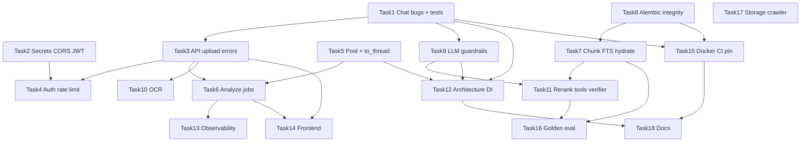

# IMPLEMENTATION PLAN — ContractLens

*Ngày lập: 2026-08-02. Nguồn: xác minh `docs/PROJECT_WEAKNESSES.md` đối chiếu source hiện tại.*  
*Phạm vi: chỉ các vấn đề đã xác nhận (✅ / ⚠️). Không thêm issue mới. Không sửa code trong lần lập kế hoạch này.*

---

## Executive Summary

Đối chiếu 69 mục trong `PROJECT_WEAKNESSES.md` với source hiện tại:

| Kết quả | Số lượng | Ghi chú |
|---------|----------|---------|
| ✅ Confirmed | 67 | Vẫn tồn tại đúng như mô tả |
| ⚠️ Partially Correct | 2 | W-020, W-063 — có vấn đề nhưng mô tả cần tinh chỉnh |
| ❌ Invalid | 0 | — |
| 🔄 Already Fixed | 0 | Không mục nào được coi là đã sửa |

**Ưu tiên tuyệt đối:** hai bug adapter QA/Chat (W-001, W-002) làm hỏng chat/history; CORS + secrets (W-045, W-049); và test bảo vệ adapter (W-058).

**Nguyên tắc gom task:** mỗi task lớn gộp các weakness liên quan cùng một bề mặt thay đổi (file/layer), giảm context-switch và giảm rủi ro conflict.

---

## Những vấn đề đã được xác nhận

### Critical (4) — vẫn đúng

| ID | Bằng chứng source |
|----|-------------------|
| **W-001** | `pipelines.py:18` gọi `answer_question(contract_id, question, provider)` ngược signature `qa_agent.py:170` `(question, contract_id, provider)` |
| **W-002** | `pipelines.py:28` truy cập `hist.messages` trong khi `get_conversation_history` (`qa_agent.py:184-208`) trả `List[ChatHistoryItem]` |
| **W-049** | `.env` còn `GEMINI_API_KEY` thật + leftover `SUPABASE_*` / `JWT_SECRET_KEY` (settings chỉ đọc `JWT_SECRET`) |
| **W-058** | 9 file `test_*.py`; không có test cho `LangGraphQaPipeline` / `pipelines.py`; `test_api.py` chỉ `/health`, `/models` |

### High / Security / Data — confirmed (chọn lọc dẫn chiếu)

| ID | Bằng chứng |
|----|------------|
| **W-045** | `main.py:72-78` `allow_origins=["*"]` + `allow_credentials=True` |
| **W-050** | `settings.py:30` `jwt_secret = "change-me-in-production"` |
| **W-044** | `routes.py:80` `await file.read()` không giới hạn; `contracts.py:29-32` chỉ check extension |
| **W-046** | `/analyze`, `/chat` không rate limit |
| **W-031** | `routes.py` `detail=str(e)` trên nhiều except |
| **W-028 / W-056** | `connection.py:13-17` connect mới mỗi lần; analyze fan-out `workflow.py:44-62` |
| **W-033** | `schema_loader.py` + `main.py:27` apply toàn bộ `schema.sql` mỗi boot |
| **W-015 / W-016** | `chunker.py:42-46` overlap vượt size; `settings.py:23,36` 512 token vs 1800 chars |
| **W-017 / W-041** | `schema.sql:149-150` + `pg_search.py:164-168` FTS `'simple'` |
| **W-008 / W-009 / W-010** | Prompt inject context thô; `llm_client.py:29-33` không timeout/retry/max_tokens |

Toàn bộ danh sách Confirmed: W-001→W-019, W-021→W-062, W-064→W-069 (trừ hai mục Partial bên dưới).

---

## Những vấn đề không chính xác / chưa đầy đủ

| ID | Status | Điều chỉnh |
|----|--------|------------|
| **W-020** | ⚠️ Partially Correct | Thiếu parent-hydrate đúng với **QA / vector retrieval** (`retriever.py`, `pg_search.py`). Nhưng **risk path đã ghép Điều** qua `get_text_by_clause` (`risk_flagger.py:21`, `contract_chunk_repository.py:39-56`). Legal GraphRAG cũng hydrate siblings. Không phải “toàn hệ thống không hydrate”. |
| **W-063** | ⚠️ Partially Correct | Hầu hết dependency unpinned — đúng. Nhưng `requirements.txt:19` có `bcrypt<4.1`. Không phải “xéro version constraint”. |

**Không có mục Invalid hoặc Already Fixed.**

---

## Thứ tự triển khai (theo ưu tiên nghiệp vụ)

1. Critical Bugs  
2. Security  
3. Data Integrity  
4. AI/RAG Accuracy  
5. Performance  
6. Architecture  
7. Maintainability  
8. Refactoring  
9. Documentation  

---

## Các task lớn

### Task 1 — Sửa bug Chat/History adapter + khóa bằng test

- **Trạng thái:** ✅ Completed (2026-08-02)
- **Bao gồm:** W-001, W-002, W-058 (phần pipelines)
- **Mục tiêu:** Chat và history hoạt động đúng; regression không tái diễn.
- **File ảnh hưởng:** `app/infrastructure/agents/pipelines.py`, `tests/unit/test_pipelines.py` (mới), có thể `tests/unit/test_agents.py`
- **Phụ thuộc:** Không
- **Rủi ro:** Thấp (đổi 2 dòng + test)
- **Độ khó:** Easy
- **Lợi ích:** Khôi phục tính năng chính của sản phẩm

### Task 2 — Secrets, CORS, JWT startup guard

- **Trạng thái:** ✅ Completed (2026-08-02) — ngoại lệ: rotate `GEMINI_API_KEY`/`JWT_SECRET` là thao tác thủ công của người dùng (W-049 ⚠️ Partially)
- **Bao gồm:** W-049, W-045, W-050, W-054 (cookie crawler), W-068 (dọn khóa chết)
- **Mục tiêu:** Không lộ/forge credential; CORS hợp lệ; env sạch.
- **File ảnh hưởng:** `.env` (local, rotate), `.env.example`, `app/main.py`, `app/core/settings.py`, `app/main.py` lifespan validate, `scripts/crawl_vbpl/common.py`
- **Phụ thuộc:** Không (có thể song song Task 1)
- **Rủi ro:** Trung bình (rotate key làm gãy env cũ nếu quên cập nhật)
- **Độ khó:** Easy
- **Lợi ích:** Chặn tấn công auth/CORS và lộ API key

### Task 3 — API error contract + upload safety

- **Bao gồm:** W-007, W-030, W-031, W-044, W-047, W-048
- **Mục tiêu:** Không `assert`/`str(e)` lộ nội bộ; upload có size/MIME limit; upload fail trả lỗi rõ; OpenAPI typed.
- **File ảnh hưởng:** `app/api/routes.py`, `app/application/use_cases/contracts.py`, `app/schemas/contract.py`, `frontend/src/App.jsx` (xử lý status error)
- **Phụ thuộc:** Task 1 khuyến nghị trước (frontend chat ổn định hơn khi test E2E)
- **Rủi ro:** Trung bình (đổi HTTP status có thể ảnh hưởng frontend)
- **Độ khó:** Easy–Medium
- **Lợi ích:** API trung thực, giảm DoS/upload abuse, DX tốt hơn

### Task 4 — Auth hardening + rate limit LLM endpoints

- **Bao gồm:** W-046, W-051, W-036 (quyết định cookie vs CSP), W-052
- **Mục tiêu:** Chặn spam LLM/brute-force; auth chặt hơn; chat memory theo user.
- **File ảnh hưởng:** `app/main.py` (middleware), `app/api/routes.py`, `app/application/use_cases/auth.py`, `app/agents/qa_agent.py`, `frontend/src/AuthContext.jsx` / `api.js` (nếu chuyển cookie)
- **Phụ thuộc:** Task 2 (JWT secret hợp lệ trước)
- **Rủi ro:** Trung bình–Cao (đổi cơ chế token ảnh hưởng login)
- **Độ khó:** Medium
- **Lợi ích:** Kiểm soát chi phí Gemini + an toàn tài khoản

### Task 5 — Connection pool + non-blocking I/O

- **Bao gồm:** W-028, W-029, W-035, W-055, W-056
- **Mục tiêu:** Một pool PG; embed/retrieve không block event loop; thống nhất driver nếu khả thi.
- **File ảnh hưởng:** `app/infrastructure/db/connection.py`, mọi repository dùng `get_db`, `app/agents/qa_agent.py`, `app/application/use_cases/contracts.py`, `app/infrastructure/embeddings/hf_embedder.py`, `requirements.txt`, `app/agents/checkpointer.py`
- **Phụ thuộc:** Không bắt buộc; nên trước Task 6 (queue) để worker cũng dùng pool
- **Rủi ro:** Trung bình (pool misconfig → deadlock/timeout)
- **Độ khó:** Medium
- **Lợi ích:** Latency/throughput tốt hơn rõ khi analyze nhiều clause

### Task 6 — Background analyze jobs

- **Bao gồm:** W-034
- **Mục tiêu:** `/analyze` trả `job_id`; worker chạy LangGraph; frontend poll.
- **File ảnh hưởng:** `app/api/routes.py`, `app/application/use_cases/contracts.py`, worker module mới, `docker-compose.yml` (Redis/worker), `frontend/src/App.jsx` / Analyze UI
- **Phụ thuộc:** Task 5 (pool), Task 3 (error contract)
- **Rủi ro:** Cao (thay đổi contract API + vận hành)
- **Độ khó:** Hard
- **Lợi ích:** Không timeout HTTP; scale worker độc lập

### Task 7 — Chunking / embedding alignment + Vietnamese FTS

- **Bao gồm:** W-015, W-016, W-017, W-018, W-041, W-022 (hiệu lực), W-020 (phần QA hydrate)
- **Mục tiêu:** Chunk không vượt embed window; regex Điều thống nhất; FTS/trgm tiếng Việt; lọc hiệu lực; hydrate parent cho QA.
- **File ảnh hưởng:** `app/document/chunker.py`, `app/agents/clause_parser.py`, `app/core/settings.py`, `app/infrastructure/embeddings/hf_embedder.py`, `schema.sql` (+ migration Task 8), `app/infrastructure/vector/pg_search.py`, `app/vectorstore/retriever.py`, `app/infrastructure/db/contract_chunk_repository.py`
- **Phụ thuộc:** Task 8 nếu đổi schema FTS/cột normalized
- **Rủi ro:** Trung bình (cần re-embed / re-ingest)
- **Độ khó:** Medium
- **Lợi ích:** Recall/precision RAG tăng; giảm lệch clause_number

### Task 8 — Schema migrations (Alembic) + data integrity

- **Bao gồm:** W-033, W-043, W-042 (pagination API+index đã có)
- **Mục tiêu:** Bỏ auto-apply full SQL; versioned migrations; email/`updated_at` ràng buộc; list contracts có phân trang.
- **File ảnh hưởng:** `alembic/` (mới), `schema.sql` (baseline), `app/infrastructure/db/schema_loader.py`, `app/main.py`, `app/infrastructure/db/user_repository.py`, `app/application/use_cases/contracts.py`, `app/api/routes.py`
- **Phụ thuộc:** Nên trước hoặc cùng Task 7 nếu cần cột normalized/trgm
- **Rủi ro:** Cao trên DB đã có dữ liệu
- **Độ khó:** Medium
- **Lợi ích:** Nâng cấp schema an toàn; data integrity

### Task 9 — LLM reliability + prompt guardrails

- **Bao gồm:** W-008, W-009, W-010, W-011, W-025, W-024, W-023 (registry tối thiểu)
- **Mục tiêu:** Timeout/retry/max_tokens; JSON structured; helper `invoke_json`; delimiter chống injection; extraction không cắt cứng mù.
- **File ảnh hưởng:** `app/agents/llm_client.py`, `app/infrastructure/llm/gemini_chat.py`, `app/agents/json_parsing.py`, `app/agents/clause_parser.py`, `app/agents/risk_flagger.py`, `app/agents/qa_agent.py`, `app/core/prompts.py`
- **Phụ thuộc:** Task 4 (rate limit) bổ trợ chi phí
- **Rủi ro:** Trung bình (đổi prompt → đổi chất lượng output)
- **Độ khó:** Medium
- **Lợi ích:** Ít hang/fail; giảm parse error; cứng hơn trước injection

### Task 10 — OCR hardening

- **Bao gồm:** W-026, W-027
- **Mục tiêu:** Giới hạn/resize ảnh; heuristic chất lượng OCR.
- **File ảnh hưởng:** `app/document/parser.py`, có thể thêm dependency ảnh (Pillow)
- **Phụ thuộc:** Task 3 (upload size limit)
- **Rủi ro:** Thấp–Trung bình
- **Độ khó:** Medium
- **Lợi ích:** Giảm chi phí/token; ít text rác vào pipeline

### Task 11 — RAG precision nâng cao (rerank + tools + verifier)

- **Bao gồm:** W-019, W-012, W-013, W-014 (planner tối thiểu), W-021
- **Mục tiêu:** Cross-encoder rerank; confidence/verifier; calculator tool; Neo4j limit đúng chỗ.
- **File ảnh hưởng:** `app/infrastructure/vector/pg_search.py`, `app/infrastructure/retrieval/legal_graph_rag.py`, `app/agents/qa_agent.py`, `app/core/prompts.py`, `app/infrastructure/neo4j/graph_repository.py`, frontend hiển thị confidence
- **Phụ thuộc:** Task 7 (chunk/FTS ổn), Task 9 (LLM helper), Task 1 (chat sống)
- **Rủi ro:** Trung bình–Cao (model rerank VRAM 4GB; UX phức tạp)
- **Độ khó:** Hard
- **Lợi ích:** Độ tin cậy pháp lý + trả lời tính toán chính xác hơn

### Task 12 — Architecture cleanup (agents/ports)

- **Bao gồm:** W-003, W-004, W-005, W-006
- **Mục tiêu:** Agents nhận search/LLM qua DI; xóa `chat_model` chết / `file_handler` chết; bỏ provider no-op hoặc implement thật.
- **File ảnh hưởng:** `app/infrastructure/container.py`, `app/infrastructure/retrieval/context.py`, `app/vectorstore/retriever.py`, `app/agents/*`, `app/document/file_handler.py`, `app/domain/ports/services.py`, frontend UploadScreen provider UI
- **Phụ thuộc:** Task 1, 5, 9 (tránh refactor khi adapter còn bug)
- **Rủi ro:** Trung bình (đụng nhiều import)
- **Độ khó:** Medium
- **Lợi ích:** Testable, bớt dual-path, dễ bảo trì

### Task 13 — Observability + logging

- **Bao gồm:** W-032, W-064
- **Mục tiêu:** request-id middleware; JSON logs; metrics cơ bản (latency analyze/chat, LLM errors).
- **File ảnh hưởng:** `app/core/logging.py`, `app/main.py`, middleware mới
- **Phụ thuộc:** Không; tốt nhất sau Task 6 để đo job
- **Rủi ro:** Thấp
- **Độ khó:** Easy–Medium
- **Lợi ích:** Debug production được

### Task 14 — Frontend UX/reliability

- **Bao gồm:** W-037, W-038, W-039, W-057
- **Mục tiêu:** Router + ErrorBoundary; refetch sau upload; api retry; giảm phụ thuộc Google Fonts; debounce chat.
- **File ảnh hưởng:** `frontend/src/App.jsx`, `frontend/src/api.js`, components, `frontend/index.html`
- **Phụ thuộc:** Task 3, 6 (poll job)
- **Rủi ro:** Thấp–Trung bình
- **Độ khó:** Medium
- **Lợi ích:** UX ổn định, deep-link, ít state lệch

### Task 15 — DevOps: pin deps, Docker, CI

- **Bao gồm:** W-061, W-062, W-063, W-059
- **Mục tiêu:** `requirements` pin/lock; Dockerfile + compose `api`; GH Actions pytest/ruff/eslint; testcontainers hoặc fake adapters.
- **File ảnh hưởng:** `requirements.txt` / lock, `Dockerfile`, `docker-compose.yml`, `.github/workflows/*`, `tests/integration/*`
- **Phụ thuộc:** Task 1 tests làm nền; Task 8 migrations cho CI DB
- **Rủi ro:** Trung bình
- **Độ khó:** Medium
- **Lợi ích:** Reproduce build; chặn regression trước merge

### Task 16 — Golden dataset + đánh giá accuracy

- **Bao gồm:** W-060
- **Mục tiêu:** Bộ hợp đồng mẫu + nhãn risk/extract; script đo precision/recall.
- **File ảnh hưởng:** `tests/fixtures/` hoặc `evals/`, scripts đánh giá, có thể `PROGRESS_REPORT` kết quả
- **Phụ thuộc:** Task 7, 9, 11 (đo sau khi RAG/LLM ổn)
- **Rủi ro:** Thấp kỹ thuật; cao về effort gắn nhãn
- **Độ khó:** Medium
- **Lợi ích:** Số liệu cho báo cáo tốt nghiệp / regression AI

### Task 17 — Storage lifecycle + misc security/perf

- **Bao gồm:** W-053, W-040 (quyết định ghi docs), W-021 (nếu chưa xong ở Task 11), W-065
- **Mục tiêu:** Retention/xóa file khi xóa contract; tài liệu hóa Neo4j vs ltree; crawler hash config/env.
- **File ảnh hưởng:** `local_storage.py`, contract delete path, `docs/*`, `scripts/crawl_vbpl/*`
- **Phụ thuộc:** Task 8 nếu thêm cột/metadata retention
- **Rủi ro:** Thấp–Trung bình
- **Độ khó:** Medium–Hard (object storage)
- **Lợi ích:** Giảm rủi ro dữ liệu nhạy cảm; crawler vận hành rõ hơn

### Task 18 — Documentation sync

- **Bao gồm:** W-066, W-067, W-069, phần còn lại W-068
- **Mục tiêu:** README có bước frontend build; đánh dấu/archieve docs cũ; viết lại PROGRESS khớp pgvector/JWT.
- **File ảnh hưởng:** `README.md`, `PROGRESS_REPORT.md`, `docs/*.md`
- **Phụ thuộc:** Nên sau các task kiến trúc lớn (12, 15) để docs không lệch lại
- **Rủi ro:** Thấp
- **Độ khó:** Easy–Medium
- **Lợi ích:** Onboarding đúng kiến trúc hiện tại

---

## Dependency giữa các task

---

## Ước lượng độ khó (tổng hợp)

| Task | Độ khó | Effort gợi ý |
|------|--------|--------------|
| 1 | Easy | 0.5 ngày |
| 2 | Easy | 0.5 ngày |
| 3 | Easy–Medium | 1 ngày |
| 4 | Medium | 2–3 ngày |
| 5 | Medium | 2 ngày |
| 6 | Hard | 3–5 ngày |
| 7 | Medium | 2–3 ngày |
| 8 | Medium | 2 ngày |
| 9 | Medium | 2–3 ngày |
| 10 | Medium | 1 ngày |
| 11 | Hard | 4–6 ngày |
| 12 | Medium | 2 ngày |
| 13 | Easy–Medium | 1 ngày |
| 14 | Medium | 2 ngày |
| 15 | Medium | 2 ngày |
| 16 | Medium | 3+ ngày (gắn nhãn) |
| 17 | Medium–Hard | 2–4 ngày |
| 18 | Easy–Medium | 1–2 ngày |

---

## Rủi ro khi triển khai

1. **Re-embed bắt buộc** sau Task 7/8 (đổi dim đã làm 1024; đổi chunk size/FTS cột → ingest lại legal + contract).  
2. **VRAM 4GB (RTX 3050 Ti)** khi thêm reranker (Task 11) cạnh bge-m3 — cần quantize hoặc chạy CPU/offload.  
3. **Đổi API analyze → async job** phá frontend hiện tại (`App.jsx` await analyze ngay).  
4. **Alembic trên DB đã `CREATE TABLE IF NOT EXISTS`** dễ lệch revision nếu không baseline cẩn thận.  
5. **Rotate secrets** làm session JWT cũ vô hiệu; Gemini key cũ nếu đã lộ vẫn cần revoke.  
6. **Gộp driver psycopg v3** (W-035) có thể phá checkpointer/repo nếu migrate nửa vời.

---

## Checklist theo giai đoạn

### Phase 1 — Stop the bleeding (P0)

- [x] Task 1: sửa `pipelines.py` argument order + `hist` list; thêm unit test mock
- [x] Task 2: rotate GEMINI/JWT (rotate thủ công — ngoại lệ); xóa SUPABASE leftover; CORS allowlist; reject default JWT; bỏ cookie default crawler
- [ ] Smoke: `POST /chat` trả lời theo câu hỏi thật; `GET /chat/{id}/history` không 500 — **chưa chạy được: cần Docker Postgres/Neo4j bật + Gemini key hợp lệ** (adapter đã khóa bằng unit test `tests/unit/test_pipelines.py`)

**Exit criteria:** Chat/history xanh (đạt ở mức unit test; E2E còn lại khi có stack); secrets không còn default/leftover nguy hiểm; CORS không còn `*`+credentials.

### Phase 2 — Secure API surface (P0–P1)

- [ ] Task 3: thay `assert` → 503; generic 500; upload size/MIME; fail parse không giả 200; type `AnalyzeResponse`
- [ ] Task 4: rate limit `/analyze` `/chat` `/auth/login`; lockout cơ bản; `thread_id = user:contract` (tùy chọn cookie JWT)
- [ ] Cập nhật frontend xử lý upload `error` / 422

**Exit criteria:** Không lộ stack/SQL ra client; upload 20MB+ bị từ chối; spam analyze bị chặn.

### Phase 3 — Runtime stability (P1)

- [ ] Task 5: `ConnectionPool` + `asyncio.to_thread` cho embed/retrieve; cache query embedding
- [ ] Task 8: Alembic baseline từ `schema.sql`; bỏ auto-apply nguy hiểm; pagination contracts; email/`updated_at` integrity
- [ ] Task 6 (có thể bắt đầu thiết kế API job): analyze async + poll

**Exit criteria:** Analyze 20+ clause không làm cạn PG connections; schema đổi được bằng migration.

### Phase 4 — RAG / AI accuracy (P1–P2)

- [ ] Task 7: fix overlap; căn `max_chunk_size` với 512 tokens; regex Điều chung; FTS/trgm VN; filter `eff_*`; hydrate parent cho QA
- [ ] Task 9: timeout/retry/max_tokens; `invoke_json`; structured JSON; prompt delimiters; extraction dài
- [ ] Task 10: OCR resize + quality heuristics
- [ ] Re-ingest legal sample + đo thủ công vài query

**Exit criteria:** Chunk embed không truncate mù; FTS khớp không dấu (hoặc gần đúng); OCR ảnh lớn bị từ chối/resize.

### Phase 5 — Product intelligence (P1–P2)

- [ ] Task 11: reranker; verifier/confidence; calculator tool; Cypher limit đúng
- [ ] Task 16: golden set tối thiểu + script metric
- [ ] Task 6 hoàn tất nếu chưa xong ở Phase 3

**Exit criteria:** Có số precision/recall trên golden set; câu hỏi bồi thường có tool path.

### Phase 6 — Architecture & UX polish (P2–P3)

- [ ] Task 12: DI agents; xóa dead `file_handler` / unused `chat_model`; provider cleanup
- [ ] Task 13: request-id + metrics
- [ ] Task 14: router, ErrorBoundary, refetch, retry, fonts
- [ ] Task 17: retention storage; crawler hash config; quyết định ltree vs Neo4j trong docs

**Exit criteria:** Không còn import agents→context global; FE refresh không mất view chính.

### Phase 7 — Ship & document (P1–P2)

- [ ] Task 15: pin/lock requirements; Dockerfile; compose `api`; CI pytest+ruff+eslint
- [ ] Task 18: README frontend build; rewrite/archive PROGRESS + docs lệch FAISS/Supabase
- [ ] Đóng vòng: chạy lại checklist Phase 1 smoke trên môi trường compose đầy đủ

**Exit criteria:** `docker compose up` chạy được api+db; CI đỏ khi tái diễn W-001/W-002; docs khớp code.

---

## Mapping nhanh Weakness → Task

| Weaknesses | Task |
|------------|------|
| W-001, W-002, W-058* | 1 |
| W-049, W-045, W-050, W-054, W-068* | 2 |
| W-007, W-030, W-031, W-044, W-047, W-048 | 3 |
| W-046, W-051, W-036, W-052 | 4 |
| W-028, W-029, W-035, W-055, W-056 | 5 |
| W-034 | 6 |
| W-015, W-016, W-017, W-018, W-020*, W-022, W-041 | 7 |
| W-033, W-042, W-043 | 8 |
| W-008, W-009, W-010, W-011, W-023*, W-024, W-025 | 9 |
| W-026, W-027 | 10 |
| W-012, W-013, W-014*, W-019, W-021 | 11 |
| W-003, W-004, W-005, W-006 | 12 |
| W-032, W-064 | 13 |
| W-037, W-038, W-039, W-057 | 14 |
| W-059, W-061, W-062, W-063 | 15 |
| W-060 | 16 |
| W-040, W-053, W-065 | 17 |
| W-066, W-067, W-069 | 18 |

`*` = phủ một phần trong task (phần còn lại ở task khác nếu cần).

---

*Kết thúc kế hoạch. Mọi kết luận dựa trên xác minh source tại thời điểm 2026-08-02; chi tiết từng weakness xem `docs/PROJECT_WEAKNESSES.md` (Verification Log + trạng thái từng mục).*
