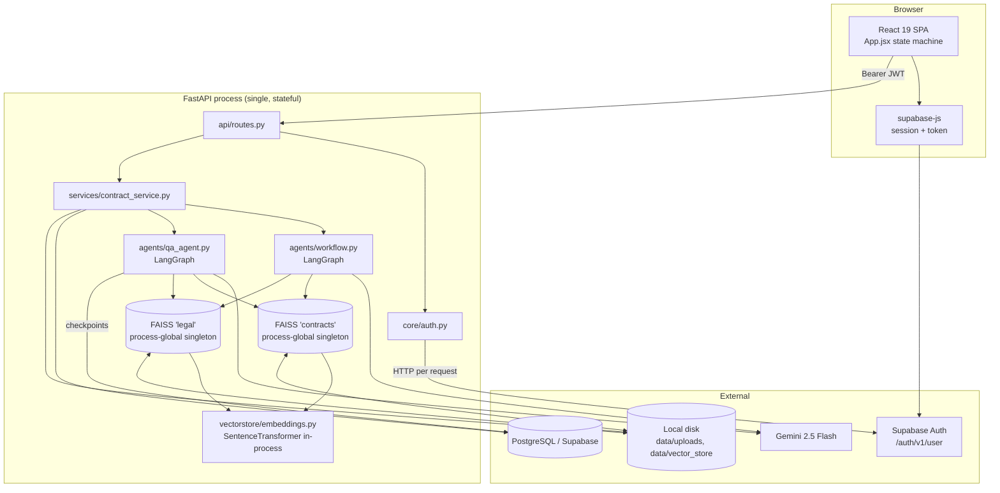
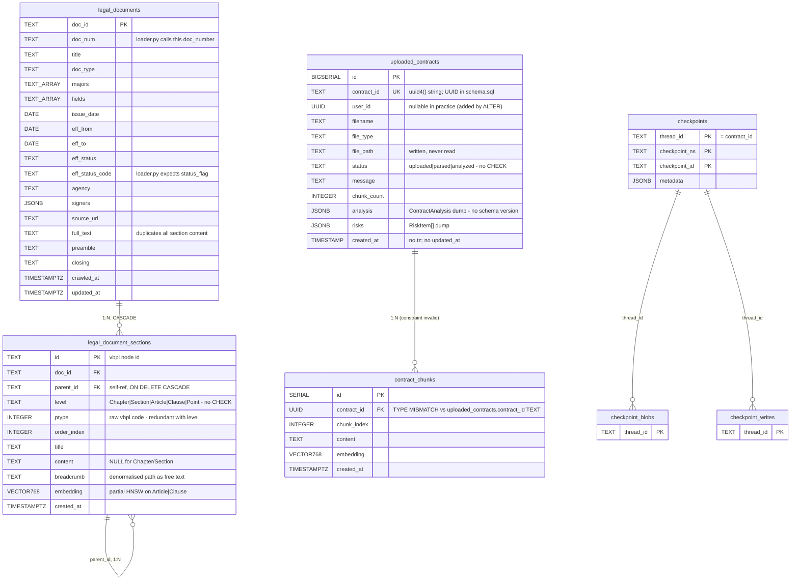
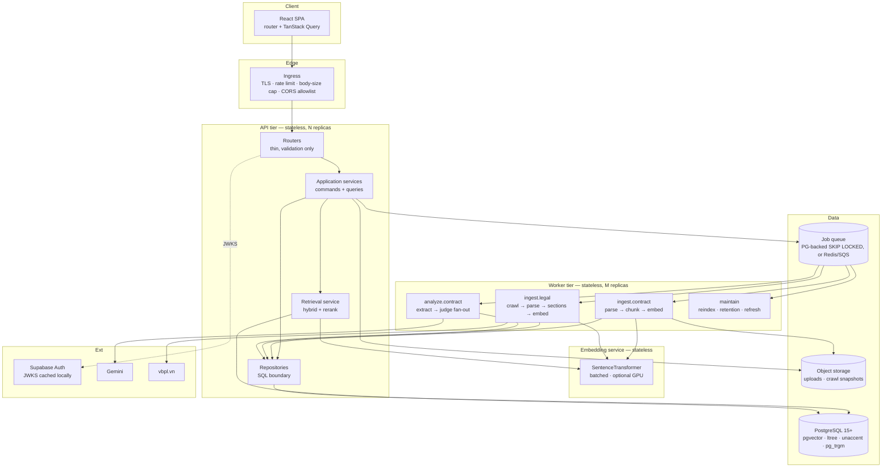

# ContractLens — Production Architecture & Database Review

**Scope of review:** the whole `D:\contract-agent` repository at commit `a92dd52`, the untracked `schema.sql`, and the untracked crawler output folder `Nghị định số 168-2024-NĐ-CP …`.

**Method:** every tracked source file, test, config, doc, and every crawler artifact was read. Structural claims about the crawled data were produced by executing measurement scripts over the actual JSON/Markdown, not by reading samples. Library behaviour claims were verified against the *installed* package source (`langchain-community 0.4.1`, `langchain 1.3.1`).

**Epistemic labels used throughout:**

| Label | Meaning |
|---|---|
| **FACT** | Directly observable in code, SQL, config, or measured data. Cited. |
| **INFERENCE** | Logically derived from facts. Reasoning shown. |
| **RECOMMENDATION** | My engineering judgement. Tradeoffs and alternatives given. |
| **UNKNOWN** | Cannot be determined from the repository. Explicitly flagged, never guessed. |

**Global UNKNOWNs that limit this review** (stated up front so no conclusion silently depends on a guess):

1. **No live database access.** `.env` does not exist (verified). Every statement about the *deployed* Supabase schema is therefore inference from DDL in code. Where code DDL and `schema.sql` disagree, I report the disagreement rather than picking a winner.
2. **No crawler source code exists in this repository.** Verified: `git ls-files` returns no crawler, scraper, or ingestion module. Only crawler *output* is present. Statements about crawler behaviour are inferred from the shape of its output.
3. **Only one crawled document is available** (`doc_id=173920`). All per-document size and structure statistics are single-sample. Extrapolations to 100k/1M documents are flagged where sample size matters.
4. **`docs/dfd.md`, `docs/frontend.md`, `docs/user-flow.md`, `docs/processing-design.md` and `schema.sql` are untracked** (`git status`). They are design intent, not committed contract. Where they contradict code, code wins for "current state" and the doc is treated as *intended* state.

---

# TABLE OF CONTENTS

- [STEP 1 — Repository inventory](#step-1--repository-inventory)
- [STEP 2 — System explanation and all flows](#step-2--system-explanation-and-all-flows)
- [STEP 3 — Dependency graph](#step-3--dependency-graph)
- [STEP 4 — Complete code review (issues I-1 … I-41)](#step-4--complete-code-review)
- [STEP 5 — Database analysis and crawler data analysis](#step-5--database-analysis-and-crawler-data-analysis)
- [STEP 6 — Critical evaluation: PostgreSQL + pgvector + ltree + Neo4j](#step-6--critical-evaluation-postgresql--pgvector--ltree--neo4j)
- [STEP 7 — Target architecture](#step-7--target-architecture)
- [STEP 8 — PostgreSQL schema design](#step-8--postgresql-schema-design)
- [STEP 9 — pgvector strategy](#step-9--pgvector-strategy)
- [STEP 10 — ltree design](#step-10--ltree-design)
- [STEP 11 — Neo4j design (conditional, not recommended now)](#step-11--neo4j-design-conditional)
- [STEP 12 — Synchronization and consistency](#step-12--synchronization-and-consistency)
- [STEP 13 — Scalability estimates](#step-13--scalability-estimates)
- [STEP 14 — Refactoring roadmap](#step-14--refactoring-roadmap)

---

# STEP 1 — Repository inventory

**FACT.** 76 tracked files + 5 untracked paths. Git history is 3 commits (`b01cd39` initial, `4fcea5c` update, `a92dd52` flowchart md).

```
D:\contract-agent
├── app/                              # FastAPI backend (Python)
│   ├── main.py                       # app factory, CORS, startup/shutdown, static mount
│   ├── api/routes.py                 # 6 REST endpoints under /api/v1
│   ├── core/
│   │   ├── config.py                 # env → module-level globals + logging
│   │   ├── database.py               # psycopg2 connect-per-call + init_db() DDL
│   │   ├── auth.py                   # Supabase JWT introspection via HTTP
│   │   └── prompts.py                # 5 prompt templates (English, Vietnamese output)
│   ├── schemas/contract.py           # 10 Pydantic models
│   ├── agents/
│   │   ├── workflow.py               # LangGraph analysis graph (extract → fan-out judge → aggregate)
│   │   ├── clause_parser.py          # 485-line rule-based extractor + LLM gap-fill
│   │   ├── risk_flagger.py           # per-clause RAG + LLM compliance verdict
│   │   ├── qa_agent.py               # LangGraph QA graph (retrieve → route → generate/refusal)
│   │   ├── llm_client.py             # Gemini singleton
│   │   ├── checkpointer.py           # AsyncPostgresSaver + psycopg pool
│   │   └── json_parsing.py           # fenced-JSON extractor
│   ├── document/
│   │   ├── parser.py                 # docx / pdf / image(Gemini OCR)
│   │   ├── chunker.py                # clause-aware recursive splitter
│   │   └── file_handler.py           # extension allowlist + disk write
│   ├── vectorstore/
│   │   ├── faiss_store.py            # FAISS wrapper, 2 process-global singletons
│   │   ├── embeddings.py             # HuggingFaceEmbeddings singleton
│   │   └── retriever.py              # 2 retrieval functions
│   ├── knowledge_base/loader.py      # Postgres → FAISS legal KB rebuild
│   ├── services/contract_service.py  # orchestration + ownership checks
│   └── helpers/text_normalizer.py    # DEAD CODE (0 importers)
├── scripts/load_legal_kb.py          # CLI entry for the KB rebuild
├── tests/                            # 11 tests (4 integration, 7 unit)
├── frontend/                         # React 19 + Vite 8 + Tailwind 3, Supabase Auth
├── requirements.txt                  # 21 deps, ZERO version pins
├── .env.example                      # 15 config keys
├── schema.sql                        # UNTRACKED — pgvector schema, does not match code
├── docs/                             # UNTRACKED (3 of 4) — DFD, frontend, user flow, processing design
└── Nghị định số 168-2024-NĐ-CP …/    # UNTRACKED — crawler output, 4 files
    ├── thuoc_tinh.json               #    700 B  — document attributes
    ├── luoc_do.json                  #  6.4 KB  — relation graph (15 types × 2 directions)
    ├── muc_luc.json                  #  474 KB  — table-of-contents tree, 1308 nodes
    └── van_ban.md                    #  364 KB  — full text with inline id anchors
```

**FACT — absent infrastructure.** No `Dockerfile`, no `docker-compose.yml`, no CI workflow, no `pyproject.toml`/`setup.cfg`/`pytest.ini`, no migration tool (Alembic/Flyway/sqitch), no `.dockerignore`, no Python linter/formatter config, no pre-commit config, no OpenAPI spec artifact, no load-test harness, no observability config.

**FACT — absent code that documentation implies.** No crawler, no parser for `van_ban.md`/`muc_luc.json`/`luoc_do.json`, no ingestion pipeline writing to `legal_documents` or `legal_document_sections`, no reference-extraction code, no scheduler, no queue worker. The only ingestion path in code is `app/knowledge_base/loader.py`, which *reads* legal tables that nothing in this repository *writes*.

**INFERENCE.** The repository contains a working contract-review product plus the *outputs and target schema* of a separate, not-yet-integrated legal-corpus subsystem. The review must treat these as two systems at very different maturity levels.

---

# STEP 2 — System explanation and all flows

## 2.0 Architecture as built



**FACT — the process is stateful.** `app/vectorstore/faiss_store.py:80-95` holds two module-level singletons; `app/vectorstore/embeddings.py:5` holds a third. Vector state lives in process memory and on the local filesystem of that one process, not in a shared store.

## 2.1 Request flow (generic)

| # | Step | Location |
|---|---|---|
| 1 | Browser attaches `Authorization: Bearer <supabase access_token>` | `frontend/src/api.js:5-9` |
| 2 | FastAPI resolves `Depends(get_current_user_id)` | `app/api/routes.py:30,40,50,58,68` |
| 3 | A **new** `httpx.AsyncClient` is constructed and `GET {SUPABASE_URL}/auth/v1/user` is called | `app/core/auth.py:13-17` |
| 4 | Non-200 → 401; transport error → 503 | `app/core/auth.py:18-23` |
| 5 | Route delegates to a service function | `app/api/routes.py` |
| 6 | Service asserts ownership with a fresh psycopg2 connection | `contract_service.py:23-33` |
| 7 | Business logic runs; exceptions map `ValueError→404`, everything else `→500 detail=str(e)` | `routes.py:43-46` etc. |

**FACT.** Auth costs one outbound HTTPS round-trip per API call, with no local JWT signature verification and no caching. `httpx.AsyncClient` is created and torn down per call, so no TLS session or connection reuse.

## 2.2 Upload / indexing flow

Entry: `POST /api/v1/upload` → `routes.upload` → `contract_service.upload_contract`.

| Order | Function | File:line | Notes |
|---|---|---|---|
| 1 | `save_upload` | `document/file_handler.py:21-29` | `validate_file` extension allowlist; `contract_id = uuid4()`; **`content = await file.read()` loads the entire body into RAM**; writes `data/uploads/<uuid><ext>` |
| 2 | `parse_document` | `document/parser.py:58-66` | dispatch on extension |
| 2a | `parse_docx` | `parser.py:1-16` | paragraphs then tables flattened to `a \| b \| c` |
| 2b | `parse_pdf` | `parser.py:19-32` | `pdfplumber`, text layer only, no OCR fallback |
| 2c | `parse_image` | `parser.py:35-55` | base64 → Gemini Vision with `OCR_PROMPT` |
| 3 | `chunk_by_clause` | `document/chunker.py:44-105` | split on `Điều|ĐIỀU|Khoản|KHOẢN\s+\d+[.:\-)]`; oversize pieces go through `_split_text`; whole-text fallback if only a preamble was found |
| 4 | `get_contract_collection().add_documents(docs)` | `faiss_store.py:47-60` | embeds under a `threading.Lock`, then `save_local()` **rewrites the whole index file** |
| 5 | Upsert row | `contract_service.py:53-58` | `ON CONFLICT (contract_id) DO UPDATE` |

**FACT.** Steps 2–4 are wrapped in `try/except Exception` (`contract_service.py:42-51`) that logs and continues. A parse failure still returns HTTP 200 with `status="uploaded"`.

**FACT.** Chunks are written only to FAISS. Nothing in `app/` writes to a `contract_chunks` table, despite `schema.sql:69-81` defining one.

## 2.3 Analysis flow

Entry: `POST /api/v1/analyze` → `contract_service.analyze_contract:86-107`.

```
_assert_owns_contract            → DB connection #1
if not force: _load_cached_analysis → DB connection #2 (returns early on hit)
get_contract_collection().get(where={"contract_id": …})   ← FULL in-memory scan of ALL contracts
full_text = "\n".join(documents)
run_analysis_workflow(...)
_save_analysis_result            → DB connection #3
```

LangGraph graph (`agents/workflow.py:74-82`):

```
START → extract ──┬─(Send per clause, max_concurrency=4)→ judge_clause → aggregate → END
                  └─(no clauses)──────────────────────────────────────→ aggregate
```

- `_extract_node:33-40` → `asyncio.to_thread(parse_contract, …)`.
  - `parse_contract:453-484` runs ~15 regex extractor groups, then `_fill_gaps_with_llm:419-450` makes **one** Gemini call over `text[:12000]` and fills only fields the regexes left empty.
- `_judge_clause_node:55-67` → `asyncio.to_thread(evaluate_clause, …)`.
  - `evaluate_clause:10-61` builds a query from `title + summary`, `retrieve_legal(query, k=3)` with `min_score=0.6`. **If retrieval is empty it returns a `warning` RiskItem without calling the LLM** (`risk_flagger.py:20-30`) — a deliberate refusal. Otherwise one Gemini call, with one retry on unparsable JSON.
- `_aggregate_node:70-71` returns `{}`; it exists purely as a join point for the `operator.add` reducer on `risks`.

**FACT — LLM call count per uncached analysis** = 1 extraction + (1 or 2) per clause with legal grounding. For a 20-clause contract: 21–41 Gemini calls, 4 in flight.

## 2.4 Retrieval / search flow

```
retriever.retrieve_contract(q, contract_id, k=None)   # retriever.py:7-15
  → FaissStore.similarity_search(q, k=TOP_K_RETRIEVAL(5), where={"contract_id": …})  # NO min_score, deliberate
retriever.retrieve_legal(q, k=3)                      # retriever.py:18-19
  → FaissStore.similarity_search(q, k=3, min_score=SIMILARITY_THRESHOLD(0.6))
```

**FACT (verified against installed `langchain_community 0.4.1`).** `FAISS.similarity_search_with_score_by_vector` executes:

```python
scores, indices = self.index.search(vector, k if filter is None else fetch_k)   # fetch_k default = 20
...
if filter is not None: ... filter_func(doc.metadata) ...
return docs[:k]
```

Metadata filtering is **post-hoc over the global top-`fetch_k`=20**. See issue **I-1**; this is the single most consequential defect in the system.

**FACT.** Similarity semantics are correct: `encode_kwargs={"normalize_embeddings": True}` (`embeddings.py:22`) + `DistanceStrategy.MAX_INNER_PRODUCT` (`faiss_store.py:55`) = cosine, and the installed FAISS code selects `operator.ge` for MAX_INNER_PRODUCT thresholds. So `min_score=0.6` means "cosine ≥ 0.6" as intended.

## 2.5 Chat / QA flow

Entry: `POST /api/v1/chat` → `qa_agent.answer_question:170-181`, `thread_id = contract_id`.

```
START → retrieve ─(_has_context)→ generate → END
                └─(else)────────→ refusal  → END
```

- `_retrieve_node:58-73` — both retrievers; truncates contexts to 8000/3000 chars; records `_valid_clause_numbers`.
- `_generate_node:88-146` — `trim_messages(messages[:-1], max_tokens=2000, strategy="last")` is the memory eviction policy; system prompt + trimmed history + freshly-built human message; one retry on unparsable JSON; **citation verification** drops any `cited_clauses` entry not present in `_valid_clause_numbers` (`:134-139`).
- `get_conversation_history:184-208` replays the entire checkpointed message list and pairs Human/AI messages.

**FACT.** Persistence is LangGraph `AsyncPostgresSaver` over a `psycopg_pool.AsyncConnectionPool` with `prepare_threshold=None` (`checkpointer.py:20-32`) — a correct and non-obvious accommodation for Supavisor transaction-mode pooling.

## 2.6 Legal knowledge-base ingestion flow

Entry: `python scripts/load_legal_kb.py` → `knowledge_base/loader.load_legal_documents:16-58`.

```sql
SELECT dc.chunk_ref, dc.doc_id, dc.chunk_index, dc.chunk_text, dc.section_type,
       ld.title, ld.doc_number, ld.category
FROM document_chunks dc JOIN legal_documents ld ON ld.doc_id = dc.doc_id
WHERE ld.status_flag = 1
ORDER BY dc.doc_id, dc.chunk_index
```

Server-side named cursor, `itersize=256`, `collection.reset()` first (full rebuild), `persist=False` per batch and a single `save()` at the end.

**FACT — this query cannot run against `schema.sql`.** Column-by-column:

| Query references | Exists in `schema.sql`? | Actual name there |
|---|---|---|
| `document_chunks` (table) | **No** | `legal_document_sections` (`schema.sql:40`) |
| `dc.chunk_ref` | No | — |
| `dc.chunk_index` | No | `order_index` (`:46`) |
| `dc.chunk_text` | No | `content` (`:48`) |
| `dc.section_type` | No | `level` (`:44`) / `ptype` (`:45`) |
| `ld.doc_number` | **No** | `doc_num` (`:8`) |
| `ld.category` | No | `majors[]` / `fields[]` (`:11-12`) |
| `ld.status_flag` | **No** | `eff_status_code` (`:17`) |

See **I-2**.

## 2.7 Frontend ↔ backend interaction

**FACT.** `frontend/src/App.jsx` is a 4-state machine driven by three variables: `loading` → blank; `!session` → `LoginScreen`; `result` → `AnalysisResult`; `view` → `UploadScreen` | `ContractListScreen`. There is no router; no deep links; refresh loses the open contract.

**FACT.** Opening an existing contract calls `analyzeContract(contract.contract_id)` (`App.jsx:67`) — i.e. a *read* is expressed as `POST /api/v1/analyze`. It returns cached rows on a hit but triggers a full multi-LLM run on a miss. See **I-24**.

## 2.8 Background jobs, scheduled jobs, cache, error handling

| Concern | Status | Evidence |
|---|---|---|
| Background jobs | **None.** No BackgroundTasks, Celery, RQ, arq, or worker process. All LLM work is synchronous inside the request. | absence across `app/` |
| Scheduled jobs | **None.** KB rebuild is a manual CLI invocation. | `scripts/load_legal_kb.py`; `docs/dfd.md:466` |
| Cache — analysis | Postgres JSONB columns `analysis`, `risks`; `force=true` bypass. No TTL, no invalidation on KB change. | `contract_service.py:63-84` |
| Cache — chat memory | LangGraph checkpoint tables; trimmed to 2000 tokens at prompt time only. | `qa_agent.py:94-99` |
| Cache — embeddings / LLM | **None.** Identical clause text re-embeds and re-prompts every run. | — |
| Error handling | Route-level `try/except`; `ValueError→404`; bare `Exception→500 detail=str(e)`. Upload swallows parse errors. No error taxonomy, no correlation id, no retry/backoff on Gemini or Supabase. | `routes.py:31-74`, `contract_service.py:42-51` |
| Logging | One root logger to stdout, INFO. Structured-ish but string-formatted, no JSON, no request id, no trace context. `logger.error` used for non-errors (e.g. dropped citations, `qa_agent.py:139`). | `core/config.py:27-33` |

---

# STEP 3 — Dependency graph

## 3.1 Module dependency graph (actual imports)

```
app.main
 ├→ app.agents.checkpointer ─→ app.core.config
 ├→ app.api.routes
 │   ├→ app.agents.llm_client ─→ app.core.config
 │   ├→ app.core.auth        ─→ app.core.config
 │   ├→ app.schemas.contract
 │   └→ app.services (barrel) ─→ app.services.contract_service
 │        ├→ app.core.config
 │        ├→ app.core.database        ─→ app.core.config
 │        ├→ app.schemas.contract
 │        ├→ app.document.file_handler ─→ app.core.config
 │        ├→ app.document.parser       ─→ (lazy) app.agents.llm_client, app.core.prompts
 │        ├→ app.document.chunker      ─→ app.core.config
 │        ├→ app.vectorstore.faiss_store ─→ app.core.config, app.vectorstore.embeddings
 │        ├→ app.agents.workflow
 │        │    ├→ app.agents.clause_parser ─→ app.core.prompts, app.agents.llm_client,
 │        │    │                              app.agents.json_parsing, app.schemas.contract
 │        │    ├→ app.agents.risk_flagger  ─→ app.core.prompts, app.agents.llm_client,
 │        │    │                              app.agents.json_parsing,
 │        │    │                              app.vectorstore.retriever
 │        │    └→ app.agents.llm_client
 │        ├→ app.agents.qa_agent
 │        │    ├→ app.agents.checkpointer
 │        │    ├→ app.agents.llm_client, app.agents.json_parsing
 │        │    ├→ app.core.prompts, app.schemas.contract
 │        │    └→ app.vectorstore.retriever ─→ app.vectorstore.faiss_store
 │        └→ app.agents.llm_client
 └→ app.core.{config,database}

app.knowledge_base.loader ─→ app.core.{config,database}, app.vectorstore.faiss_store
      ↑ only importer: scripts/load_legal_kb.py

app.helpers.text_normalizer ← NO IMPORTERS
```

**Layering, top to bottom:** `main` → `api` → `services` → {`agents`, `document`, `vectorstore`} → {`core`, `schemas`}.

## 3.2 Circular dependencies

**FACT: none at module level.** `app/document/parser.py:35-40` imports `app.agents.llm_client` *inside* `parse_image`, which is a deferred import that also happens to avoid a `document → agents` edge at import time.

**INFERENCE.** That deferred import is nonetheless a **layer violation**: `document/` (a mechanical text-extraction layer) reaches upward into `agents/` (an AI layer) and into `core/prompts`. The dependency exists, it is just invisible to static import graphs.

## 3.3 Hidden dependencies

| # | Hidden dependency | Evidence | Consequence |
|---|---|---|---|
| H-1 | Process-global mutable FAISS singletons are an implicit shared dependency of `services`, `agents`, `knowledge_base` | `faiss_store.py:80-95` | No module can be tested or scaled independently; two uvicorn workers silently diverge |
| H-2 | `core/config.py` performs **side effects at import**: `os.makedirs` ×2 and `logging.basicConfig` | `config.py:24-32` | Importing anything creates directories and hijacks root logging; unavoidable in tests |
| H-3 | Import-time global event-loop policy mutation | `main.py:9-10` | Any importer of `app.main` (e.g. `tests/integration/test_api.py:2`) gets its loop policy changed |
| H-4 | `qa_agent._get_graph()` depends on `init_checkpointer()` having already run | `qa_agent.py:161-167`, `checkpointer.py:44-47` | Temporal coupling enforced only by a runtime `RuntimeError` |
| H-5 | `services` depends on the deployed DB's actual column types, which `init_db()` only partially controls | `database.py:27-49` vs `schema.sql:71` | See I-3 |
| H-6 | `loader.py` depends on tables no code in the repo creates | `loader.py:6-13` | The legal KB cannot be built from this repository alone |
| H-7 | `retrieve_legal` correctness depends on the FAISS `legal` store having been built out-of-band | `retriever.py:18-19` | On a fresh deploy `_store is None` → every clause returns the "insufficient grounding" warning, and the product silently degrades to "no analysis" while reporting success |

**H-7 is the most operationally dangerous**: `faiss_store.similarity_search:74-75` returns `[]` when `_store is None`, and `risk_flagger.py:20-30` converts that into a plausible-looking user-facing warning. A missing knowledge base is indistinguishable from a genuinely ungrounded clause.

## 3.4 Tightly coupled modules

| Coupling | Evidence | Why it hurts |
|---|---|---|
| `contract_service` ↔ FAISS internals | `contract_service.py:96` calls `.get(where=…)`, whose implementation reads `self._store.docstore._dict` (`faiss_store.py:65`) | The service layer is coupled to a private attribute of a third-party library. Swapping vector stores requires touching the service. |
| `agents` ↔ concrete vector store | `risk_flagger.py:7`, `qa_agent.py:14` import concrete functions, not an interface | No seam for testing or for a hybrid retriever |
| `services` ↔ psycopg2 SQL strings | 5 inline SQL statements in `contract_service.py` | No repository layer; schema changes ripple into business logic |
| Everything ↔ `core.config` module globals | 9 modules import module-level constants | Config cannot be overridden per request/test/tenant without monkeypatching |
| LangGraph state ↔ retrieval payloads | `QAState` carries `_contract_context`, `_legal_context` (`qa_agent.py:35-36`) | Those payloads get checkpointed to Postgres every turn — see I-14 |

## 3.5 Dead code

| Item | Evidence |
|---|---|
| Entire `app/helpers/text_normalizer.py` (3 functions) | grep across `app/`, `scripts/`, `tests/`: zero importers |
| `risk_flagger.flag_risks` (`:64-75`) | zero importers; docstring claims "used outside the async workflow (e.g. tests, scripts)" — no test or script uses it |
| `ON CONFLICT (contract_id) DO UPDATE` (`contract_service.py:56`) | `contract_id` is a freshly generated `uuid4()` per call (`file_handler.py:23`); the conflict branch is unreachable |
| `except psycopg2.DataError` (`contract_service.py:28-31`) | `database.py:33` declares `contract_id TEXT`; a malformed string cannot raise `DataError` against a TEXT comparison. Reachable only if the deployed column is actually `UUID` — see I-3 |
| `idx_contracts_id` (`database.py:47`) | duplicate of the index implied by `contract_id … UNIQUE` (`:33`) |
| `PROVIDERS` / `provider` plumbing | see I-4 — the parameter is accepted at 9 call sites and ignored at the only place it matters |

## 3.6 Duplicated logic

| # | Duplication | Locations |
|---|---|---|
| D-1 | Clause splitting implemented twice with **different regexes** | `clause_parser.py:370-373` (`Điều` only, capture-number) vs `chunker.py:46` (`Điều` **and** `Khoản`) |
| D-2 | Unicode NFC normalization | `clause_parser.py:21,455` and `chunker.py:45` |
| D-3 | "call LLM, parse JSON, retry once, log and give up" | `clause_parser.py:407-416`, `risk_flagger.py:40-48`, `qa_agent.py:109-117` — three near-identical blocks |
| D-4 | Whitespace-collapse normalization | `clause_parser.py:20-22` vs `helpers/text_normalizer.py:5-12` (the latter dead) |
| D-5 | Address extraction regex inlined a second time | `clause_parser.py:75-78` (`_ADDRESS_RE`) re-typed verbatim at `:117` |
| D-6 | Context formatting for prompts | `qa_agent.py:44-55` duplicated in `docs/processing-design.md:448-451` as an inlined variant (doc drift, not code) |

## 3.7 Unnecessary abstraction

| # | Abstraction | Why unnecessary |
|---|---|---|
| U-1 | `PROVIDERS` dict + `provider: str` threaded through routes → service → workflow → graph state → agents | Exactly one provider; `get_chat_model` ignores its argument (`llm_client.py:12-20`). ~9 signatures and 2 TypedDict fields exist to carry a constant. |
| U-2 | `app/services/__init__.py` barrel re-export | 5 names re-exported for a single consumer; adds indirection with no decoupling (the barrel imports the concrete module eagerly) |
| U-3 | `_aggregate_node` returning `{}` | A no-op node; LangGraph needs a join target, but naming it "aggregate" implies logic that does not exist |
| U-4 | `FaissStore.get(where=…)` mimicking Chroma's API | The Chroma-shaped `{"documents": [...], "metadatas": [...]}` return type leaks a foreign vendor's contract, then forces `contract_service.py:97-100` into dict-key defensive checks |
| U-5 | `chunker._split_text` reimplementing `RecursiveCharacterTextSplitter` | LangChain is already a dependency and ships this splitter; the hand-rolled version has a distinct overlap bug (I-19) |

---

# STEP 4 — Complete code review

41 issues. Ordered by priority, then by category. Every issue cites file:line.

---

## CRITICAL

### I-1 · FAISS metadata filtering searches only the global top-20, silently breaking per-contract retrieval

**Category:** Query design / correctness / scalability
**Issue.** All per-contract retrieval goes through `FaissStore.similarity_search(..., where={"contract_id": …})`, which maps to LangChain's `filter=` argument. In `langchain_community 0.4.1` that filter is applied **after** an ANN search limited to `fetch_k` (default **20**) over the *entire shared index*.

**Why it is bad.** The number of results returned for contract *X* is not `min(k, chunks_of_X)`; it is the number of *X*'s chunks that happen to land in the global 20 nearest neighbours across **all** contracts of **all** users. As the shared index grows, that number tends to 0.

**Evidence.**
```7:15:app/vectorstore/retriever.py
def retrieve_contract(query: str, contract_id: str, k: int = None) -> List[Document]:
    return get_contract_collection().similarity_search(
        query, k=k or TOP_K_RETRIEVAL, where={"contract_id": contract_id}
    )
```
```73:77:app/vectorstore/faiss_store.py
    def similarity_search(self, query: str, k: int = 5, where: dict | None = None, min_score: float | None = None) -> list[Document]:
        if self._store is None:
            return []
        kwargs = {"score_threshold": min_score} if min_score is not None else {}
        return self._store.similarity_search(query, k=k, filter=where, **kwargs)
```
Installed library (verified by `inspect.getsource`, `langchain_community/vectorstores/faiss.py`):
```python
scores, indices = self.index.search(vector, k if filter is None else fetch_k)  # fetch_k = 20
...
if filter is not None:
    if filter_func(doc.metadata): docs.append(...)
return docs[:k]
```
`fetch_k` is never passed by this codebase, so it stays 20.

**Impact.**
- *Correctness:* chat answers degrade to "not enough grounding" for contracts whose chunks are not globally top-20 — and the refusal message (`qa_agent.py:16-19`) makes this look like intended behaviour.
- *Scalability:* failure probability grows monotonically with corpus size. With 1 contract it never fires; with 1,000 contracts it fires almost always. This is the classic defect that passes every demo and fails every launch.
- *Performance:* no benefit — `fetch_k=20` is not a speed optimisation here.

**Refactoring proposal.** Short term: pass `fetch_k=max(200, k*40)` and keep a per-`contract_id` FAISS index rather than one shared index. Correct term: move contract chunks to `pgvector` where `WHERE contract_id = $1 ORDER BY embedding <=> $2 LIMIT k` is a *pre*-filter with exact semantics (see STEP 9 for the pgvector filtered-recall caveat and its mitigation).

**Difficulty:** Easy (mitigation) / Medium (proper fix, part of the pgvector migration).
**Priority:** **Critical.**

---

### I-2 · The legal-KB loader queries a schema that does not exist in `schema.sql`; eight column/table names disagree

**Category:** Configuration management / data integrity / architecture
**Issue.** `loader.py`'s SQL and `schema.sql` describe two incompatible schema generations.

**Why it is bad.** The only ingestion path into the legal vector store is unrunnable against the documented schema. Combined with H-7, the failure mode is silent: no legal KB → every clause returns a "needs manual review" warning while HTTP 200 is reported.

**Evidence.**
```6:13:app/knowledge_base/loader.py
_QUERY = """
    SELECT dc.chunk_ref, dc.doc_id, dc.chunk_index, dc.chunk_text, dc.section_type,
           ld.title, ld.doc_number, ld.category
    FROM document_chunks dc
    JOIN legal_documents ld ON ld.doc_id = dc.doc_id
    {where_clause}
    ORDER BY dc.doc_id, dc.chunk_index
"""
```
```18:18:app/knowledge_base/loader.py
    where_clause = "WHERE ld.status_flag = 1" if LEGAL_KB_ACTIVE_ONLY else ""
```
versus `schema.sql:8` (`doc_num`), `:17` (`eff_status_code`), `:11-12` (`majors`, `fields`), `:40` (`legal_document_sections`), `:44` (`level`), `:46` (`order_index`), `:48` (`content`). Full mapping table in §2.6.

**Impact.** Maintainability (two schemas in one repo), correctness (unrunnable query), and product quality (silently unusable analysis).

**Refactoring proposal.** Pick `schema.sql` as the target, rewrite `_QUERY` against `legal_document_sections`, and — per STEP 8 — retire the loader entirely once retrieval reads pgvector directly, since a Postgres→FAISS copy step stops being necessary.

**Difficulty:** Easy (rewrite the query) / Medium (as part of retiring FAISS).
**Priority:** **Critical.**

---

### I-3 · `schema.sql`'s `contract_chunks` foreign key is type-incompatible with the table `init_db()` creates

**Category:** Database design / type safety
**Issue.** `schema.sql:71` declares `contract_id UUID NOT NULL REFERENCES uploaded_contracts(contract_id)`, but `database.py:33` declares `uploaded_contracts.contract_id TEXT`.

**Evidence.**
```69:72:schema.sql
CREATE TABLE IF NOT EXISTS contract_chunks (
    id              SERIAL PRIMARY KEY,
    contract_id     UUID NOT NULL REFERENCES uploaded_contracts(contract_id) ON DELETE CASCADE,
```
```31:34:app/core/database.py
                CREATE TABLE IF NOT EXISTS uploaded_contracts (
                    id BIGSERIAL PRIMARY KEY,
                    contract_id TEXT NOT NULL UNIQUE,
```

**Why it is bad.** PostgreSQL requires an equality operator between the referencing and referenced types. There is no `uuid = text` operator, so this `CREATE TABLE` fails with *"foreign key constraint … cannot be implemented / Key columns are of incompatible types: uuid and text."* **UNKNOWN:** not executed against a live database (no `.env`), so I cannot confirm what type the deployed column actually has. `schema.sql:69` also creates `contract_chunks` *before* `uploaded_contracts` exists in file order, so `psql -f schema.sql` on a fresh database fails for that reason too.

**Impact.** `schema.sql` is not a runnable artifact. Anyone treating it as the provisioning script gets a partially-created schema.

**Refactoring proposal.** Standardise on `UUID` for `contract_id` everywhere (it *is* a UUID — `file_handler.py:23`), put `uploaded_contracts` into `schema.sql` in dependency order, delete the DDL from `init_db()`, and move all schema evolution into versioned migrations (I-9).

**Difficulty:** Medium (needs a data migration if the deployed column is TEXT with non-UUID rows).
**Priority:** **Critical.**

---

### I-4 · Process-global, disk-persisted FAISS singletons make the application impossible to scale horizontally

**Category:** Architecture / scalability
**Issue.** Vector state is per-process memory plus per-process local disk, and it is *written* on the request path.

**Evidence.**
```80:95:app/vectorstore/faiss_store.py
_contract_collection = None
_legal_collection = None

def get_contract_collection() -> FaissStore:
    global _contract_collection
    if _contract_collection is None:
        _contract_collection = FaissStore("contracts")
    return _contract_collection
```
```47:60:app/vectorstore/faiss_store.py
    def add_documents(self, docs: list[Document], persist: bool = True):
        ...
        with self._lock:
            if self._store is None:
                self._store = FAISS.from_documents(...)
            else:
                self._store.add_documents(docs)
        if persist:
            self.save()
```

**Why it is bad.** With `--workers N` or more than one container: (a) a chunk written by worker 1 is invisible to worker 2, so `analyze`/`chat` fail non-deterministically depending on which worker serves the request; (b) `save_local` from two workers races on the same directory and can corrupt or clobber the index; (c) the "millions of requests" target is unreachable because the write path is inherently single-node.

**Impact.** Scalability (hard ceiling of one process), correctness under concurrency, availability (index rebuild on restart), memory (full index resident per worker).

**Refactoring proposal.** Move both collections to pgvector (STEP 9). Vector state becomes shared, transactional, backed up with the database, and horizontally scalable behind read replicas.

**Difficulty:** Medium.
**Priority:** **Critical.**

---

### I-5 · Whole-index rewrite on every upload; O(N) disk write per request

**Category:** Performance / async
**Evidence.** `faiss_store.py:59-60` calls `self.save()` after every `add_documents`, and `save()` → `FAISS.save_local()` serialises the **entire** index and docstore (`faiss_store.py:35-38`).

**Why it is bad.** Cost per upload is proportional to total corpus size, not to the uploaded document. At 1M chunks × 768 dims × 4 B ≈ 3 GB, every single upload writes ~3 GB — while holding `self._lock`, and on the event-loop thread (`upload_contract` is `async` and calls `add_documents` synchronously at `contract_service.py:45`), blocking *all* concurrent requests.

**Impact.** Performance (latency grows with corpus), throughput (global lock + blocked event loop), disk I/O amplification, memory (serialisation buffers).

**Refactoring proposal.** pgvector `INSERT` is O(rows inserted). Interim: `persist=False` on the request path plus a periodic flush.

**Difficulty:** Easy (interim) / Medium (pgvector).
**Priority:** **Critical.**

---

### I-6 · `analyze_contract` reconstructs contract text by full-scanning every contract in the index

**Category:** Query design / memory / performance
**Evidence.**
```96:100:app/services/contract_service.py
    all_docs = get_contract_collection().get(where={"contract_id": contract_id})
    ...
    full_text = "\n".join(all_docs["documents"])
```
```62:71:app/vectorstore/faiss_store.py
    def get(self, where: dict | None = None) -> dict:
        if self._store is None: return {"documents": [], "metadatas": []}
        all_docs = list(self._store.docstore._dict.values())
        if where:
            all_docs = [d for d in all_docs if all(d.metadata.get(k) == v for k, v in where.items())]
        return {"documents": [d.page_content for d in all_docs], ...}
```

**Why it is bad.** Three compounding problems. (a) `list(...)` materialises **every chunk of every contract of every user** into a Python list on each analyse call — at 1M chunks × ~500 chars that is ~500 MB of transient allocation to retrieve one contract. (b) It reaches into `docstore._dict`, a private attribute. (c) `where` filtering is Python-side, O(N) per call.

Worse, the reconstruction is **lossy and out of order**: dict insertion order is not clause order, and `chunker.py:79` chunks with `CHUNK_OVERLAP=50` characters, so `"\n".join(...)` re-duplicates 50 characters at every chunk boundary before the text is handed to the regex extractor.

**Impact.** Memory (unbounded transient), performance (O(total corpus) per analyse), correctness (extraction runs on reordered, partially duplicated text).

**Refactoring proposal.** Persist the parsed full text once (`uploaded_contracts.full_text`, or better a `contract_documents` row) at upload time and read it back by primary key. Never reconstruct source text from chunks.

**Difficulty:** Easy.
**Priority:** **Critical.**

---

### I-7 · Unbounded in-memory file upload

**Category:** Security (DoS) / memory
**Evidence.**
```26:29:app/document/file_handler.py
    content = await file.read()
    with open(file_path, "wb") as f:
        f.write(content)
```
No `MAX_UPLOAD_SIZE` exists in `.env.example` or `core/config.py`; no reverse-proxy config is in the repository.

**Why it is bad.** An authenticated client can post a multi-gigabyte body and the server buffers all of it in RAM before any check. A handful of concurrent requests OOM-kills the process, taking the in-memory FAISS index with it (I-4).

**Impact.** Availability, memory, security.

**Refactoring proposal.** Stream in fixed chunks (`while chunk := await file.read(1 << 20)`), enforce a configured byte ceiling mid-stream, and reject on `Content-Length` before reading. Also add a body-size limit at the ingress.

**Difficulty:** Easy.
**Priority:** **Critical.**

---

### I-8 · `allow_dangerous_deserialization=True` turns the vector-store directory into a code-execution vector

**Category:** Security
**Evidence.**
```28:30:app/vectorstore/faiss_store.py
                return FAISS.load_local(
                    self.folder_path, get_embeddings(), allow_dangerous_deserialization=True
                )
```

**Why it is bad.** `load_local` unpickles the docstore. Anyone able to write to `data/vector_store/` — another tenant on the host, a compromised sibling process, a path-traversal bug elsewhere, a restored backup from an untrusted source — achieves arbitrary code execution as the application user at startup. The flag exists precisely to make this risk explicit.

**Impact.** Security (RCE), compliance (this is a legal-document system holding client contracts).

**Refactoring proposal.** Eliminate the pickle path entirely by moving to pgvector. If FAISS must be kept short-term: restrict the directory to mode `0700` owned by the app user, store a HMAC of the index files and verify before load, and never load a store from a shared or user-writable volume.

**Difficulty:** Easy (permissions + HMAC) / Medium (removal).
**Priority:** **Critical.**

---

### I-9 · Schema evolution by startup side-effect; no migrations

**Category:** Configuration management / operations
**Evidence.**
```27:49:app/core/database.py
def init_db():
    with get_db() as conn:
        with conn.cursor() as cur:
            cur.execute("""CREATE TABLE IF NOT EXISTS uploaded_contracts ( ... )""")
            cur.execute("ALTER TABLE uploaded_contracts ADD COLUMN IF NOT EXISTS user_id UUID")
            cur.execute("ALTER TABLE uploaded_contracts ADD COLUMN IF NOT EXISTS analysis JSONB")
            cur.execute("ALTER TABLE uploaded_contracts ADD COLUMN IF NOT EXISTS risks JSONB")
            cur.execute("CREATE INDEX IF NOT EXISTS idx_contracts_id ON uploaded_contracts(contract_id)")
            cur.execute("CREATE INDEX IF NOT EXISTS idx_contracts_user ON uploaded_contracts(user_id)")
```
Called from `main.py:30` on every startup.

**Why it is bad.** There is no schema version, so there is no way to know which state a database is in, no down-migration, no review artifact for schema changes, and no way to run a change *before* the new code deploys. `ADD COLUMN IF NOT EXISTS` is a patch history encoded as an append-only list of idempotent statements — it can only ever add, never rename, retype, or backfill. Note that `ALTER TABLE … ADD COLUMN user_id UUID` at `:44` cannot backfill existing rows, so `user_id` is nullable in practice despite `NOT NULL` in the `CREATE TABLE` at `:35`. `CREATE INDEX` (not `CONCURRENTLY`) takes an `ACCESS EXCLUSIVE` lock — on a large table this blocks every write during boot.

**Impact.** Operations, maintainability, availability during deploy, data integrity (`user_id` nullability).

**Refactoring proposal.** Adopt Alembic. Move `uploaded_contracts` and everything in `schema.sql` into numbered revisions. Make `init_db()` a *verification* step that asserts `alembic_version` matches the expected head and refuses to start otherwise.

**Difficulty:** Medium.
**Priority:** **Critical.**

---

### I-10 · `eff_status` in the crawled attributes contradicts the crawled relation graph — the KB will serve repealed law as current

**Category:** Data integrity / domain correctness
**Issue.** For `doc_id=173920`, `thuoc_tinh.json` says the decree is in force with no end date, while `luoc_do.json` records that a later document repeals it and another amends it.

**Evidence (measured).**
```13:14:Nghị định số 168-2024-NĐ-CP …/thuoc_tinh.json
  "eff_status": "Còn hiệu lực",
  "eff_status_code": "CHL",
```
```12:12:Nghị định số 168-2024-NĐ-CP …/thuoc_tinh.json
  "eff_to": null,
```
Yet incoming relations record `van_ban_bi_bai_bo → 336/2025/NĐ-CP` (doc_id 185666) and `sua_doi_bo_sung → 238/2026/NĐ-CP` (doc_id `f4b0c320-79e6-11f1-8c8a-3587e086d762`) — i.e. this decree has been amended and repealed by later instruments (`luoc_do.json:122-130` and `:176-184`).

**Why it is bad.** `loader.py:18` filters the KB with `WHERE ld.status_flag = 1` — a single boolean derived from exactly the attribute that is stale. A repealed decree passes that filter, gets embedded, gets retrieved by `retrieve_legal`, and is handed to Gemini as "Relevant legal excerpts". The system then produces a `critical` finding citing law that no longer applies. For a legal-advice product this is the worst possible class of error: confidently wrong, with a citation.

**INFERENCE.** `eff_status` is a point-in-time snapshot captured at crawl time; the relation graph is the authoritative and more recent signal. Effective status must be *derived*, not stored as a single trusted scalar.

**Impact.** Correctness with legal/liability consequences; retrieval quality; product trust.

**Refactoring proposal.** (1) Store relations as first-class rows (STEP 8, `legal_document_relations`). (2) Compute a materialised `is_effective_at(ts)` from `eff_from`, `eff_to`, **and** incoming `van_ban_bi_bai_bo` / `thay_the` / `tam_ngung_hieu_luc` edges. (3) Filter retrieval on that derived predicate at query time with an as-of timestamp, not on `status_flag`. (4) Include the document's effective window in the prompt context so the model can qualify its answer. (5) Re-crawl `thuoc_tinh` whenever an incoming relation changes.

**Difficulty:** Medium.
**Priority:** **Critical.**

---

### I-11 · Every request pays a synchronous HTTPS round-trip to Supabase for auth, with a fresh TCP/TLS connection

**Category:** Performance / scalability / API design
**Evidence.**
```12:17:app/core/auth.py
    try:
        async with httpx.AsyncClient(timeout=10) as client:
            res = await client.get(
                f"{SUPABASE_URL}/auth/v1/user",
                headers={"Authorization": f"Bearer {token}", "apikey": SUPABASE_SECRET_KEY},
            )
```

**Why it is bad.** Three separate costs. (a) Added tail latency on *every* endpoint, including `GET /contracts`, equal to a full TLS handshake plus a remote lookup. (b) `async with httpx.AsyncClient(...)` constructs and destroys the client per call, so no connection pooling and no TLS session reuse — the handshake is paid every time. (c) Supabase's auth endpoint becomes a hard availability and rate-limit dependency of the entire API; when it throttles, every endpoint returns 503.

Supabase issues RS256/HS256 JWTs that can be verified locally with the project's JWKS in microseconds, with no network call.

**Impact.** Performance (dominant latency term on cheap endpoints), scalability (external QPS multiplier equal to your own QPS), availability (single point of failure), cost.

**Refactoring proposal.** Verify the JWT locally: fetch JWKS once, cache with a background refresh, validate `exp`/`aud`/`iss`/signature, read `sub` as the user id. Keep the remote introspection only as an opt-in strict mode, and reuse one module-level `httpx.AsyncClient` when it is used.

**Difficulty:** Easy.
**Priority:** **Critical.**

---

### I-12 · No connection pooling for psycopg2; 2–3 new PostgreSQL connections per API call

**Category:** Performance / scalability
**Evidence.**
```8:24:app/core/database.py
def get_connection():
    conn = psycopg2.connect(DATABASE_URL)
    conn.autocommit = False
    return conn

@contextmanager
def get_db() -> Generator:
    conn = get_connection()
    try:
        yield conn; conn.commit()
    except Exception:
        conn.rollback(); raise
    finally:
        conn.close()
```
`analyze_contract` opens three: `_assert_owns_contract:25`, `_load_cached_analysis:64`, `_save_analysis_result:78`.

**Why it is bad.** A fresh Postgres connection costs a TCP handshake, TLS, authentication, and a backend fork — commonly 5–50 ms against Supabase, versus microseconds from a pool. At any real concurrency this exhausts Supabase's connection limit and starves the LangGraph checkpointer pool, which shares the same database. Note the inconsistency: `checkpointer.py:20-29` correctly uses a pool for `psycopg`, while the main data path does not.

Additionally these are **blocking** calls made from `async def` functions (`contract_service.py:86`, `110`, `133`), so each one stalls the event loop and every other in-flight request.

**Impact.** Latency (multiplied per request), throughput (event-loop stalls), availability (connection exhaustion).

**Refactoring proposal.** Single async pool. Either standardise on `psycopg` 3 + `AsyncConnectionPool` (already a dependency via the checkpointer, and lets you delete `psycopg2-binary` — see I-31) or use SQLAlchemy 2 async with `asyncpg`. Collapse `analyze_contract`'s three round-trips into one statement that checks ownership and returns the cached analysis together.

**Difficulty:** Medium.
**Priority:** **Critical.**

---

## HIGH

### I-13 · Embedding input truncated at 256 tokens while chunks are sized in characters — measurable content loss on real legal text

**Category:** Search quality / configuration
**Evidence.**
```24:26:app/vectorstore/embeddings.py
        # PhoBERT max is 256 tokens; prevents CUDA scatter/gather OOB. Not exposed as a
        # constructor kwarg by HuggingFaceEmbeddings, so set it on the underlying model directly.
        _embeddings._client.max_seq_length = 256
```
Chunking is character-based: `MAX_CHUNK_SIZE=500` (`.env.example:8`, `config.py:17`). The legal loader does **no** chunking at all — it embeds whole `chunk_text` values as they come from the database (`loader.py:33-44`).

**Measured on the actual crawled decree** (segmenting `van_ban.md` at clause anchors): 333 segments, mean **779** characters, p90 **1,749**, max **8,704**.

**Why it is bad.** Vietnamese legal prose runs roughly 3–4 characters per PhoBERT token, so 256 tokens ≈ 800–1,000 characters. The mean clause sits right at the limit, p90 is ~2× over, and the largest is ~9× over. Everything past the cutoff is **silently discarded** — no warning, no log. For penalty provisions, the specific offence and the fine amount are usually *late* in the clause, which is exactly the part that gets dropped. Also note `_embeddings._client` is a private attribute; a `langchain-huggingface` refactor breaks this line quietly and re-enables the CUDA out-of-bounds crash the comment describes.

**Impact.** Search quality (the primary quality lever in a RAG product), correctness of the compliance verdict, and a hidden upgrade hazard.

**Refactoring proposal.** Chunk in *tokens* with the model's own tokenizer, target ~220 tokens with ~40 tokens overlap, and split at clause/point boundaries first (the data has explicit `Điểm a/b/c` structure to split on). Log whenever input exceeds the model limit. Longer term evaluate a model with a larger window; keep 768 dims so the schema is unaffected.

**Difficulty:** Medium.
**Priority:** **High.**

---

### I-14 · Retrieved contexts live in LangGraph state, so ~11 KB of redundant text is checkpointed to Postgres per chat turn

**Category:** Memory / storage / performance
**Evidence.**
```28:37:app/agents/qa_agent.py
class QAState(TypedDict):
    messages: Annotated[List[BaseMessage], add_messages]
    contract_id: str
    provider: str
    source_clauses: List[str]
    needs_clarification: bool
    _has_context: bool
    _contract_context: str
    _legal_context: str
    _valid_clause_numbers: List[str]
```
```70:71:app/agents/qa_agent.py
        "_contract_context": _format_contract_context(contract_docs)[:8000],
        "_legal_context": _format_legal_context(legal_docs)[:3000],
```
The graph is compiled **with** the checkpointer (`qa_agent.py:166`).

**Why it is bad.** A leading underscore is a Python naming convention; it means nothing to `TypedDict` or to LangGraph. Every field of `QAState` is part of the checkpointed state, so up to 11,000 characters of retrieved text are serialised into `checkpoint_blobs` on each node transition, for every turn, forever. The data is pure derived cache — regenerable in one retrieval call. At 100k conversations × 20 turns that is on the order of **20+ GB** of redundant blobs, which also inflates every backup and slows `aget_state` in `get_conversation_history` (`:190-191`).

**Impact.** Storage growth, backup size and duration, chat-history read latency, database cost.

**Refactoring proposal.** Keep transient retrieval payloads out of checkpointed state: either pass them through a non-persisted channel, or split into a small persisted state and a per-invocation context object. Independently, add retention: prune checkpoints for threads idle beyond N days.

**Difficulty:** Medium.
**Priority:** **High.**

---

### I-15 · `similarity_search` is unsynchronised against concurrent index mutation

**Category:** Async / concurrency / correctness
**Evidence.** `add_documents` (`faiss_store.py:50`) and `reset` (`:42`) take `self._lock`; `get` (`:62-71`) and `similarity_search` (`:73-77`) take nothing. Uploads and chat/analysis run concurrently in the same process (`--reload`/`--workers 1` plus `asyncio.to_thread` fan-out at `workflow.py:59`).

**Why it is bad.** A reader can observe `self._store` mid-mutation. `get` iterates `docstore._dict.values()` while `add_documents` inserts into that same dict → `RuntimeError: dictionary changed size during iteration`. Reading `index_to_docstore_id` while FAISS appends can raise or return a stale id whose docstore lookup then throws `ValueError: Could not find document for id` (that `raise` is in the installed library source). `reset()` sets `_store = None` between a reader's `is None` check and its use → `AttributeError`.

**Impact.** Intermittent 500s that are extremely hard to reproduce; correctness.

**Refactoring proposal.** Short term: a `threading.RLock` covering reads too, or copy-on-write (build a new index and atomically swap the reference). Proper fix: pgvector, where MVCC gives readers a consistent snapshot for free.

**Difficulty:** Easy (lock) / Medium (pgvector).
**Priority:** **High.**

---

### I-16 · Raw exception strings returned to clients

**Category:** Security (information disclosure) / error handling
**Evidence.** Five occurrences of the same pattern:
```34:36:app/api/routes.py
    except HTTPException:
        raise
    except Exception as e:
        raise HTTPException(status_code=500, detail=str(e))
```
plus `:45-46`, `:53-54`, `:63-64`, `:73-74`. And on the upload path the exception text is persisted *and returned* in a success response:
```51:51:app/services/contract_service.py
        message = f"File uploaded but parsing failed: {str(e)}"
```

**Why it is bad.** `str(e)` on a psycopg2 error contains the failing SQL, column names, and often the host. On an `httpx` error it contains internal URLs. On a filesystem error it contains absolute server paths. This is free reconnaissance for an attacker and it leaks schema details to any authenticated user.

**Impact.** Security; also operability — the client sees detail that never reaches structured logs in a searchable form.

**Refactoring proposal.** Define an application exception hierarchy (`NotFoundError`, `ValidationError`, `UpstreamError`, `DomainError`). Register FastAPI exception handlers that map each to a status code and a **stable, generic** client message plus a `correlation_id`; log the full exception server-side against that id. Never interpolate `str(e)` into a response.

**Difficulty:** Easy.
**Priority:** **High.**

---

### I-17 · `CORSMiddleware(allow_origins=["*"], allow_credentials=True)` — an invalid and unsafe combination

**Category:** Security
**Evidence.**
```23:23:app/main.py
app.add_middleware(CORSMiddleware, allow_origins=["*"], allow_credentials=True, allow_methods=["*"], allow_headers=["*"])
```

**Why it is bad.** The CORS spec forbids `Access-Control-Allow-Origin: *` together with `Access-Control-Allow-Credentials: true`; browsers reject it, so the configuration is simultaneously broken *and* maximally permissive for non-credentialed requests. Starlette's workaround (reflecting the request `Origin`) makes it effectively "allow every origin with credentials", which is precisely what CORS exists to prevent. Any website a logged-in user visits can call this API.

**Impact.** Security (CSRF-adjacent cross-origin data access), plus confusing behaviour.

**Refactoring proposal.** An explicit `CORS_ALLOWED_ORIGINS` env list, no wildcard in any deployed environment, `allow_credentials=False` unless cookies are actually used (they are not — auth is a Bearer header, `api.js:8`), and an explicit method/header allowlist.

**Difficulty:** Easy.
**Priority:** **High.**

---

### I-18 · Extension-only file validation; declared type is never verified against content

**Category:** Security / error handling
**Evidence.**
```11:18:app/document/file_handler.py
def validate_file(file: UploadFile) -> str:
    ext = os.path.splitext(file.filename or "unknown")[1].lower()
    if ext not in ALLOWED_EXTENSIONS:
        raise HTTPException(status_code=400, detail=f"File type '{ext}' is not supported. ...")
    return ext
```
Dispatch then trusts that extension (`parser.py:58-66`); `.doc` is routed to `python-docx`, which only reads OOXML.

**Why it is bad.** No magic-byte check, no `content_type` check, no size check, no decompression-ratio check. A renamed zip bomb reaches `python-docx`; a crafted PDF reaches `pdfplumber`; a genuine legacy `.doc` (OLE2) is accepted by validation and then fails deep inside a parser, surfacing as a generic message. Both parsers are large C/Python surfaces being fed unvalidated bytes.

**Impact.** Security (parser exploitation, decompression DoS), reliability, UX.

**Refactoring proposal.** Sniff magic bytes (`PK\x03\x04` for OOXML, `%PDF-` for PDF, `\xD0\xCF\x11\xE0` for OLE2) and require agreement with the extension. Reject legacy `.doc` explicitly with an actionable message, or convert it. Cap uncompressed size and entry count for zip-based formats. Cap image dimensions before OCR.

**Difficulty:** Easy.
**Priority:** **High.**

---

### I-19 · Overlap implementation inflates chunks beyond the configured maximum and duplicates content

**Category:** Correctness / search quality
**Evidence.**
```36:41:app/document/chunker.py
    if chunk_overlap > 0 and len(chunks) > 1:
        overlapped = [chunks[0]]
        for i in range(1, len(chunks)):
            overlapped.append(chunks[i - 1][-chunk_overlap:] + chunks[i])
        return overlapped
```

**Why it is bad.** Overlap is *appended* after chunks have already been packed to `chunk_size`, so every chunk from the second onward is up to `chunk_size + chunk_overlap` = 550 characters — the invariant the function's own recursion relies on is violated. The prefix is taken from the *pre*-overlap `chunks[i-1]`, which is correct, but the result still means ~10% of the corpus is embedded twice, and duplicate near-identical vectors crowd the top-k (making I-1's fetch_k starvation worse). Combined with I-6, the duplicated 50 characters are also re-inserted into the text handed to the extractor.

**Impact.** Search quality (redundant neighbours), storage (+10%), correctness of downstream text reconstruction.

**Refactoring proposal.** Delete `_split_text` and use `RecursiveCharacterTextSplitter` (already available via `langchain-text-splitters`), which applies overlap during packing and respects the maximum. Better still, per I-13, use the token-aware splitter.

**Difficulty:** Easy.
**Priority:** **High.**

---

### I-20 · `provider` is a five-layer no-op abstraction

**Category:** Unnecessary abstraction / API design / dependency injection
**Evidence.**
```12:20:app/agents/llm_client.py
def get_chat_model(provider: str = DEFAULT_PROVIDER) -> ChatGoogleGenerativeAI:
    global _gemini_chat
    if _gemini_chat is None:
        _gemini_chat = ChatGoogleGenerativeAI(model=GEMINI_MODEL, google_api_key=GEMINI_API_KEY, temperature=0)
    return _gemini_chat
```
`provider` is accepted and ignored. It is nonetheless carried through `routes.py:14,21,42,60` → `contract_service.py:86,133` → `workflow.py:22,30,50,59,85` → `qa_agent.py:31,108,170` → `risk_flagger.py:10,40` → `clause_parser.py:403,419,453`, and it occupies a field in **both** LangGraph TypedDicts, meaning it is also checkpointed.

**Why it is bad.** It is the shape of an abstraction with none of the substance: it cannot select a provider, cannot be validated (any string is accepted by `AnalyzeRequest.provider: str` and silently ignored), and gives API clients a parameter that does nothing. The one thing a real provider abstraction would need — a registry mapping key → model factory — is exactly what is missing.

**Impact.** Maintainability, API honesty, wasted state.

**Refactoring proposal.** Either make it real — `PROVIDERS: dict[str, Callable[[], BaseChatModel]]`, a cached factory keyed by provider, and `Literal[...]` validation on the request model so an unknown provider is a 422 — or delete the parameter from all five layers and expose a single configured model. Do not leave it as-is.

**Difficulty:** Easy.
**Priority:** **High.**

---

### I-21 · `god function`: `clause_parser.py` is a 485-line procedural module with ~30 regexes and no domain seam

**Category:** SOLID / clean architecture / maintainability
**Evidence.** `app/agents/clause_parser.py`, 485 lines, 20 module-level compiled patterns plus ~10 inline `re.search` calls, 17 private extractor functions, and `parse_contract:453-484` constructing a 20-field object in one call. Extractors are hard-coded to Vietnamese **employment** contracts: `_extract_party_a` defaults the role to `"Người sử dụng lao động"` (`:97`), `_extract_party_b` to `"Người lao động"` (`:130`), `_VALUE_PATTERNS` leads with `Lương căn bản` (`:218`), `_extract_governing_law` leads with `pháp luật lao động` (`:302`).

**Why it is bad.** Open/Closed is violated at the worst place: adding a second contract type (lease, sale, services) means editing the same functions every existing type depends on, with 11 tests as the safety net (none of which cover this module — I-27). Single Responsibility is violated: one module owns type detection, party extraction, date parsing, finance parsing, clause splitting, LLM fallback, and merge policy. Magic numbers are unexplained: `end = start + 2000` (`:99`), `len(text) * 3 // 4` (`:136`), `[:120]` (`:123`), `[:150]` (`:387`), `[:12000]` (`:407`), `[:3000]`/`[:4000]` (`risk_flagger.py:36-37`). `_extract_party_b:136` searches only the last quarter of the document with no stated justification, and `:129` reads `match.group("role")` guarded by a ternary while `_extract_party_a:94` guards with an early return — two conventions for the same problem.

**Impact.** Maintainability (highest-churn file, lowest testability), extensibility (blocks the obvious product roadmap), complexity.

**Refactoring proposal.** Introduce a `FieldExtractor` protocol (`name`, `applies_to(doc_type)`, `extract(text) -> value | None`) and a registry. Move each field group into its own extractor with its own unit tests and fixtures. Make document-type detection a first step that selects a *profile* (a list of extractors + defaults) so employment-specific heuristics live in an employment profile rather than in shared code. Promote every magic number to a named module constant with a comment explaining the bound.

**Difficulty:** Hard.
**Priority:** **High.**

---

### I-22 · No repository layer: SQL strings embedded in the service layer

**Category:** Clean architecture / repository pattern / testability
**Evidence.** Five inline statements in `contract_service.py` (`:27`, `:56`, `:66-69`, `:80-83`, `:113-117`) plus DDL in `core/database.py` and the KB query in `knowledge_base/loader.py`.

**Why it is bad.** Business orchestration and persistence are fused. Every schema change touches business code; every business test needs a live database (which is exactly why `tests/integration/test_api.py:24` requires one — I-27). Result-set unpacking is positional (`contract_service.py:128`: `for contract_id, filename, status, chunk_count, created_at in rows`), so reordering the `SELECT` list silently mis-assigns fields with no type error.

**Impact.** Maintainability, testability, correctness fragility.

**Refactoring proposal.** A `ContractRepository` with intention-named methods (`get_owned(contract_id, user_id)`, `save_analysis(...)`, `list_for_user(user_id, limit, cursor)`), returning typed rows (`dict_row` or Pydantic). Inject it into the service. The service then contains only policy and orchestration and becomes unit-testable with a fake repository.

**Difficulty:** Medium.
**Priority:** **High.**

---

### I-23 · Missing composite index for the only list query; one redundant index present

**Category:** Query design / performance
**Evidence.** Query: `WHERE user_id = %s ORDER BY created_at DESC` (`contract_service.py:113-117`). Indexes created: `idx_contracts_id ON (contract_id)` and `idx_contracts_user ON (user_id)` (`database.py:47-48`).

**Why it is bad.** `idx_contracts_user` can satisfy the predicate but not the ordering, so Postgres adds a sort over every row belonging to that user. For a heavy user with thousands of contracts that is a full sort on each page load. Meanwhile `idx_contracts_id` duplicates the index that `contract_id … UNIQUE` (`:33`) already created — pure write amplification and wasted storage on every insert.

**Impact.** Read latency on the app's landing screen; unnecessary write cost.

**Refactoring proposal.** `CREATE INDEX idx_contracts_user_created ON uploaded_contracts (user_id, created_at DESC);` and `DROP INDEX idx_contracts_id;`. Combine with keyset pagination (I-25).

**Difficulty:** Easy.
**Priority:** **High.**

---

### I-24 · `POST /analyze` conflates "read cached result" with "run an expensive job"

**Category:** API design / REST semantics
**Evidence.** `analyze_contract:86-107` returns cached rows when they exist and otherwise runs the full multi-LLM workflow inline. The frontend uses it purely as a read when opening a saved contract:
```67:67:frontend/src/App.jsx
      const analyzed = await analyzeContract(contract.contract_id);
```

**Why it is bad.** One endpoint has two wildly different cost and latency profiles — a few milliseconds on a cache hit versus 30–60 seconds and 21–41 LLM calls on a miss (`docs/user-flow.md:123` states ~30–60 s). Callers cannot tell which they will get. It is not cacheable by any HTTP layer, cannot be retried safely, has no idempotency key, and holds an HTTP connection open for a minute — which will hit proxy and load-balancer idle timeouts long before it hits application limits. Opening an old contract whose cache was cleared silently spends real money.

**Impact.** Scalability (long-held connections, no queue), cost predictability, UX (no progress, no cancel), operability.

**Refactoring proposal.** Split read from write:
- `GET /api/v1/contracts/{id}/analysis` → `200` with the stored result, `404` if never analysed. Cacheable, cheap, safe to retry.
- `POST /api/v1/contracts/{id}/analysis-runs` → `202 Accepted` + `{run_id, status_url}`; the work goes to a background worker.
- `GET /api/v1/analysis-runs/{run_id}` → `pending|running|succeeded|failed` with progress (clauses judged / total), and SSE or polling for the UI.
This also removes `force` as a magic boolean and gives you a natural place to record cost, duration, and model version per run.

**Difficulty:** Hard (needs a worker and job table — see STEP 7).
**Priority:** **High.**

---

### I-25 · `GET /api/v1/contracts` has no pagination and returns an unbounded array

**Category:** API design / performance
**Evidence.** `contract_service.list_contracts:110-130` — `SELECT … WHERE user_id = %s ORDER BY created_at DESC` with no `LIMIT`, `fetchall()` into a list, returned as `ContractListResponse.contracts` (`schemas/contract.py:93-94`). The frontend loads all of them on mount (`App.jsx:21-23`).

**Why it is bad.** Response size and memory grow without bound with a user's history. No `LIMIT` also means the composite index of I-23 cannot short-circuit.

**Impact.** Latency, memory, mobile bandwidth.

**Refactoring proposal.** Keyset pagination: `?limit=50&cursor=<created_at,contract_id>`, with `WHERE user_id = $1 AND (created_at, contract_id) < ($2, $3) ORDER BY created_at DESC, contract_id DESC LIMIT $4` — index-only and stable under concurrent inserts, unlike `OFFSET`. Return `{items, next_cursor}`.

**Difficulty:** Easy (backend) / Medium (with the UI).
**Priority:** **High.**

---

### I-26 · Upload reports HTTP 200 when parsing failed, and the frontend immediately fails on the follow-up call

**Category:** Error handling / API design / UX
**Evidence.**
```42:51:app/services/contract_service.py
    try:
        text = parse_document(file_path, file_ext)
        ...
    except Exception as e:
        logger.error(f"Upload parse failed: contract_id={contract_id} error={e}")
        message = f"File uploaded but parsing failed: {str(e)}"
```
The frontend chains upload → analyze unconditionally:
```40:43:frontend/src/App.jsx
      const upload = await uploadContract(file);
      setStatusText("Đang chạy AI phân tích rủi ro & sai luật...");
      const analyzed = await analyzeContract(upload.contract_id, provider);
```
With no chunks indexed, `analyze_contract:97-99` raises `ValueError` → 404 → the user sees *"No documents found for contract: …"*.

**Why it is bad.** The bare `except Exception` cannot distinguish "encrypted PDF" from "scanned PDF with no text layer" from "Gemini quota exhausted" from a bug — all become the same 200 response. The real failure surfaces one request later as a misleading 404, and the row is left in `status='uploaded'` with no retry path. `chunk_count=0` is a perfectly good signal that nobody checks.

**Impact.** UX, supportability, error-handling correctness.

**Refactoring proposal.** Catch specific exceptions and map them to typed outcomes. Return `422` with an actionable reason for unparsable input (and a distinct code for "PDF has no text layer — try uploading a photo instead", which the OCR path can actually handle). Have the frontend branch on `status`/`chunk_count` before calling analyse. Persist a `failure_reason` code, not a raw message.

**Difficulty:** Easy.
**Priority:** **High.**

---

### I-27 · Test suite: 11 tests, no coverage of any AI or retrieval module, and integration tests require a live production database

**Category:** Testing
**Evidence.** All tests: `tests/unit/test_agents.py` (2 — Pydantic construction only), `test_chunker.py` (2), `test_parser.py` (3), `tests/integration/test_api.py` (4).

Untested modules: `risk_flagger`, `qa_agent`, `workflow`, `retriever`, `faiss_store`, `embeddings`, `knowledge_base/loader`, `core/auth`, `core/database`, `services/contract_service`, `agents/json_parsing`, `agents/llm_client`, `agents/checkpointer`, and the *entire* extraction logic in `clause_parser` (485 lines, 0 tests).

`tests/unit/test_agents.py` does not test an agent — it constructs two Pydantic models. And:
```23:25:tests/integration/test_api.py
def test_analyze_invalid_id():
    resp = client.post("/api/v1/analyze", json={"contract_id": "00000000-0000-0000-0000-000000000001"})
    assert resp.status_code == 404
```
This asserts 404, which requires `_assert_owns_contract` to reach a real database and find nothing. With no `DATABASE_URL` (and `.env` does not exist), `psycopg2.connect("")` raises, the bare handler converts it to 500, and the test fails. The suite therefore only passes when pointed at a live Supabase instance.

**Why it is bad.** The highest-risk logic in the product — retrieval, refusal thresholds, citation verification, the fan-out graph, JSON repair — has zero automated coverage, while the assertion depth of what *is* covered is very low (`assert len(docs) >= 2`). Requiring a live shared database makes the suite non-hermetic, slow, order-dependent, and unusable in CI.

**Impact.** Every refactor in this document is riskier than it needs to be. There is no regression net for I-1, I-10, or I-13 — all three are silent-degradation bugs that only tests would have caught.

**Refactoring proposal.**
1. `pytest.ini`/`pyproject.toml` with markers `unit` / `integration`, and `--strict-markers`.
2. Hermetic unit tests: a fake embedding function (deterministic hash → vector) and an in-memory store double, so retrieval and graph logic are testable with no network.
3. **Regression test for I-1**: index 500 chunks across 50 contracts, assert `retrieve_contract` returns exactly the target contract's chunks and at least `min(k, n)` of them. This test fails today.
4. Golden-file tests for `clause_parser` over anonymised contracts, one file per field group.
5. Contract tests for LLM JSON shapes using recorded responses (no live Gemini).
6. Integration tests against an ephemeral Postgres (testcontainers or a CI service) with migrations applied — never a shared environment.
7. Wire it all to CI with a coverage floor.

**Difficulty:** Medium.
**Priority:** **High.**

---

### I-28 · Blocking I/O and CPU-bound work on the event loop

**Category:** Async
**Evidence.** `async def` functions performing synchronous work:
- `contract_service.upload_contract:36` → `parse_document` (pdfplumber / a Gemini HTTP call), `chunk_by_clause`, `add_documents` (SentenceTransformer inference + full index save) — all synchronous, none in a thread.
- `contract_service.analyze_contract:86`, `list_contracts:110`, `chat_with_contract:133`, `get_chat_history:138` → blocking `psycopg2` via `get_db()`.
- `document/file_handler.save_upload:27-28` → synchronous `open()`/`write()`.
- `parse_image:52` → blocking `get_chat_model().invoke(...)` inside the async upload path.

`workflow.py:35,59` correctly uses `asyncio.to_thread`; the upload path does not.

**Why it is bad.** A single upload of a large PDF blocks the loop through parse + embed + full-index-save (I-5). During that window the process serves nobody: health checks time out, unrelated chats hang, and the load balancer may evict the instance. This is the difference between a slow endpoint and a slow *service*.

**Impact.** Throughput, tail latency across all endpoints, availability.

**Refactoring proposal.** Push CPU/blocking work off the loop (`asyncio.to_thread` or a `ProcessPoolExecutor` for embedding), use async DB access (I-12), use `aiofiles` or thread-offloaded writes, and use `ainvoke` for the OCR call. Strategically, move parse+embed into the background worker of I-24 so the request path only enqueues.

**Difficulty:** Medium.
**Priority:** **High.**

---

### I-29 · No timeouts, retries, or circuit breaking on Gemini calls

**Category:** Error handling / availability
**Evidence.** `ChatGoogleGenerativeAI(model=…, google_api_key=…, temperature=0)` (`llm_client.py:19`) — no `timeout`, no `max_retries`. Callers retry exactly once and only for *unparsable JSON* (`clause_parser.py:411-415`, `risk_flagger.py:43-48`, `qa_agent.py:112-114`); a 429 or 503 propagates as an exception. In `_judge_clause_node:65-67` that exception is swallowed into `{"risks": []}`.

**Why it is bad.** A transient rate-limit on 5 of 20 clauses silently produces an analysis missing those 5 clauses — with no indication to the user that the report is incomplete. That is a *correctness* failure dressed as resilience. And with no timeout, a hung upstream call holds a worker thread and the fan-out slot indefinitely.

**Impact.** Correctness (silently partial results), availability, cost (retry storms without backoff).

**Refactoring proposal.** Explicit `timeout` and `max_retries` with exponential backoff and jitter on the client. Distinguish *retryable* (429, 5xx, timeout) from *terminal* (4xx, safety block) errors. Track per-clause status in the result (`judged | skipped_rate_limited | skipped_no_grounding | error`) and surface a completeness indicator in `AnalyzeResponse` so a partial report is visibly partial. Add a circuit breaker that fails the run fast rather than burning 20 clause-slots against a down provider.

**Difficulty:** Medium.
**Priority:** **High.**

---

### I-30 · `AnalyzeResponse` is untyped at the API boundary

**Category:** Type safety / API design
**Evidence.**
```59:62:app/schemas/contract.py
class AnalyzeResponse(BaseModel):
    contract_id: str
    analysis: Any
    risks: List[Any]
```
Yet `ContractAnalysis` and `RiskItem` are fully specified at `:27-47` and `:19-24`. The service dumps to dicts before returning (`contract_service.py:107`), and the cached path returns raw JSONB straight from the database (`:74`).

**Why it is bad.** The two response paths — cached and fresh — are never validated against the same shape, so a schema change to `ContractAnalysis` leaves old cached JSONB silently incompatible and the API contract cannot detect it. `Any` also means the generated OpenAPI schema is empty for the most important response in the product, so no client can be generated and the frontend hand-writes field access (`AnalysisResult.jsx:11-17`).

**Impact.** Type safety, client/server drift, API documentation quality.

**Refactoring proposal.** `analysis: ContractAnalysis` and `risks: List[RiskItem]`. Validate the cached JSONB through the same models on read (`ContractAnalysis.model_validate(row)`) so incompatible cache entries fail loudly and can be regenerated. Add a `schema_version` column alongside the JSONB to make migration explicit.

**Difficulty:** Easy.
**Priority:** **High.**

---

### I-31 · Zero pinned dependencies, two PostgreSQL drivers, and no lockfile

**Category:** Configuration management / reproducibility
**Evidence.**
```1:21:requirements.txt
fastapi
uvicorn[standard]
torch
sentence-transformers
faiss-cpu
numpy
langchain
langchain-core
langchain-community
langchain-huggingface
langchain-google-genai
langgraph
langgraph-checkpoint-postgres
psycopg[binary]
pdfplumber
pydantic
python-dotenv
python-multipart
python-docx
psycopg2-binary
httpx
```

**Why it is bad.** No version is constrained, so two installs a week apart produce different software — and this stack is exceptionally volatile (LangChain has had repeated breaking reorganisations; the installed set here is `langchain 1.3.1` + `langchain-community 0.4.1`). The code additionally depends on **private** attributes of two of these packages (`faiss_store.py:65` `docstore._dict`; `embeddings.py:26` `_embeddings._client`), which is exactly what a minor bump breaks. `torch` unpinned and unqualified pulls a CUDA build of ~2.5 GB on Linux even for CPU-only deployments. `psycopg[binary]` (v3, for the checkpointer) and `psycopg2-binary` (v2, for everything else) are both present — two drivers, two connection models, two pooling stories in one process.

**Impact.** Reproducibility, deploy reliability, image size and cold start, maintainability.

**Refactoring proposal.** Move to `pyproject.toml` with a resolved lockfile (`uv lock` or `poetry.lock`); pin exact versions for application deps and use compatible ranges only for libraries. Install `torch` from the CPU index explicitly. Delete `psycopg2-binary` and standardise on `psycopg` 3 (this also unlocks the shared async pool in I-12). Add a scheduled dependency-update job so pinning does not become staleness.

**Difficulty:** Easy.
**Priority:** **High.**

---

## MEDIUM

### I-32 · Deprecated `@app.on_event` startup/shutdown hooks
**Category:** Maintainability. **Evidence:** `main.py:27,35`. Deprecated since FastAPI 0.93 in favour of `lifespan`. Also makes startup/shutdown untestable as a unit and prevents the `TestClient` from exercising them predictably (relevant to I-27). **Proposal:** `@asynccontextmanager async def lifespan(app)` and `FastAPI(lifespan=lifespan)`; move `init_db()` out entirely per I-9. **Difficulty:** Easy. **Priority:** Medium. *(Also noted in `PROGRESS_REPORT.md:104`.)*

### I-33 · Configuration is module-level globals with no validation
**Category:** Configuration management / DI. **Evidence:** `core/config.py:8-25` — 15 `os.getenv` calls, `int()`/`float()` coercion that raises an unhelpful `ValueError` at import on a typo, no bounds checking (`SIMILARITY_THRESHOLD=5.0` is accepted and silently disables all legal retrieval), no required-field enforcement (an empty `GEMINI_API_KEY` fails only at the first LLM call), and two `os.makedirs` side effects at import (H-2). **Why bad:** misconfiguration surfaces late and far from its cause; nothing can be overridden per test. **Proposal:** `pydantic-settings` `BaseSettings` with `Field(ge=…, le=…)` bounds, required fields, `SecretStr` for keys, a single `get_settings()` cached accessor injected via `Depends`, and fail-fast validation at startup with a readable report. **Difficulty:** Easy. **Priority:** Medium.

### I-34 · No dependency injection: singletons and module imports throughout
**Category:** Dependency injection / testability. **Evidence:** 3 module-global singletons (`faiss_store.py:80-81`, `embeddings.py:5`, `llm_client.py:9`), 2 more in `checkpointer.py:7-8`, 2 module-level compiled LangGraph graphs (`workflow.py:82`, `qa_agent.py:158`), config as module globals. FastAPI's `Depends` is used only for auth. **Why bad:** no seam for test doubles, so every test needs the real thing (a database, a 500 MB model, a paid API); and singleton lifetime is tied to process lifetime, which is what makes I-4 unfixable in place. **Proposal:** define protocols for `VectorStore`, `Embedder`, `ChatModel`, `ContractRepository`; construct concrete instances once in `lifespan` and store on `app.state`; inject via `Depends`. Keeps FastAPI-idiomatic and requires no DI framework. **Difficulty:** Medium. **Priority:** Medium.

### I-35 · `logger.error` used for normal control flow; no structured logging or correlation ids
**Category:** Logging / observability. **Evidence:** `qa_agent.py:139` logs dropped citations at ERROR (a *success* of the safety mechanism); `clause_parser.py:411` and `risk_flagger.py:43` log at ERROR before a retry that usually succeeds. All logging is f-string interpolated into one text stream (`config.py:27-33`) with no request id, user id, trace id, or JSON. There are no metrics and no tracing. **Why bad:** ERROR loses meaning, so real errors cannot be alerted on; and with concurrent fan-out (4 clauses in flight) interleaved plain-text lines cannot be correlated to a request or a clause. **Proposal:** correct the levels (dropped citation → WARNING with a counter; pre-retry → INFO/DEBUG). Adopt structured JSON logging with a `contextvar` correlation id set by middleware and propagated into LangGraph nodes. Emit metrics for the things that matter operationally: retrieval hit rate, refusal rate, `insufficient_evidence` rate, LLM latency/cost/token counts per run, cache hit ratio. Add OpenTelemetry spans around retrieval and each LLM call. **Difficulty:** Medium. **Priority:** Medium.

### I-36 · Two divergent clause-splitting regexes produce inconsistent clause identity
**Category:** Duplicate logic / correctness. **Evidence:** `clause_parser.py:370-373` matches `Điều|ĐIỀU` only; `chunker.py:46` matches `Điều|ĐIỀU|Khoản|KHOẢN`. **Why bad:** the analyser's clause list and the chunker's `clause_number` metadata are produced by different rules over the same text, so `RiskItem.clause_ref` ("Điều 5", `risk_flagger.py:16`) and the chat citation namespace (`metadata["clause_number"]`, which may be a *Khoản* number, `chunker.py:76`) are not the same identifier space. Citation verification at `qa_agent.py:136` compares across these namespaces, so a legitimate citation can be dropped and a wrong one can be accepted when a Khoản number collides with a Điều number. **Proposal:** one `clause_identity` module owning the grammar for Điều/Khoản/Điểm, returning a structured `ClauseRef(article, clause, point)`. Use it in both places; make the citation namespace explicit and comparable. **Difficulty:** Medium. **Priority:** Medium.

### I-37 · Frontend has no routing, no retry, and duplicates server state
**Category:** Frontend architecture. **Evidence:** `App.jsx:9-132` — four view states in local `useState`, no router (`package.json` has no routing dependency), no deep links, and a page refresh drops the open contract. Server state is duplicated optimistically on upload (`App.jsx:45-48` inserts a row with `status: "analyzed"` and a client-generated `created_at`) and `listContracts()` failure is swallowed into an empty list (`:25-27`) so the user sees "no contracts" rather than an error. There is no request cancellation and no retry anywhere. **Why bad:** unshareable URLs, lost work on refresh, a client/server truth divergence in the list, and failures that look like empty states. **Proposal:** add a router with `/contracts`, `/contracts/:id`, `/upload`; adopt a server-state library (TanStack Query) for caching, retry, invalidation, and loading/error states so optimistic inserts are replaced by cache invalidation; render an explicit error state distinct from empty. **Difficulty:** Medium. **Priority:** Medium.

### I-38 · No rate limiting, quota, or abuse control on LLM-spending endpoints
**Category:** Security / cost. **Evidence:** no rate-limit middleware in `main.py`; `POST /analyze` with `force=true` (`routes.py:15`) re-runs the entire workflow on demand, and `POST /chat` is one LLM call per request. **Why bad:** any authenticated user can loop `force=true` and convert your Gemini budget into their denial-of-wallet attack, while also saturating the 4-slot fan-out for every other user. **Proposal:** per-user and per-IP rate limits at the ingress; a per-user daily analysis/chat quota enforced in the application with a clear 429; cost accounting per run (natural once I-24's run table exists); a global concurrency cap on LLM calls shared across requests, not per request. **Difficulty:** Medium. **Priority:** Medium.

### I-39 · `GET /api/v1/models` is unauthenticated
**Category:** API design / security. **Evidence:** `routes.py:24-26` has no `Depends(get_current_user_id)`, unlike every other route. It leaks the exact model identifier (`GEMINI_MODEL`, `llm_client.py:5`). **Why bad:** minor information disclosure and an inconsistency in the auth story; it is also an unauthenticated endpoint that can be hammered freely. **Proposal:** require auth for consistency, or move it to a build-time constant in the frontend, since the value is static configuration rather than data. **Difficulty:** Easy. **Priority:** Medium.

### I-40 · `chat` thread identity is the contract, not (user, contract)
**Category:** Architecture / data modelling. **Evidence:** `qa_agent.py:174` — `config={"configurable": {"thread_id": contract_id}}`. **Why bad:** it works today only because `_assert_owns_contract` guarantees one owner per contract. The moment sharing, team workspaces, or ownership transfer arrives (all plausible next features), two users transparently share one conversation, including each other's questions. There is also no way to start a second, separate conversation about the same contract. **Proposal:** `thread_id = f"{user_id}:{contract_id}:{conversation_id}"`, with `conversation_id` a first-class entity. Do this *before* any sharing feature, because migrating existing checkpoint threads afterwards is unpleasant. **Difficulty:** Easy now, Hard later. **Priority:** Medium.

### I-41 · Uploaded files are written to local disk with no lifecycle, encryption, or cleanup
**Category:** Architecture / security / operations. **Evidence:** `file_handler.py:25` writes to `UPLOAD_DIR` (`data/uploads`, `config.py:16`); `data/` is git-ignored (`.gitignore:9`); no deletion path exists anywhere in `app/`; `uploaded_contracts.file_path` is stored (`database.py:37`) but only ever written, never read. **Why bad:** signed client contracts — commercially sensitive personal data — accumulate forever on an ephemeral container filesystem: lost on redeploy (so `file_path` dangles), not encrypted at rest, not backed up, not deletable on user request. For Vietnamese personal-data obligations (and any GDPR-adjacent requirement) there is no way to honour a deletion request. It also cements the single-node constraint of I-4. **Proposal:** object storage (S3/Supabase Storage) with server-side encryption, a lifecycle policy, and pre-signed URLs; store the object key rather than a local path; implement hard delete of object + rows + chunks + checkpoints on user request; if local disk must remain, mount a persistent encrypted volume and add a retention job. **Difficulty:** Medium. **Priority:** Medium. *(Raise to High if the system processes real client contracts today.)*

---

## Issue summary

| Priority | Count | IDs |
|---|---|---|
| Critical | 12 | I-1 … I-12 |
| High | 19 | I-13 … I-31 |
| Medium | 10 | I-32 … I-41 |

**Category coverage of the review** (categories requested in the brief, and where each is addressed): Architecture I-4, I-24, I-41 · SOLID I-21, I-22 · Clean Architecture I-22, I-34 · Layer violation §3.2, I-6 · God objects I-21 · Long functions I-21 · Duplicate logic I-19, I-36, §3.6 · Naming §3.7, I-35 · Async I-15, I-28 · Memory leaks/growth I-7, I-14, I-6 · Error handling I-16, I-26, I-29 · Logging I-35 · Configuration I-31, I-33, I-9 · Dependency Injection I-34 · Testing I-27 · Type safety I-30, I-3 · Exception handling I-16, I-26 · API design I-24, I-25, I-39 · Query design I-1, I-6, I-23 · Batch processing I-5, and `loader.py:26-28` (correct: server-side cursor with `itersize`) · Streaming I-7, I-28 (absent; also no streaming LLM responses, which is why chat feels slow) · Caching §2.8, I-14 · Transaction handling below · Code reuse §3.6 · Folder structure below · Domain separation I-21 · Repository pattern I-22 · Service pattern I-22 · CQRS suitability below · Event-driven suitability below.

**Transaction handling (assessment).** `get_db()` gives one transaction per context manager and correctly rolls back on exception (`database.py:14-24`). But `upload_contract` performs three side effects — disk write, FAISS mutation, DB insert — with no compensating action, so a DB failure after a successful FAISS insert leaves an orphan vector with no row (and, per I-4, no way to find it). Once chunks live in pgvector this becomes a single transaction and the inconsistency disappears. That is a substantial secondary argument for the migration.

**Folder structure (assessment).** The layout is reasonable and better than most projects at this stage: clear `api / services / agents / document / vectorstore / core / schemas` separation, tests mirroring source. Two real problems: `agents/` mixes genuine agents (`qa_agent`, `risk_flagger`) with infrastructure (`llm_client`, `checkpointer`, `json_parsing`) and a pure text-processing module (`clause_parser` uses no agent machinery); and `helpers/` is a name that attracts unrelated code (it currently holds only dead code). **Proposal:** `agents/` for orchestration only; move `llm_client`/`checkpointer`/`json_parsing` to `infrastructure/llm/`; move `clause_parser` to `document/extraction/`; delete `helpers/`. Add `repositories/` (I-22) and `workers/` (I-24).

**CQRS suitability (assessment).** Full CQRS with separate stores is unjustified — write volume is low and there is no read-model contention. But the *command/query split* is exactly the right fix for I-24, and it is worth adopting at the API and service level: `AnalysisReadService` (cheap, cacheable, replica-friendly) versus `AnalysisRunCommand` (expensive, queued, idempotent). Take the naming and separation discipline; skip the event-sourced machinery.

**Event-driven suitability (assessment).** Justified in one place and one place only: the analysis pipeline (I-24, I-28). `upload → parse → chunk → embed → judge` is a long, fallible, expensive, parallelisable pipeline — the canonical case for a queue with retries and dead-lettering. Justified later for corpus ingestion: when a re-crawl changes a document, an `document.updated` event should trigger re-embedding of affected sections and invalidation of dependent analyses (which is how I-10's staleness gets fixed durably). *Not* justified for CRUD (`GET /contracts`), and not justified as a system-wide event bus — that would add distributed-tracing burden to a codebase that does not yet have a correlation id.

---

# STEP 5 — Database analysis and crawler data analysis

## 5.1 Sources of schema truth (three, mutually inconsistent)

| Source | Status | Defines |
|---|---|---|
| `app/core/database.py:27-49` | Tracked, executed at every startup | `uploaded_contracts` (+3 late-added columns, 2 indexes) |
| `schema.sql` | **Untracked**, never executed by code | `legal_documents`, `legal_document_sections`, `contract_chunks`, pgvector extension |
| `app/knowledge_base/loader.py:6-13` | Tracked, executed by CLI | Implies `legal_documents(doc_number, category, status_flag)` + `document_chunks(chunk_ref, chunk_index, chunk_text, section_type)` |
| LangGraph `AsyncPostgresSaver.setup()` | Library-managed | `checkpoints`, `checkpoint_blobs`, `checkpoint_writes`, `checkpoint_migrations` |

**FACT.** No two of the first three agree. See I-2 and I-3.

**FACT.** `PROGRESS_REPORT.md:108` records additional tables on the deployed Supabase instance (`contracts`, `contract_chunks`, `contract_types`, `scraped_contracts`) that no Python code uses, and `schema.sql:66-68` refers to a `contract_chunks` that was *previously deleted*. **UNKNOWN:** the actual deployed schema. This must be dumped (`pg_dump --schema-only`) and reconciled before any migration work — it is task **P1-0** in the roadmap.

## 5.2 Current ERD (as-is, union of all sources)



**Cardinality (measured from the one available document):** `legal_documents 1 : 1308 legal_document_sections`, of which 387 (29.6%) would carry content anchors and be embeddable.

### Index inventory and assessment

| Index | Defined | Assessment |
|---|---|---|
| `uploaded_contracts` UNIQUE(contract_id) | `database.py:33` | Needed |
| `idx_contracts_id (contract_id)` | `database.py:47` | **Redundant** — duplicates the above (I-23) |
| `idx_contracts_user (user_id)` | `database.py:48` | Insufficient — the query also orders by `created_at DESC` (I-23) |
| `idx_ld_doc_type`, `idx_ld_eff_status`, `idx_ld_issue_date DESC` | `schema.sql:31-33` | Reasonable, though low-cardinality single-column btrees (`doc_type`, `eff_status_code`) rarely beat a seq scan alone; useful only as part of composites |
| `idx_ld_title_gin USING gin(to_tsvector('simple', title))` | `schema.sql:34` | **`'simple'` is wrong for Vietnamese.** `simple` does no stemming and no stop-word handling; it also does not fold diacritics, so `"lao động"` and `"lao dong"` do not match. Needs `unaccent` + a Vietnamese configuration, or trigram search. |
| `idx_lds_doc (doc_id, order_index)` | `schema.sql:56` | Good — supports ordered document rendering |
| `idx_lds_parent (parent_id)` | `schema.sql:57` | Needed for recursive descent |
| `idx_lds_level (level)` | `schema.sql:58` | Low value alone (5 distinct values over millions of rows); useful only inside composites or partial indexes |
| `idx_lds_content_gin` | `schema.sql:59` | Same `'simple'` problem as above, on the far more important column |
| `idx_lds_embedding` HNSW partial `WHERE level IN ('Article','Clause')` | `schema.sql:60-62` | **Good instinct** — the partial predicate keeps 909 Point rows per document out of the index. But no `m`/`ef_construction` are specified, so pgvector defaults (16/64) apply, and no `vector_l2_ops`/`ip_ops` alternative was considered. Also: a partial HNSW index is only usable when the query repeats the predicate — see STEP 9. |
| `idx_cc_contract (contract_id, chunk_index)` | `schema.sql:80` | Good |
| `idx_cc_embedding` HNSW, non-partial | `schema.sql:81` | Correct for this table, but see the filtered-recall caveat in STEP 9 |

### Constraints: what is missing

**FACT.** Across all three sources there is **not one** `CHECK` constraint, no `NOT NULL` on `legal_documents.eff_from`/`issue_date`, no unique constraint on `(doc_id, order_index)` or on `legal_documents.doc_num`, no `CHECK (level IN (...))`, no `CHECK (eff_to IS NULL OR eff_to >= eff_from)`, no `CHECK (status IN ('uploaded','parsed','analyzed'))`, no `CHECK (severity IN ('critical','warning','ok'))` on the JSONB, and no `updated_at` trigger anywhere (`legal_documents.updated_at` defaults to `NOW()` at `schema.sql:25` and is never updated). Severity is validated only in Pydantic (`schemas/contract.py:22`), which does not protect the database from any other writer.

**INFERENCE.** The database is being used as a dumb store with all invariants in application code. That is defensible for a single-writer prototype and untenable for a system with a crawler, a backfill script, and an API all writing concurrently.

### Normalisation assessment

- `uploaded_contracts` — 1NF violated by design: `analysis` and `risks` JSONB hold repeating groups (parties, clauses, risk items). Acceptable as a *cache* of a computed result; not acceptable as the query surface (you cannot ask "show me every contract with a critical termination-clause risk" without a full JSONB scan).
- `legal_documents` — mostly 3NF. Two deliberate denormalisations: `full_text` (`:21`) duplicates the concatenation of all section content, and `majors`/`fields` are arrays instead of junction tables. The array choice is fine (small, closed-ish vocabularies, GIN-indexable); `full_text` roughly **doubles** corpus storage (STEP 13).
- `legal_document_sections` — 3NF, except `breadcrumb` (`:49`) and `ptype` (`:45`) are both derivable (`breadcrumb` from the parent chain, `ptype` from `level` — the mapping is 1:1 in the measured data: 2↔Chapter, 3↔Section, 5↔Article, 6↔Clause, 7↔Point). `breadcrumb` as free text is unqueryable structurally, which is precisely the gap `ltree` fills (STEP 10).

## 5.3 Crawler output analysis (measured, not sampled)

All figures below were produced by executing measurement scripts over the four files in `Nghị định số 168-2024-NĐ-CP …`. Sample size: **1 document**.

### What data is collected

| File | Size | Content |
|---|---|---|
| `thuoc_tinh.json` | 700 B | 13 keys: `doc_id, doc_num, doc_type, title, majors, fields, issue_date, eff_from, eff_to, eff_status, eff_status_code, agency, signers` |
| `luoc_do.json` | 6.4 KB | `doc_id`, `relations` (outgoing), `relations_incoming` — **15 relation types each** |
| `muc_luc.json` | 474 KB | Nested TOC tree, 1308 nodes, 7–8 keys per node |
| `van_ban.md` | 364 KB (278k chars) | Full text, Markdown, with HTML-comment id anchors |

**FACT — `thuoc_tinh.json` keys map 1:1 onto `schema.sql:8-20`** (modulo `doc_num`). This part of the schema is well-grounded in real crawler output. `source_url`, `full_text`, `preamble`, `closing` are not in the crawler output and must be derived.

**FACT — `doc_id` has two distinct formats in the same corpus.** Numeric strings (`"173920"`, `"70821"`, `"140152"`) and UUIDs (`"b043c150-7924-11f1-85a7-e1f385e447d3"`, `"c30f4280-751b-11f1-9da1-8d4aca03d986"`), both appearing in `luoc_do.json`. **This validates `schema.sql`'s choice of `TEXT` for `doc_id`** — a `UUID` or `BIGINT` column would reject half the corpus. Keep it, and add a `CHECK` documenting both accepted shapes.

### Document hierarchy (measured)

```
Levels:   Chapter 4  ·  Section 8  ·  Article 55  ·  Clause 332  ·  Point 909      (total 1308)
ptype:          2           3              5             6              7
Depth histogram (1-indexed): {1: 4, 2: 17, 3: 80, 4: 376, 5: 831}   → max depth 5
```

**FACT — the tree is *not* level-uniform.** Observed parent→child pairs:

| Parent → Child | Count |
|---|---|
| (root) → Chapter | 4 |
| Chapter → Section | 8 |
| Chapter → **Article** | **9** |
| Section → Article | 46 |
| Article → Clause | 332 |
| Clause → Point | 909 |

Nine Articles hang directly off a Chapter while 46 sit under a Section. **This is the single most important structural fact for the ltree design**: tree *depth* does not determine semantic *level*, so any path scheme that encodes position-by-depth (`doc.1.2.3`) is wrong. Labels must encode level explicitly (STEP 10).

**FACT — no level below `Point` exists** in this document. The brief asks whether ltree should model `… → Point → Subpoint`; the available evidence shows **no Subpoint level**. **UNKNOWN** whether other Vietnamese instrument types (notably Bộ luật and Luật) introduce deeper nesting. Design for depth 6 with headroom, do not hard-code 5.

**FACT — `id == key` for all 1308 nodes**, and `orderIndex` is a **dense pre-order DFS sequence 1…1308** with no gaps or duplicates. This is valuable: `order_index` alone reproduces correct reading order for the whole document with a single `ORDER BY`, and pre-order numbering means a node's subtree is a contiguous range — a free nested-set interval if you also store each node's subtree size.

### Content anchoring — the key limitation

**FACT (measured).** `van_ban.md` contains exactly two marker kinds:

```
<!-- article_id: 2acb4400-2db9-11f1-8a65-454fe993a476 -->     × 55  (all unique)
<!-- clause_id:  2acbe040-2db9-11f1-b74c-ddf3a70d5e51 -->     × 332 (all unique)
```

Cross-check results:
- article markers not in TOC: **0**; TOC Articles not in the Markdown: **0**
- clause markers not in TOC: **0**; TOC Clauses not in the Markdown: **0**
- TOC **Point** ids appearing anywhere in the Markdown: **0** (of 909)
- TOC **Chapter/Section** ids appearing anywhere in the Markdown: **0** (of 12)

Total: **387 of 1308 nodes (29.6%) are content-addressable.**

**This directly contradicts a claim in `schema.sql`:**
```37:39:schema.sql
-- id == id tu API muc luc vbpl == id cua the <p> trong HTML noi dung (da xac
-- nhan khop 1-1 qua vi du thuc te Luat Thue TNCN 109/2025/QH15).
```
**FACT.** For `doc_id=173920` the 1:1 correspondence holds **only at Article and Clause level**. Point-level content is present as inline text (`a) …`, `b) …`) with no id. **INFERENCE:** either the crawler's Markdown renderer emits anchors only for those two levels, or vbpl's HTML only carries `<p id>` at those levels for this document type. Either way, `legal_document_sections.content` **cannot be populated for the 909 Point rows** from these artifacts, and the partial HNSW index at `schema.sql:60-62` (`WHERE level IN ('Article','Clause')`) happens to be exactly right — probably for the wrong reason.

**Consequence for the design.** Point-level text must be obtained by *segmenting* a Clause's content on the `^[a-zđ])\s` marker pattern, which is a parsing step no code currently implements. Until that exists, the finest retrievable granularity is the Clause. **RECOMMENDATION:** make Clause the primary retrieval unit and treat Point as a display/citation refinement derived by parsing — do not block the pipeline on Point-level anchors that the source does not provide.

### Titles — TOC and body carry different halves

**FACT.** `muc_luc.json` titles are bare labels: `"Điều 1"`, `"Chương I"`, `"Mục 1"`, `"Khoản 1"`, `"Điểm a"`. The *rubric* exists only in `van_ban.md` as an H2 heading: `## **Điều 1. Phạm vi điều chỉnh**` (55 such headings, matching the 55 Articles exactly). Chapter names (`**NHỮNG QUY ĐỊNH CHUNG**`) appear in the body as bold lines, not headings.

`schema.sql:47` comments that `title` holds `"Dieu 1. Pham vi dieu chinh"`. **INFERENCE:** that requires *joining* TOC labels to body headings; neither artifact provides it alone. The ingestion pipeline must do this, and it is not written yet.

**FACT — dirty data.** One TOC title contains a non-breaking space: `"Điều \xa02"`. **INFERENCE:** naive `title.split()` or regex `Điều\s+(\d+)` on `\s` will handle `\xa0` in Python 3 (`\s` matches it with `re.UNICODE`, which is default), but string equality and `ltree` label generation will not. **RECOMMENDATION:** normalise NFC + collapse all Unicode whitespace (including `\xa0`, `\u2009`, `\u200b`) as the first ingestion step, and assert the label alphabet before building any `ltree` path.

### Legal references and cross-references (measured)

| Pattern | Occurrences |
|---|---|
| `Điều\s+\d+` | 419 |
| `khoản\s+\d+\s+Điều\s+\d+` | 193 |
| `điểm\s+\w+\s+khoản\s+\d+\s+Điều\s+\d+` | 119 |
| `Điều này` (self-reference) | 204 |
| `Nghị định này` (self-reference) | 123 |
| `Luật\s+[A-ZĐ]` (external instrument) | 24 |

Most-cited external instruments: `Luật Xử lý vi phạm hành chính` (8), `Luật Trật tự, an toàn giao thông đường bộ` (7), `Luật Doanh nghiệp`, `Luật Hợp tác xã`.

**INFERENCE — three conclusions that shape the whole design.**
1. **Intra-document references dominate by ~17:1** (419 internal vs 24 external). The reference graph is overwhelmingly *inside* one document, which is a tree/interval problem, not a graph-database problem.
2. **References are hierarchically qualified** (`điểm a khoản 3 Điều 6`), so a resolved reference target is a *path*, not a document id. This is a direct argument for `ltree`: the natural representation of a reference target is exactly an ltree path.
3. **Nothing extracts these today.** No code in the repository parses references. The 731 in-text references in this one document are unexploited, and they are the highest-value unbuilt feature (they enable "show me everything that depends on this clause", which is the core value proposition of a legal KB).

### Amendments and versions (measured)

**FACT — `luoc_do.json` provides 15 relation types in both directions.** Non-zero for this document:

| Direction | Type | Count | Meaning |
|---|---|---|---|
| outgoing | `can_cu_ban_hanh` | 5 | legal basis this decree was issued under |
| outgoing | `sua_doi_bo_sung` | 1 | it amends `100/2019/NĐ-CP` |
| incoming | `van_ban_bi_bai_bo` | 1 | repealed by `336/2025/NĐ-CP` |
| incoming | `can_cu_ban_hanh` | 3 | 3 later instruments cite it as basis |
| incoming | `sua_doi_bo_sung` | 1 | amended by `238/2026/NĐ-CP` |

Full type vocabulary (both directions): `van_ban_bi_bai_bo, ban_dich, can_cu_ban_hanh, dan_chieu, dinh_chi_thi_hanh, dinh_chinh, hop_nhat, huong_dan_ap_dung, quy_dinh_chi_tiet_huong_dan_thi_hanh, sua_doi_bo_sung, tam_ngung_hieu_luc, thay_the, bo_sung, giai_thich, cong_bo`.

**FACT — the two directions are asymmetric in payload.** Outgoing entries carry `doc_id, doc_num, title, issue_date, eff_from, eff_to, status`; incoming entries carry **only** `doc_id, title`. **INFERENCE:** an edge table populated from the incoming side cannot be enriched with dates or `doc_num` — the referenced document must be crawled separately before its metadata is known. The ingestion design therefore needs a **discovery queue**: every relation target becomes a candidate document to crawl. That is a crawler-frontier design, and it does not exist.

**FACT — amendments are recorded at document granularity only.** `luoc_do.json` says `238/2026/NĐ-CP` amends this decree; it does **not** say which Articles or Clauses were amended. **INFERENCE:** to know that "khoản 3 Điều 6 was amended", you must parse the amending document's own text (which says things like *"sửa đổi điểm m khoản 3 Điều 6"* — and note `van_ban.md`'s own Điều 53 contains exactly this construction at document level). Article-level amendment tracking is therefore a *derived* artifact requiring reference extraction, not something the crawler provides. Any design promising clause-level amendment history must budget for that parser.

**FACT — version identity is absent.** There is no `version`, `revision`, or `as_of` field in any artifact. The crawl captures the document *as currently displayed*, and `crawled_at` (`schema.sql:24`) is the only temporal anchor. **INFERENCE:** the corpus is a snapshot store, not a version store. Point-in-time legal questions ("what was the fine on 2025-06-01?") cannot be answered from it. If that is a product requirement, versioning must be designed in (STEP 7/8) — and the honest answer today is that it is not supported.

### Metadata and attachments

**FACT.** `signers` is an array of `{name, title}` (one entry here: `Trần Hồng Hà / "Phó  Thủ tướng"` — note the **double space**, more dirty data). `majors` is empty `[]`; `fields` is `["Chưa phân loại"]` ("unclassified"). **INFERENCE:** classification metadata is frequently absent or a placeholder, so any retrieval filter or facet built on `fields`/`majors` will be sparse. Do not make them required, and do not build a category-based routing strategy on them without measuring fill rates across a real corpus.

**FACT — no attachments are represented.** `van_ban.md` contains **0** Markdown table rows and no appendix/annex markers; no artifact has an attachment or file reference. **UNKNOWN:** how vbpl attachments (`Phụ lục`, forms, fee tables) are exposed, or whether this decree has any. **Nothing in this review designs attachment storage**, because there is no evidence to design from. That is a gap to close by inspecting a document known to have appendices — flagged as **P0-4** in the roadmap.

### Domain payload: the highest-value unextracted data

**FACT (measured).**

| Pattern | Occurrences |
|---|---|
| `[Pp]hạt tiền từ` (fine range) | 186 |
| money amounts (`\d[\d.]{5,}\s*đồng`) | 472 |
| `trừ điểm giấy phép lái xe` (licence point deduction) | 103 |

**INFERENCE.** This decree is not prose — it is a **highly structured penalty table serialised as text**. Each Point typically encodes (offence description, vehicle class, fine lower bound, fine upper bound, points deducted, additional sanctions). None of that is extracted into any column in `schema.sql`, so the only way to answer *"what is the fine for X?"* is semantic retrieval plus an LLM reading the numbers back — the least reliable possible mechanism for a factual numeric lookup, and precisely the class of question `PROGRESS_REPORT.md:87` records the chatbot as *deliberately refusing* to answer.

**RECOMMENDATION.** Add a domain-specific `legal_penalties` projection table (STEP 8, table 12). Extracting 186 fine ranges with a deterministic regex + validation pass converts the product's weakest answer type into its strongest, and it does so *without* an LLM in the answer path. Judged against effort, this is the highest return-on-investment item in the entire review, and it is not on any existing roadmap.

### Text volume statistics (measured)

```
Clause-delimited segments: 333
mean 779 chars · p90 1,749 · max 8,704 · total document 277,961 chars
```
Used in I-13 (embedding truncation) and STEP 13 (sizing).

---

# STEP 6 — Critical evaluation: PostgreSQL + pgvector + ltree + Neo4j

I evaluated each technology against the measured data, the actual query patterns the product needs, and the alternatives. My conclusion is **three yes, one no** — the proposed stack is over-specified by exactly one component.

**Verdict summary**

| Technology | Verdict | One-line reason |
|---|---|---|
| PostgreSQL | **Adopt (already in place)** | Already the system of record; nothing about this workload argues for moving off it |
| pgvector | **Adopt — highest priority** | Replaces FAISS, which is the root cause of 5 of the 12 Critical issues |
| ltree | **Adopt — with a strict label discipline** | Cheap, built-in, and a precise fit for hierarchical reference targets and subtree context assembly |
| Neo4j | **Reject for now; revisit on explicit triggers** | The measured graph is small, shallow, and 94% intra-document; Postgres answers every needed query, and dual-store consistency is a real cost paid for a hypothetical benefit |

---

## 6.1 PostgreSQL

**Why should it exist?** It is the system of record for users' contracts, analysis cache, and LangGraph checkpoints, and it is where the legal corpus is meant to live. Supabase provides it, with Auth attached.

**What problem does it solve?** Durable, transactional, relational storage with mature backup/PITR, and — decisively for this system — the ability to put vectors, hierarchy, full text, and relational metadata **in one transaction**.

**If removed?** Total rewrite. Not a live question.

**Performance.** Adequate by a wide margin for the metadata workload. The measured corpus is small: 1,308 rows per document, ~1M relation edges at 100k documents. The performance risk is entirely in the vector index (STEP 13), not in relational access.

**Maintenance / operational complexity.** Low, and *already paid* — Supabase runs it. Note two Supabase-specific constraints already visible in the code: the connection pooler forces `prepare_threshold=None` (`checkpointer.py:26-28`), and Supabase RLS helpers (`auth.uid()`) do not exist on a self-hosted Postgres, which `schema.sql:83-89` documents accurately and handles by enforcing ownership in application code (`_assert_owns_contract`). That is a correct decision, given the backend connects via psycopg directly rather than through PostgREST.

**Storage / learning / scaling / migration / risk.** Storage is the main cost driver, dominated by vectors (STEP 13). Learning cost: none, the team is already using it. Scaling: vertical first, then read replicas for retrieval, then partitioning. Migration: n/a. Risk: low; the one real risk is Supabase connection limits, which I-12 makes far worse than it needs to be.

**Alternatives considered.** MySQL/MariaDB (no pgvector, no ltree, no arrays, no GIN — would force a separate vector store, i.e. exactly today's problem); SQLite + sqlite-vec (single-writer, no concurrency — non-starter); a document store like MongoDB (would suit the nested TOC nicely but loses relational integrity for users/contracts and has weaker text search for Vietnamese).

**Final recommendation: keep PostgreSQL.** Fix how it is *used* (I-9 migrations, I-12 pooling, I-22 repository layer, I-23 indexes, missing constraints in §5.2), not what it is.

---

## 6.2 pgvector

**Why should it exist?** Semantic retrieval is the core mechanism of both product features (compliance judging and chat). Today that runs on FAISS, and FAISS is the direct cause of **I-1** (filtered recall broken), **I-4** (no horizontal scaling), **I-5** (O(N) write per upload), **I-6** (full-scan text reconstruction), **I-8** (pickle RCE), and **I-15** (unsynchronised reads). That is five Critical issues and one High from a single architectural choice.

**What problem does it solve?** (a) **Correct pre-filtered search** — `WHERE contract_id = $1 ORDER BY embedding <=> $2 LIMIT 5` has exact filter semantics, eliminating I-1 outright rather than papering over it with a bigger `fetch_k`. (b) **Shared state** — any number of application instances query one index. (c) **Transactional consistency** — chunk rows and their vectors commit with the contract row, eliminating the orphan-vector failure mode. (d) **Operational unification** — one backup, one restore, one PITR timeline covers metadata *and* vectors. (e) **Hybrid search** — BM25/`tsvector` and vector similarity can be combined in one SQL statement, which is not possible when the two live in different systems.

**If removed (i.e. keep FAISS or move to a dedicated vector DB)?** Keeping FAISS means keeping all six issues above and accepting a single-node write path — incompatible with the stated scale target. Moving to a dedicated vector DB (Qdrant/Milvus/Weaviate) fixes the filtering and sharing problems but re-introduces the dual-store consistency burden that is the main argument *against* Neo4j below; it would be inconsistent to reject Neo4j on that basis and then accept it here for a smaller benefit.

**Performance benefit.** Filtered recall goes from "broken at scale" to exact. Absolute latency: HNSW at 10M vectors with the index resident in RAM is typically single-digit to low-tens of milliseconds for top-10 — slower than in-process FAISS on a small index (no network hop, no SQL parse), but *correct*, which the current setup is not. For this product's latency budget the comparison is irrelevant: retrieval is a few tens of milliseconds inside a request that spends 30–60 seconds in LLM calls.

**Maintenance cost.** Real but modest: HNSW index builds are slow and memory-hungry (`maintenance_work_mem` must be raised, and building 10M vectors takes hours), and `REINDEX`/rebuild needs a maintenance plan. Offset by deleting the entire `faiss_store.py` persistence, locking, and reset machinery.

**Operational complexity.** **Lower than today.** One store instead of two, no local vector files to back up or protect, no `allow_dangerous_deserialization`, no index rebuild on process restart. Supabase ships pgvector, so there is nothing new to run.

**Storage cost.** The dominant cost of the whole design. `vector(768)` = 3,072 bytes payload; HNSW roughly doubles that. See STEP 13 for the numbers and the mitigations (`halfvec`, dimension reduction, embedding at Clause level only) — this is where the architecture actually strains.

**Learning cost.** Low. The concepts (HNSW `m`/`ef_construction`/`ef_search`, operator classes, `<=>` vs `<->`) are a day of reading. `hnsw.iterative_scan` and filtered-recall behaviour are the two subtleties that matter (STEP 9).

**Scaling impact.** Good to ~10M vectors on one large node; beyond that needs partitioning plus quantisation (STEP 13). Read replicas scale retrieval horizontally.

**Migration complexity.** Low–Medium. Both collections are rebuildable from source: contract chunks from stored `full_text` (once I-6 is fixed), and the legal collection from `legal_document_sections`. Re-embedding is a batch job, not a data-preserving migration, so there is no risky cutover — run both in parallel, compare retrieval output, then switch.

**Risk.** Main risk is the filtered-recall subtlety: HNSW *post*-filters within the index scan, so a highly selective `WHERE` can return fewer than `LIMIT` rows — the same *class* of problem as I-1, though with a proper fix available (partial indexes and/or `hnsw.iterative_scan = relaxed_order` in pgvector ≥ 0.8). This must be explicitly designed and tested, not assumed away. **UNKNOWN:** the pgvector version available on the target Supabase instance; verify before choosing between iterative scan and partial indexes.

**Alternatives.** Qdrant/Milvus/Weaviate — better raw vector performance and richer filtering, at the cost of a second datastore, dual writes, and a second backup story. Elasticsearch/OpenSearch — good hybrid search but a heavy operational footprint. FAISS on a dedicated service — you would be building Qdrant. **None of these justify their marginal cost at 10M vectors when the data already lives in Postgres.**

**Final recommendation: adopt pgvector, first, before any other database work.** It removes more Critical issues than any other single change in this document.

---

## 6.3 ltree

**Why should it exist?** The corpus is inherently a tree of measured depth 5, and — critically — the measured reference syntax targets *paths*: 119 occurrences of `điểm a khoản 3 Điều 6` in a single document. A reference target is naturally `173920.dieu_6.khoan_3.diem_a`, which is exactly an ltree path.

**What problem does it solve?** Four concrete query needs that `parent_id` alone serves poorly:

1. **Subtree fetch for RAG context assembly** — "give me Điều 6 and everything under it, in order". With `parent_id` this is a recursive CTE (5 levels, one index lookup per level per node); with ltree it is `WHERE path <@ '173920.dieu_6'` against a single GiST index. This is the hottest query in the retrieval path, because good legal answers need a clause's *siblings and parent* for context, not the clause alone.
2. **Ancestor chain for citation rendering** — "Chương I > Mục 2 > Điều 6 > Khoản 3". Today `schema.sql:49` solves this by denormalising a free-text `breadcrumb`, which is unqueryable and must be regenerated on any structural change. `path @> other.path` gives it structurally.
3. **Level-pattern queries** — "every Khoản across the corpus that has Điểm children" via `lquery` patterns.
4. **Reference resolution** — a parsed reference becomes a path string and resolves with one indexed lookup, instead of a multi-join walk down the hierarchy.

**If removed?** Everything remains *possible* via `parent_id` + recursive CTEs — nothing becomes impossible. What you lose is subtree-query performance and a natural key for reference targets; what you keep is a free-text `breadcrumb` that must be maintained by hand. **INFERENCE:** ltree is a performance and expressiveness denormalisation, not a capability unlock. That is exactly why it is cheap to adopt and cheap to abandon.

**Performance benefit.** Substantial for subtree/ancestor queries: one GiST index probe versus a 5-level recursive CTE. Note the honest counterpoint — because `order_index` is a **dense pre-order DFS sequence** (measured fact), you could instead store `(order_index, subtree_size)` and get subtree queries as a single `BETWEEN` range on a btree, which is *faster still*. The catch is that nested-set intervals must be renumbered on any insertion, which is unacceptable once amendments start inserting `Điều 6a`. ltree paths are stable under insertion if labels are stable. **RECOMMENDATION:** ltree, precisely because it survives amendment-driven insertion.

**Maintenance cost.** Low, with one genuine trap: paths must be regenerated for a subtree whenever structure changes, and a *renumbering* amendment ("Điều 7 becomes Điều 8") invalidates every stored path and every stored reference to it. **This is the single biggest ltree design decision**, and STEP 10 addresses it by deriving labels from **stable node ids**, not from display numbers.

**Operational complexity.** Near zero. `ltree` is a bundled contrib extension, available on Supabase, `CREATE EXTENSION ltree;`. No new process, no new backup path.

**Storage cost.** Negligible. A depth-5 path with the label scheme in STEP 10 is ~40–60 bytes; the GiST index is a small fraction of the table. Against ~3 KB per row for the embedding, this rounds to zero.

**Learning cost.** Low but non-zero, and there are two sharp edges the team must know before writing a single path: **labels are restricted to `[A-Za-z0-9_]`**, so Vietnamese diacritics and spaces are illegal — `Điều 6` cannot be a label and must be transliterated; and `.` is the separator, so it cannot appear in a label. Getting this wrong produces runtime errors on ingestion, which is why STEP 10 specifies an explicit, asserted label alphabet.

**Scaling impact.** Fine. GiST on ltree scales to tens of millions of rows. At 1M documents × 1,308 nodes = 1.3B rows the *table* needs partitioning by `doc_id` long before ltree itself becomes the constraint.

**Migration complexity.** Low. Add a nullable `path ltree` column, backfill with one recursive CTE, add the GiST index, then enforce `NOT NULL`. Fully reversible; no data loss if abandoned.

**Risk.** Low. Worst case the column is redundant and you drop it. The one real risk — path instability under renumbering — is a *design* risk, mitigated by the stable-id label scheme.

**Alternatives.** `parent_id` + recursive CTE (already present; keep it as the integrity backbone). Materialised path as `TEXT` + `LIKE 'prefix%'` (works, btree-indexable, but no ancestor operator, no level patterns, and prefix collisions between `dieu_6` and `dieu_60` must be handled by hand — ltree's label boundaries handle this for free). Nested sets (fastest reads, unacceptable insert cost). Closure table (fast for arbitrary ancestor/descendant queries, but O(depth) rows per node — ~5× row multiplication for a query pattern ltree already covers).

**Final recommendation: adopt ltree, as an addition to `parent_id`, not a replacement.** Keep `parent_id` for referential integrity and cascade semantics; add `path ltree` as the query surface; **delete `breadcrumb`** and derive display strings from the path. Adopt it *at the same time* as the ingestion pipeline, because backfilling later is more work than generating paths at write time.

---

## 6.4 Neo4j — the one component I recommend against

I want to be explicit that I tried to justify Neo4j and could not, on this data. Here is the reasoning, with the measurements it rests on.

**Why might it exist?** The legal domain is genuinely graph-shaped: documents amend, repeal, supersede, and cite one another; clauses reference other clauses; and questions like "what is affected if this article changes?" are transitive-closure queries. `luoc_do.json` provides a 15-type relation vocabulary in both directions — a real, typed, multi-relational graph. That is a legitimate motivation, not a fashion.

**What problem would it solve?** Variable-length path queries with low authoring effort. `MATCH (a)-[:AMENDS*1..5]->(b)` is more pleasant to write than the equivalent recursive CTE, and Neo4j's native adjacency avoids index lookups per hop.

**Now the measurements.**

| Measurement | Value | Source |
|---|---|---|
| Document-level relation degree (this document) | 6 outgoing, 5 incoming | `luoc_do.json` |
| Intra-document references | 419 `Điều N` + 193 `khoản N Điều N` + 119 `điểm..khoản..Điều` | `van_ban.md` |
| External document references | 24 | `van_ban.md` |
| Ratio internal : external | **~17 : 1** | derived |
| Max hierarchy depth | 5 | `muc_luc.json` |

Projected edge counts at 100k documents (linear extrapolation from one document — flagged as single-sample):
- document↔document relation edges: 100k × ~11 ≈ **1.1M**
- intra-document reference edges: 100k × ~500 ≈ **50M**, of which ~94% have both endpoints *inside the same document*
- hierarchy edges: 100k × 1,308 ≈ **131M** (but these are `parent_id`, already relational, and nobody would put them in Neo4j)

**INFERENCE — the graph that actually needs graph traversal is the 1.1M-edge document relation graph.** That is *small*. A 1.1M-row edge table with btree indexes on both endpoints answers a 5-hop recursive CTE in single-digit milliseconds. The 50M intra-document reference edges do not need traversal at all: they are 94% same-document lookups, which is a `WHERE doc_id = $1 AND target_path <@ $2` query — an ltree/btree problem, and one Neo4j would be *worse* at, since it has no ltree.

**What would happen if Neo4j were removed from the plan?** Nothing is lost. Every query in STEP 11's Cypher examples has a direct SQL equivalent with acceptable latency at these volumes. What is *avoided* is substantial:

**Performance benefit: small, and partly negative.** Neo4j wins on deep variable-length traversal. But: no query the product needs today exceeds ~3 hops; every graph query would need a *second* round trip to Postgres to fetch the actual text (Neo4j would hold ids, not content), turning one SQL join into two network calls; and you cannot combine a graph traversal with a vector similarity search in one query — which is precisely the shape of the most valuable retrieval query ("find semantically similar clauses **that are still in force** and **not superseded**"). In Postgres that is one statement. Across Postgres + Neo4j it is application-level join logic with two failure modes.

**Maintenance cost: high.** A second database to version, patch, tune, monitor, capacity-plan, and back up. A second query language in the codebase. A second driver. A second set of connection-pool problems. And — the expensive part — **a synchronisation pipeline** (STEP 12) that must be written, tested, monitored, and repaired when it drifts.

**Operational complexity: high.** Neo4j needs its own heap and page-cache tuning; clustering requires Enterprise. Backups are separate and are *not* consistent with the Postgres backup, so a point-in-time restore leaves the two stores at different logical times and requires a reconciliation run. Compare with today: Supabase already backs up Postgres.

**Storage cost: worse than the relational alternative.** 50M relationships in Neo4j ≈ 15–30 GB with indexes and property store. The same edges as a Postgres table: 50M × ~60 bytes ≈ 3 GB + ~4 GB of indexes. Postgres is roughly 3–4× more compact here, because the edges are narrow and Neo4j's per-relationship overhead dominates.

**Learning cost: high and lopsided.** Cypher, the property-graph model, index-free adjacency, memory tuning, and APOC. Realistically weeks to competence and months to production judgement — and **UNKNOWN:** whether anyone on this team has Neo4j production experience. Nothing in the repository suggests so. Adopting a second database with no in-house expertise, while 12 Critical issues are open in the primary one, is the wrong sequencing.

**Scaling impact: neutral-to-negative.** Community Edition is single-instance — it would become the availability floor of the whole system. Postgres read replicas are already available on Supabase.

**Migration complexity: Medium-High, and permanent.** The one-time load is easy. The *ongoing* cost is the CDC pipeline, and it never goes away.

**Risk: the important one is consistency.** Two stores with no shared transaction means a window where Postgres says a document is repealed and Neo4j does not — and the failure surfaces as *legally wrong advice*, which is this product's worst failure mode (see I-10 for the same class of bug arising from a single stale field). Every additional source of truth multiplies that risk.

**Alternatives, in the order I would reach for them.**
1. **Relational edge table + recursive CTE.** `legal_document_relations(source_doc_id, target_doc_id, relation_type, direction, discovered_at)` with btree indexes on both endpoints. Handles all 15 relation types, all needed traversals, in one transaction with everything else. **This is my recommendation.**
2. **Postgres + materialised transitive closure.** If a specific deep query becomes hot, materialise its closure into a table refreshed on change. Buys Neo4j-like read latency for one query shape at a fraction of the cost.
3. **Apache AGE** (openCypher inside Postgres). Cypher syntax without a second database. **UNKNOWN:** whether Supabase supports the AGE extension — verify before considering. Even if available, it adds an extension dependency for syntactic convenience.
4. **Neo4j.** Only when the triggers below fire.

**Final recommendation: do not adopt Neo4j now.** Implement the relational edge table (STEP 8, table 8) and measure. Revisit **only** when at least one of these is *observed*, not anticipated:

| Trigger | Threshold | Why this number |
|---|---|---|
| T1 | A user-facing feature requires variable-length traversal **> 4 hops**, and the recursive CTE exceeds a p95 of 200 ms on production data | Below 4 hops, CTEs are comfortably fast at these volumes |
| T2 | Document-level relation edges exceed **~50M** (≈ 5M documents) | Roughly where per-hop index lookups start to dominate |
| T3 | Graph *pattern matching* (variable-length with predicates on intermediate nodes) becomes a core feature | This is where Cypher is genuinely more expressive, not just more concise |
| T4 | A team member has production Neo4j experience **and** all Critical issues in STEP 4 are closed | Never add a datastore while the primary one is unhealthy |

Until then, keep STEP 11's model as a **design-ready contingency**: define the node/relationship schema now so that the relational edge table is shaped to map onto it one-to-one, making a future migration mechanical rather than a redesign. That is how you preserve the option without paying for it.

---

## 6.5 Recommended stack

```
PostgreSQL 15+  (system of record, Supabase-managed)
  + pgvector    (all embeddings: legal sections AND contract chunks)
  + ltree       (legal document hierarchy paths + reference targets)
  + unaccent + pg_trgm  ← ADDITION, not in the original proposal
  + a relational edge table for document relations  ← replaces Neo4j
  ─ Neo4j       (deferred behind triggers T1–T4)
  ─ FAISS       (removed)
```

**Why `unaccent` + `pg_trgm` are a necessary addition.** `schema.sql:34,59` uses `to_tsvector('simple', …)`, which does not fold Vietnamese diacritics — so a user searching `"nghi dinh"` or `"lao dong"` (extremely common, since many Vietnamese users type without diacritics) matches nothing. `unaccent` fixes diacritic folding; `pg_trgm` provides fuzzy matching for document numbers and titles (`"168/2024"` vs `"168/2024/NĐ-CP"`). Both are bundled extensions. Hybrid search (STEP 9) depends on the lexical half actually working, and today it does not.

---

# STEP 7 — Target architecture

Designed for the recommended stack (PostgreSQL + pgvector + ltree + relational edge table; **no Neo4j**).

## 7.1 Logical architecture



**Key deltas from today**

| # | Change | Fixes |
|---|---|---|
| 1 | Vectors move from in-process FAISS to pgvector | I-1, I-4, I-5, I-8, I-15 |
| 2 | API tier becomes fully stateless → N replicas | I-4 |
| 3 | All LLM work moves to workers behind a queue | I-24, I-28, I-29 |
| 4 | Embedding becomes a separate scalable service | I-28, and decouples model upgrades |
| 5 | Repository layer is the only place SQL exists | I-22 |
| 6 | Auth verifies JWTs locally against cached JWKS | I-11 |
| 7 | Uploads and crawl snapshots move to object storage | I-41 |
| 8 | Legal ingestion becomes a first-class pipeline | I-2, I-10 |
| 9 | Alembic migrations replace startup DDL | I-3, I-9 |

**RECOMMENDATION on the queue.** Start with a **Postgres-backed queue** (`jobs` table + `SELECT … FOR UPDATE SKIP LOCKED`). It needs no new infrastructure, is transactional with the data it operates on (enqueue and state change commit together — which removes a whole class of "job enqueued but row not written" bugs), and is entirely sufficient at this throughput. Move to Redis/SQS only when job rates exceed a few hundred per second, which is far beyond the projected workload.

## 7.2 Physical architecture (initial production topology)

| Component | Sizing | Notes |
|---|---|---|
| Ingress | managed LB | TLS, per-IP + per-user rate limits, 25 MB body cap |
| API | 3 × (2 vCPU, 4 GB) | stateless; `--workers` now safe |
| Workers | 2 × (4 vCPU, 8 GB), autoscale on queue depth | analysis is I/O-bound on LLM; parsing is CPU-bound |
| Embedding | 2 × (4 vCPU, 8 GB) CPU, or 1 × T4 GPU | batch size 32; GPU only if embedding QPS justifies it |
| PostgreSQL primary | 8 vCPU, 32 GB, NVMe — grow per STEP 13 | `shared_buffers` 25%, `maintenance_work_mem` ≥ 2 GB for HNSW builds |
| PG read replica | ×1, same class | serves retrieval and `GET` traffic |
| Object storage | managed, SSE-enabled, lifecycle policy | uploads + raw crawl snapshots |

**Critical Postgres settings for this workload:** `maintenance_work_mem` ≥ 2 GB (HNSW build speed), `max_parallel_maintenance_workers` ≥ 4, `shared_buffers` sized so the HNSW index is resident (STEP 13), `work_mem` modest (many small queries), `effective_cache_size` ≈ 75% RAM, and `ALTER TABLE … ALTER COLUMN embedding SET STORAGE PLAIN` on every vector column (see STEP 9 for why).

## 7.3 Data flow — contract path

```
POST /contracts (multipart, streamed, size-capped)
  → object storage PUT                        (I-7, I-41)
  → INSERT uploaded_contracts (status='received')
  → INSERT jobs (type='ingest.contract')      same transaction
  → 202 Accepted {contract_id, status_url}

worker ingest.contract:
  fetch object → parse (docx|pdf|image OCR)
  → INSERT contract_documents(full_text)      (I-6: text stored once, authoritatively)
  → token-aware clause chunking               (I-13, I-19)
  → embedding service, batched
  → INSERT contract_chunks (content, embedding) — ONE transaction
  → UPDATE status='ready', chunk_count
  → on failure: status='failed', failure_code  (I-26)

POST /contracts/{id}/analysis-runs            (I-24)
  → INSERT analysis_runs(status='queued') + jobs(type='analyze.contract')
  → 202 {run_id}

worker analyze.contract:
  read contract_documents.full_text (by PK)
  → extract (profile-selected extractors)     (I-21)
  → per clause: hybrid retrieve → judge (LLM), bounded concurrency, retries (I-29)
  → INSERT contract_analyses + contract_risks (typed rows, not JSONB blob)
  → UPDATE analysis_runs(status, cost, tokens, duration, model_version)

GET /contracts/{id}/analysis  → cheap, cacheable, replica-served
```

## 7.4 Data flow — legal corpus ingestion (currently absent; this is new)

```
crawl_frontier (doc_id, priority, state, attempts, next_attempt_at)
  ↓ worker ingest.legal, per document
1. fetch thuoc_tinh / muc_luc / van_ban / luoc_do → raw snapshot to object storage
   (raw is immutable and re-parseable; never re-fetch to fix a parser bug)
2. normalise text: NFC + collapse Unicode whitespace incl. \xa0   ← measured need
3. UPSERT legal_documents from thuoc_tinh
4. UPSERT legal_document_sections from muc_luc
      - parent_id from tree structure
      - order_index from orderIndex (dense pre-order, measured)
      - path (ltree) from stable-id label scheme (STEP 10)
5. attach content: join Markdown anchors → sections
      - Article + Clause: direct via <!-- article_id / clause_id -->   (387/1308 measured)
      - Chapter/Section: title from body bold lines; content NULL
      - Point: SEGMENT the parent Clause on ^[a-zđ])\s markers        ← 909/1308, no anchors exist
6. join Article rubric from body H2 heading → sections.title           ← measured: only place it exists
7. UPSERT legal_document_relations from luoc_do (both directions)
8. enqueue every relation target into crawl_frontier                   ← discovery; incoming edges carry only doc_id+title
9. extract references from content → legal_references (resolve to ltree paths where possible)
10. extract domain projections → legal_penalties                        ← 186 fine ranges measured
11. chunk + embed changed sections only (content hash comparison)
12. recompute derived effectiveness → refresh legal_document_effectivity (I-10)
13. invalidate dependent contract analyses whose cited sections changed
```

**Steps 2, 5, 6, 8, 9, 10, 12, 13 do not exist in any form today.** Steps 5 and 6 are mandatory to make `schema.sql`'s `content` and `title` columns populatable at all; step 12 is what fixes I-10; step 8 is what makes the corpus grow beyond hand-picked documents.

## 7.5 Index flow

| Trigger | Action |
|---|---|
| New/changed section content | recompute hash → re-chunk → re-embed → replace chunk rows in one transaction |
| Embedding model change | new `embedding_model_id`; write new chunk rows alongside old; switch reads by config; drop old after verification (dual-write, no downtime) |
| Bulk backfill | drop HNSW → `COPY` rows → `CREATE INDEX CONCURRENTLY` with raised `maintenance_work_mem` (10–100× faster than incremental insert) |
| Routine maintenance | monitor index bloat and dead tuples; periodic `REINDEX CONCURRENTLY`; verify `autovacuum` keeps up on high-churn chunk tables |

## 7.6 Background and scheduled jobs

| Job | Type | Schedule | Purpose |
|---|---|---|---|
| `ingest.contract` | queue | on demand | parse/chunk/embed uploads |
| `analyze.contract` | queue | on demand | extraction + per-clause judging |
| `ingest.legal` | queue | on demand + frontier | crawl and ingest one document |
| `frontier.enqueue` | cron | daily | promote discovered relation targets |
| `recrawl.stale` | cron | weekly | re-crawl documents whose incoming relations changed, or older than N days |
| `effectivity.refresh` | cron | daily | recompute derived legal effectiveness (**I-10**) |
| `analysis.invalidate` | queue | on legal change | mark analyses citing changed law as stale |
| `retention.checkpoints` | cron | daily | prune idle chat threads (**I-14**) |
| `retention.uploads` | cron | daily | enforce object-storage lifecycle (**I-41**) |
| `index.maintain` | cron | weekly | bloat check, `REINDEX CONCURRENTLY` when needed |
| `metrics.rollup` | cron | hourly | retrieval hit rate, refusal rate, cost per run |

## 7.7 Failure recovery

| Failure | Detection | Recovery |
|---|---|---|
| Worker dies mid-job | heartbeat / lease expiry | lease timeout returns the job to `queued`; jobs must be **idempotent** (`ON CONFLICT DO UPDATE` keyed on `(contract_id, chunk_index)` / `(section_id, chunk_index)`) |
| LLM rate limit | 429 from provider | exponential backoff + jitter; after N attempts mark the *clause* `skipped_rate_limited` and the run `partial` — **never silently drop** (I-29) |
| Embedding service down | health check | job stays queued; alert on queue depth; retrieval degrades to lexical-only rather than failing |
| Crawl target changed shape | parser assertion failure | fail the job, keep the raw snapshot, alert; re-parse from the snapshot after fixing the parser — no re-fetch |
| HNSW index corrupt/bloated | recall and latency monitors | `REINDEX CONCURRENTLY`; vectors are in the heap so nothing is lost |
| Postgres primary loss | managed failover | promote replica; in-flight jobs replay from their leases |
| Bad deploy | error-rate alert | roll back app; migrations must be backward-compatible for one release (expand/contract) |
| Poisoned data (bad crawl) | validation counters | re-run ingestion from immutable snapshots; `legal_documents.crawled_at` bounds the blast radius |

## 7.8 Backup strategy

| Asset | Method | RPO / RTO |
|---|---|---|
| PostgreSQL | managed daily base backup + WAL PITR | RPO ≈ minutes, RTO ≈ 1 h |
| Object storage (uploads) | versioning + cross-region replication | RPO ≈ minutes |
| Object storage (crawl snapshots) | versioned; also the recovery source for the corpus | derived data, low RPO need |
| Embeddings | **not separately backed up** — derived, regenerable | recompute cost only |
| Restore drill | quarterly, into a scratch project, with a documented checklist | — |

**RECOMMENDATION.** Treat embeddings as derived, never as precious. Their being inside the primary database is a convenience for consistency, not a reason to protect them: it must always be cheaper to re-embed than to restore. That property is what makes the "drop index, bulk load, rebuild" flow in §7.5 safe.

## 7.9 Migration strategy

Expand/contract, one concern per release, always backward-compatible for one version:

1. **P0** — dump the real deployed schema; reconcile against `database.py`, `schema.sql`, `loader.py`. Nothing else starts until the actual baseline is known.
2. Introduce Alembic; capture the reconciled state as revision `0001` with **no** DDL changes.
3. Add new tables and columns as nullable/defaulted. Deploy code that writes both old and new.
4. Backfill in batches; verify counts and spot-check content.
5. Switch reads to the new path behind a config flag; compare outputs (shadow-read).
6. Stop writing the old path.
7. Contract: drop old columns/tables in a later release.

Vector cutover specifically: build pgvector chunks *alongside* FAISS, run both retrievers in shadow mode logging both result sets to `search_logs`, compare overlap and latency, then flip the flag. No destructive step until the comparison is satisfactory.

## 7.10 Consistency strategy

- **Strong (single transaction):** contract row + chunks + vectors; section + path + chunks; analysis + risks + run status. This is the whole point of choosing pgvector — these were three separate systems before.
- **Read-your-writes:** route a user's reads to the primary for a short window after their write, or pin the session; otherwise replica lag makes an upload appear to have failed.
- **Eventually consistent (bounded, monitored):** derived effectivity, reference resolution, analysis invalidation. Each carries a `computed_at` and each has a monitored staleness SLO.
- **Idempotency everywhere:** every job keyed on natural keys with `ON CONFLICT`, so at-least-once delivery is safe.

## 7.11 Versioning strategy

**FACT (from STEP 5):** the crawler provides no version identity; the corpus is a snapshot store.

**RECOMMENDATION — three layers, adopted in this order:**

1. **Snapshot layer (do now, cheap).** `legal_document_snapshots(doc_id, crawled_at, content_hash, storage_key)` — every crawl keeps its raw artifacts immutably. This alone makes "what did we believe on date D?" answerable and makes every parser bug retroactively fixable.
2. **Derived effectivity layer (do now, fixes I-10).** `legal_document_effectivity(doc_id, valid_from, valid_to, status, derived_from)` computed from `eff_from`/`eff_to` **plus** incoming `van_ban_bi_bai_bo` / `thay_the` / `tam_ngung_hieu_luc` edges. All retrieval filters on this, as of a query timestamp — never on a stored scalar.
3. **Section-level temporal layer (defer until required).** `legal_document_sections` gains `valid_from`/`valid_to` and becomes append-only, so a section has a history of revisions. **This is expensive** — it multiplies rows, complicates every query and every ltree path, and (per STEP 5) requires parsing amending documents to know *which* sections changed. Do not build it until a stakeholder explicitly requires point-in-time answers.

**API versioning:** keep the `/api/v1` prefix; add `/v2` for the breaking response changes in I-24, I-25, I-30 rather than mutating `v1` under existing clients.

**Analysis versioning:** store `prompt_version`, `model_version`, `embedding_model_id`, and `kb_snapshot_at` on every `analysis_runs` row. Without these, no analysis result is reproducible or explainable — an unacceptable property for a legal-advice audit trail.

## 7.12 Monitoring

| Layer | Signals |
|---|---|
| API | RPS, p50/p95/p99 per route, 4xx/5xx by code, auth failures |
| Queue | depth per type, oldest-job age, retry rate, DLQ size |
| Retrieval | **hit rate** (non-empty results / queries), **refusal rate**, `insufficient_evidence` rate, mean top-1 score, hybrid-vs-vector-only win rate, latency split (embed vs search) |
| LLM | calls/min, tokens in/out, cost per run, latency p95, 429 rate, unparsable-JSON rate, retry rate |
| Database | connections vs limit, cache hit ratio, slow queries, index bloat, dead tuples, replication lag, HNSW recall probe |
| Corpus | documents by effectivity status, sections without content, sections without embeddings, unresolved references, crawl frontier depth, oldest `crawled_at` |
| Quality | user feedback rate 👍/👎, dropped-citation rate, human-override rate |

**The three most important and currently unmonitored signals** — each maps directly to a Critical/High issue:
1. **Retrieval hit rate** — would have exposed I-1 immediately, because it decays monotonically with corpus growth.
2. **`insufficient_evidence` rate** — distinguishes "no relevant law exists" from "the knowledge base is missing/empty" (H-7), which are currently indistinguishable to both users and operators.
3. **Corpus effectivity distribution** — surfaces I-10 by making stale/repealed documents in the active KB countable.

---

# STEP 8 — PostgreSQL schema design

Conventions: `TIMESTAMPTZ` everywhere (the current `TIMESTAMP` at `database.py:41` loses zone information); `UUID` for internal ids; `TEXT` for external ids (justified by the measured mixed `doc_id` formats); every enum-like column gets a `CHECK`; every table gets `created_at`/`updated_at` with a trigger; `pg_trgm`, `unaccent`, `ltree`, `vector` extensions.

Growth estimates assume the measured document (1,308 sections, 387 content-bearing, 278k chars) and are flagged as **single-sample extrapolation**.

## Extensions and shared infrastructure

```sql
CREATE EXTENSION IF NOT EXISTS vector;
CREATE EXTENSION IF NOT EXISTS ltree;
CREATE EXTENSION IF NOT EXISTS unaccent;
CREATE EXTENSION IF NOT EXISTS pg_trgm;

-- Diacritic-insensitive Vietnamese text search config. schema.sql:34,59 use 'simple',
-- which does not fold diacritics, so "lao dong" cannot match "lao động".
CREATE TEXT SEARCH CONFIGURATION vi (COPY = simple);
ALTER TEXT SEARCH CONFIGURATION vi
  ALTER MAPPING FOR hword, hword_part, word WITH unaccent, simple;

CREATE OR REPLACE FUNCTION set_updated_at() RETURNS trigger AS $$
BEGIN NEW.updated_at = NOW(); RETURN NEW; END $$ LANGUAGE plpgsql;
```

---

### 1. `legal_documents` — one row per legal instrument

**Why it exists.** The corpus root. Maps 1:1 onto the crawler's `thuoc_tinh.json` (13 keys, verified).

```sql
CREATE TABLE legal_documents (
    doc_id          TEXT PRIMARY KEY,
    doc_num         TEXT NOT NULL,
    doc_num_norm    TEXT NOT NULL,           -- lower, unaccented, punctuation-stripped: "1682024ndcp"
    title           TEXT NOT NULL,
    doc_type        TEXT NOT NULL REFERENCES legal_document_types(code),
    agency          TEXT,
    majors          TEXT[] NOT NULL DEFAULT '{}',
    fields          TEXT[] NOT NULL DEFAULT '{}',
    issue_date      DATE,
    eff_from        DATE,
    eff_to          DATE,
    eff_status      TEXT,                    -- RAW crawler value; never used for filtering (I-10)
    eff_status_code TEXT,                    -- RAW crawler value; never used for filtering (I-10)
    signers         JSONB NOT NULL DEFAULT '[]',
    source_url      TEXT,
    preamble        TEXT,
    closing         TEXT,
    content_hash    TEXT,                    -- hash of normalised full text; drives re-embed decisions
    section_count   INTEGER NOT NULL DEFAULT 0,
    crawled_at      TIMESTAMPTZ,
    created_at      TIMESTAMPTZ NOT NULL DEFAULT NOW(),
    updated_at      TIMESTAMPTZ NOT NULL DEFAULT NOW(),
    CONSTRAINT ck_ld_eff_window CHECK (eff_to IS NULL OR eff_from IS NULL OR eff_to >= eff_from),
    CONSTRAINT ck_ld_doc_id_shape CHECK (doc_id ~ '^[0-9]+$' OR doc_id ~ '^[0-9a-f-]{36}$')
);
```

**Design decisions and their justification.**
- `doc_id TEXT` — **required**: measured `doc_id` values include both `"173920"` and `"b043c150-7924-11f1-85a7-e1f385e447d3"`. The `CHECK` documents both accepted shapes so a third format fails loudly rather than silently.
- `doc_num_norm` — added because users search `"168/2024"`, `"168-2024-NĐ-CP"`, and `"1682024ndcp"` interchangeably. Interestingly, `helpers/text_normalizer.py:24-29` already implements exactly this function and is dead code — it should be revived for this column rather than deleted.
- `eff_status` / `eff_status_code` retained as **raw provenance only**, explicitly never used in a `WHERE` clause. This is the schema-level enforcement of the I-10 fix.
- **`full_text` deliberately omitted.** `schema.sql:21` stores it; at 278 KB/document that is 28 GB per 100k documents duplicating content already present in `legal_document_sections`. Reconstruct on demand with `string_agg(content ORDER BY order_index)`, or serve the immutable crawl snapshot from object storage. If a display path genuinely needs it, add a materialised view rather than a column.

**Indexes**
```sql
CREATE UNIQUE INDEX uq_ld_doc_num_norm  ON legal_documents (doc_num_norm);
CREATE INDEX idx_ld_type_issue          ON legal_documents (doc_type, issue_date DESC);
CREATE INDEX idx_ld_issue               ON legal_documents (issue_date DESC);
CREATE INDEX idx_ld_title_fts           ON legal_documents USING gin (to_tsvector('vi', title));
CREATE INDEX idx_ld_title_trgm          ON legal_documents USING gin (title gin_trgm_ops);
CREATE INDEX idx_ld_majors              ON legal_documents USING gin (majors);
CREATE INDEX idx_ld_fields              ON legal_documents USING gin (fields);
CREATE INDEX idx_ld_stale               ON legal_documents (crawled_at) WHERE crawled_at IS NOT NULL;
```
Composite `(doc_type, issue_date DESC)` replaces `schema.sql`'s two separate single-column btrees, which could not serve the filter-and-sort pattern together. `gin_trgm_ops` on `title` supports fuzzy title lookup; the FTS index uses the diacritic-folding `vi` configuration. **Note:** `unaccent` is not `IMMUTABLE` by default in some setups; if the expression index is rejected, wrap it in an `IMMUTABLE` SQL function or maintain a generated `tsvector` column.

**Normalisation:** 3NF, with two justified array denormalisations (`majors`, `fields` — small closed vocabularies, GIN-indexed) and `signers` as JSONB (measured 1 entry; unbounded in principle, never queried structurally). **Partitioning:** none needed — 1M rows is trivial. **Size:** ~2 KB/row → 200 MB at 100k, 2 GB at 1M documents.

---

### 2. `legal_document_types` — reference table

**Why it exists.** `doc_type` is currently free text; the measured vocabulary is small and closed (`Nghị định`, `Luật`, `Bộ luật`, `Thông tư`, `Nghị quyết`, `Quyết định`, …). A reference table gives referential integrity plus a place to store the **legal hierarchy rank**, which retrieval needs: when a Luật and a Nghị định conflict, the Luật prevails, and a ranking column lets the retriever prefer higher-authority sources.

```sql
CREATE TABLE legal_document_types (
    code        TEXT PRIMARY KEY,          -- 'nghi_dinh'
    label_vi    TEXT NOT NULL,             -- 'Nghị định'
    authority_rank SMALLINT NOT NULL,      -- 1 = Hiến pháp … 7 = Quyết định; lower wins conflicts
    created_at  TIMESTAMPTZ NOT NULL DEFAULT NOW()
);
```
Size: < 50 rows. No partitioning. This table is **new** — nothing equivalent exists today, and without it the retriever has no way to express legal precedence.

---

### 3. `legal_document_sections` — the hierarchy

**Why it exists.** The structural tree, and the unit citations point at. Directly derived from `muc_luc.json`.

```sql
CREATE TABLE legal_document_sections (
    id              TEXT PRIMARY KEY,                    -- vbpl node id (measured: id == key)
    doc_id          TEXT NOT NULL REFERENCES legal_documents(doc_id) ON DELETE CASCADE,
    parent_id       TEXT REFERENCES legal_document_sections(id) ON DELETE CASCADE,
    path            LTREE NOT NULL,                      -- STEP 10
    depth           SMALLINT NOT NULL,                   -- = nlevel(path); measured max 5
    level           TEXT NOT NULL,
    order_index     INTEGER NOT NULL,                    -- dense pre-order DFS 1..N (measured)
    subtree_size    INTEGER NOT NULL DEFAULT 1,          -- enables [order_index, +subtree_size) range scans
    label           TEXT NOT NULL,                       -- 'Điều 1'  (from muc_luc, whitespace-normalised)
    ordinal         TEXT,                                -- '1' | 'a' | 'I'  (parsed from label)
    rubric          TEXT,                                -- 'Phạm vi điều chỉnh' (from body H2 — measured: only source)
    content         TEXT,                                -- NULL for Chapter/Section (grouping headings)
    content_source  TEXT NOT NULL DEFAULT 'none',        -- 'anchor' | 'segmented' | 'none'  ← measured necessity
    content_hash    TEXT,
    char_count      INTEGER,
    created_at      TIMESTAMPTZ NOT NULL DEFAULT NOW(),
    updated_at      TIMESTAMPTZ NOT NULL DEFAULT NOW(),
    CONSTRAINT ck_lds_level CHECK (level IN ('Chapter','Section','Article','Clause','Point','SubPoint')),
    CONSTRAINT ck_lds_content_source CHECK (content_source IN ('anchor','segmented','none')),
    CONSTRAINT ck_lds_depth CHECK (depth = nlevel(path)),
    CONSTRAINT ck_lds_no_self_parent CHECK (parent_id IS DISTINCT FROM id),
    CONSTRAINT uq_lds_doc_order UNIQUE (doc_id, order_index)
);
```

**Design decisions.**
- **`ptype` dropped.** Measured 1:1 with `level` (2↔Chapter, 3↔Section, 5↔Article, 6↔Clause, 7↔Point). Keeping both invites divergence; if raw provenance is wanted, put it in the snapshot, not in the query surface.
- **`breadcrumb` dropped.** `schema.sql:49` stores a free-text path; `path` supersedes it and is queryable. Render breadcrumbs from ancestors ordered by `nlevel(path)`.
- **`content_source` added — this is the most important new column.** Measured: only 387 of 1,308 nodes have content anchors. This column records *how* content was obtained, so retrieval quality can be measured per provenance and `segmented` Point content (which comes from a parser, not the source) is auditable and distinguishable from authoritative `anchor` content. Without it, parser bugs are invisible.
- **`label` / `ordinal` / `rubric` split.** Measured: `muc_luc.json` gives only `"Điều 1"`; the rubric `"Phạm vi điều chỉnh"` exists only as a body H2. Keeping them separate makes the join explicit and lets `rubric IS NULL` flag an incomplete ingestion.
- **`subtree_size` added.** Because `order_index` is a measured dense pre-order sequence, `WHERE doc_id = $1 AND order_index BETWEEN o AND o + subtree_size - 1` is a subtree scan on a btree — cheaper than ltree for the common single-document case. Having both gives the planner a choice: btree range for intra-document, GiST for cross-document pattern queries.
- **`level` includes `SubPoint`** even though **no SubPoint was measured**, so a deeper document does not require a migration under load.

**Indexes**
```sql
CREATE INDEX idx_lds_doc_order   ON legal_document_sections (doc_id, order_index);
CREATE INDEX idx_lds_parent      ON legal_document_sections (parent_id);
CREATE INDEX idx_lds_path_gist   ON legal_document_sections USING gist (path);
CREATE INDEX idx_lds_doc_level   ON legal_document_sections (doc_id, level)
    WHERE level IN ('Article','Clause');
CREATE INDEX idx_lds_content_fts ON legal_document_sections USING gin (to_tsvector('vi', content))
    WHERE content IS NOT NULL;
CREATE INDEX idx_lds_missing_content ON legal_document_sections (doc_id)
    WHERE content IS NULL AND level IN ('Article','Clause','Point');   -- ingestion-completeness monitor
```
The last index is an operational tool, not a query optimisation: it makes "how much of the corpus failed to get content?" a fast count, which is the monitoring gap that lets I-10-class problems hide.

**Partitioning.** None below ~200M rows. At 1M documents (1.3B rows) partition `BY HASH (doc_id)` into 32–64 partitions — hash rather than range because access is always by `doc_id` and there is no temporal locality. Note ltree GiST indexes become per-partition, so cross-document `lquery` patterns degrade to a partition-wise scan; that is acceptable because such queries are analytical, not interactive.

**Size:** ~400 bytes/row average (most rows are Points with short content). 100k docs → 131M rows → **~52 GB**. 1M docs → 1.3B rows → ~520 GB, partitioned. This table, not the metadata, is the first real scaling pressure after vectors.

---

### 4. `legal_section_chunks` — embeddings for the corpus

**Why it exists — and why it is separate from sections.** Measured clause lengths (mean 779, p90 1,749, max 8,704 chars) exceed the embedding model's 256-token window (I-13), so **one section maps to N chunks**. `schema.sql:50` puts `embedding` directly on the section row, which structurally cannot represent that and silently truncates. A separate table is not a stylistic preference; it is required by the measured data.

```sql
CREATE TABLE legal_section_chunks (
    id              BIGSERIAL PRIMARY KEY,
    section_id      TEXT NOT NULL REFERENCES legal_document_sections(id) ON DELETE CASCADE,
    doc_id          TEXT NOT NULL REFERENCES legal_documents(doc_id) ON DELETE CASCADE,  -- denormalised for filtering
    path            LTREE NOT NULL,                      -- denormalised: enables subtree-scoped vector search
    chunk_index     SMALLINT NOT NULL,
    token_count     SMALLINT NOT NULL,
    content         TEXT NOT NULL,
    context_prefix  TEXT,                                -- 'Chương I > Điều 6 > Khoản 3' prepended when embedding
    embedding       vector(768) NOT NULL,
    embedding_model_id SMALLINT NOT NULL REFERENCES embedding_models(id),
    created_at      TIMESTAMPTZ NOT NULL DEFAULT NOW(),
    CONSTRAINT uq_lsc UNIQUE (section_id, chunk_index, embedding_model_id),
    CONSTRAINT ck_lsc_tokens CHECK (token_count > 0 AND token_count <= 512)
);
ALTER TABLE legal_section_chunks ALTER COLUMN embedding SET STORAGE PLAIN;
```

**Design decisions.**
- `doc_id` and `path` are **deliberately denormalised** to avoid a join inside the vector query. Filters must be on the same table as the vector for the planner to combine them well with an HNSW scan.
- `embedding_model_id` enables **zero-downtime model migration**: write new-model rows alongside old, switch reads by config, drop old after verification. Without it, changing the embedding model means downtime or a second table.
- `context_prefix` — embedding a bare `"a) Phù hiệu cấp cho xe ô tô…"` loses all context. Prepending the ancestor chain (available for free from `path`) measurably improves retrieval for short Points. Stored so it is auditable and reproducible.
- **`SET STORAGE PLAIN` is not optional.** A `vector(768)` is 3,076 bytes, above the ~2 KB TOAST threshold, so Postgres would compress and move it out of line — adding a detoast on every single distance computation and slowing HNSW builds substantially. This is the most commonly missed pgvector configuration step.

**Indexes**
```sql
CREATE INDEX idx_lsc_hnsw ON legal_section_chunks
    USING hnsw (embedding vector_cosine_ops) WITH (m = 16, ef_construction = 64);
CREATE INDEX idx_lsc_section ON legal_section_chunks (section_id, chunk_index);
CREATE INDEX idx_lsc_doc     ON legal_section_chunks (doc_id);
CREATE INDEX idx_lsc_path    ON legal_section_chunks USING gist (path);
CREATE INDEX idx_lsc_fts     ON legal_section_chunks USING gin (to_tsvector('vi', content));  -- hybrid search
```
**Partitioning.** `BY LIST (embedding_model_id)` is attractive: each model gets its own HNSW index, queries always filter on one model so the partition prune is exact, and retiring a model is `DROP PARTITION`. Beyond ~50M rows per model, sub-partition `BY HASH (doc_id)`.

**Size:** ~4.1 KB/row heap + ~3.5 KB/row HNSW (see STEP 13). Measured-document rate ≈ 500 chunks/doc → 100k docs = 50M chunks ≈ **205 GB heap + 175 GB index**. **This is the dominant cost in the entire design** and the reason STEP 13 recommends `halfvec` early.

---

### 5. `embedding_models` — reference table

**Why it exists.** Retrieval results are only comparable within one model+dimension+normalisation. Without a registry, a model change silently corrupts the vector space, and there is no record of which vectors came from what.

```sql
CREATE TABLE embedding_models (
    id           SMALLSERIAL PRIMARY KEY,
    name         TEXT NOT NULL UNIQUE,          -- 'dangvantuan/vietnamese-embedding'
    dimensions   SMALLINT NOT NULL,             -- 768 (measured: matches schema.sql)
    max_tokens   SMALLINT NOT NULL,             -- 256 (measured: embeddings.py:26)
    normalised   BOOLEAN NOT NULL DEFAULT TRUE,
    distance     TEXT NOT NULL DEFAULT 'cosine',
    is_active    BOOLEAN NOT NULL DEFAULT FALSE,
    created_at   TIMESTAMPTZ NOT NULL DEFAULT NOW(),
    CONSTRAINT ck_em_distance CHECK (distance IN ('cosine','l2','ip'))
);
```
Size: < 10 rows. **UNKNOWN worth recording here:** `dangvantuan/vietnamese-embedding` is PhoBERT-based, and PhoBERT-family models are typically trained on **word-segmented** Vietnamese input. Nothing in `embeddings.py` performs word segmentation. Whether this model's card requires it — and therefore whether current retrieval quality is being left on the table — must be verified against the model documentation and measured with an A/B retrieval test. I am flagging it rather than asserting it. `max_tokens` lives here so the chunker reads its limit from the registry instead of the hard-coded `256` at `embeddings.py:26`.

---

### 6. `legal_document_effectivity` — derived temporal validity (fixes I-10)

**Why it exists.** Measured: `thuoc_tinh.json` says the decree is in force with no end date, while `luoc_do.json` shows it repealed by `336/2025/NĐ-CP` and amended by `238/2026/NĐ-CP`. A single stored status field is provably unreliable, and `loader.py:18` filters on exactly that kind of field.

```sql
CREATE TABLE legal_document_effectivity (
    doc_id       TEXT PRIMARY KEY REFERENCES legal_documents(doc_id) ON DELETE CASCADE,
    valid_from   DATE,
    valid_to     DATE,                     -- derived: MIN(eff_to, repealing doc's eff_from)
    status       TEXT NOT NULL,            -- 'effective' | 'expired' | 'repealed' | 'partially_repealed'
                                           -- | 'suspended' | 'not_yet_effective' | 'unknown'
    repealed_by  TEXT REFERENCES legal_documents(doc_id),
    superseded_by TEXT REFERENCES legal_documents(doc_id),
    amended_by   TEXT[] NOT NULL DEFAULT '{}',
    derivation   JSONB NOT NULL,           -- audit trail: which edges/dates produced this verdict
    computed_at  TIMESTAMPTZ NOT NULL DEFAULT NOW(),
    CONSTRAINT ck_lde_status CHECK (status IN
      ('effective','expired','repealed','partially_repealed','suspended','not_yet_effective','unknown'))
);
CREATE INDEX idx_lde_status   ON legal_document_effectivity (status);
CREATE INDEX idx_lde_window   ON legal_document_effectivity (valid_from, valid_to);
CREATE INDEX idx_lde_active   ON legal_document_effectivity (doc_id) WHERE status = 'effective';
CREATE INDEX idx_lde_stale    ON legal_document_effectivity (computed_at);
```
**`derivation` is the important column.** For a legal product, "why does the system believe this is in force?" must be answerable. It records the edges and dates that produced the verdict, and `'unknown'` is a first-class status — better an explicit unknown than a confidently wrong `'effective'`. Refreshed by the `effectivity.refresh` job (§7.6) and on any relation change. Size: one row per document, ~500 B → 50 MB at 100k.

---

### 7. `legal_document_snapshots` — immutable crawl provenance

**Why it exists.** Enables re-parsing without re-crawling (parser bugs are then retroactively fixable), gives a factual answer to "what did we believe on date D?", and bounds the blast radius of a bad crawl.

```sql
CREATE TABLE legal_document_snapshots (
    id           BIGSERIAL PRIMARY KEY,
    doc_id       TEXT NOT NULL REFERENCES legal_documents(doc_id) ON DELETE CASCADE,
    crawled_at   TIMESTAMPTZ NOT NULL,
    content_hash TEXT NOT NULL,
    storage_key  TEXT NOT NULL,             -- object storage prefix holding all 4 raw artifacts
    artifact_bytes INTEGER,
    parser_version TEXT NOT NULL,
    CONSTRAINT uq_lds_snap UNIQUE (doc_id, content_hash)
);
CREATE INDEX idx_ldsnap_doc ON legal_document_snapshots (doc_id, crawled_at DESC);
```
`UNIQUE (doc_id, content_hash)` means an unchanged re-crawl is a no-op — the cheap way to make weekly re-crawling affordable. Size: ~200 B/row + object storage (~845 KB per measured document, compressible to ~150 KB).

---

### 8. `legal_document_relations` — the edge table that replaces Neo4j

**Why it exists.** Encodes all 15 measured relation types. This is the concrete alternative argued for in STEP 6.4.

```sql
CREATE TABLE legal_document_relations (
    id             BIGSERIAL PRIMARY KEY,
    source_doc_id  TEXT NOT NULL,                       -- FK omitted deliberately: see note
    target_doc_id  TEXT NOT NULL,
    relation_type  TEXT NOT NULL REFERENCES legal_relation_types(code),
    observed_from  TEXT NOT NULL,                       -- 'outgoing' | 'incoming'
    observed_on_doc TEXT NOT NULL REFERENCES legal_documents(doc_id) ON DELETE CASCADE,
    target_known   BOOLEAN NOT NULL DEFAULT FALSE,      -- target row exists in legal_documents yet?
    discovered_at  TIMESTAMPTZ NOT NULL DEFAULT NOW(),
    CONSTRAINT uq_ldr UNIQUE (source_doc_id, target_doc_id, relation_type),
    CONSTRAINT ck_ldr_observed CHECK (observed_from IN ('outgoing','incoming')),
    CONSTRAINT ck_ldr_no_self CHECK (source_doc_id <> target_doc_id)
);
CREATE INDEX idx_ldr_source ON legal_document_relations (source_doc_id, relation_type);
CREATE INDEX idx_ldr_target ON legal_document_relations (target_doc_id, relation_type);
CREATE INDEX idx_ldr_unknown ON legal_document_relations (target_doc_id) WHERE NOT target_known;
```

**Two non-obvious decisions, both forced by measured facts.**
1. **No foreign key on `source_doc_id`/`target_doc_id`.** Measured: incoming relations carry only `doc_id` and `title` — the referenced document has not been crawled yet. An FK would reject the edge and destroy the discovery mechanism. `target_known` plus `idx_ldr_unknown` make dangling targets a first-class, queryable state and drive the crawl frontier, rather than pretending they cannot exist.
2. **`observed_from` + `observed_on_doc`.** The same logical edge is visible from both endpoints with *different payloads* (measured asymmetry: outgoing carries dates and `doc_num`, incoming does not). Recording which crawl observed it makes conflicts detectable instead of silently overwriting.

**Size:** measured ~11 edges/document → 1.1M rows at 100k documents, ~80 B/row → **~90 MB + ~120 MB indexes**. Compare the Neo4j equivalent in STEP 13. **Partitioning:** unnecessary below ~500M rows.

**Recursive traversal (the query Neo4j was proposed for):**
```sql
WITH RECURSIVE chain AS (
    SELECT target_doc_id AS doc_id, relation_type, 1 AS hop
    FROM legal_document_relations
    WHERE source_doc_id = $1 AND relation_type IN ('sua_doi_bo_sung','thay_the','van_ban_bi_bai_bo')
  UNION
    SELECT r.target_doc_id, r.relation_type, c.hop + 1
    FROM legal_document_relations r JOIN chain c ON r.source_doc_id = c.doc_id
    WHERE c.hop < 5 AND r.relation_type IN ('sua_doi_bo_sung','thay_the','van_ban_bi_bai_bo')
)
SELECT c.hop, c.relation_type, d.doc_num, d.title, e.status
FROM chain c
JOIN legal_documents d USING (doc_id)
LEFT JOIN legal_document_effectivity e USING (doc_id)
ORDER BY c.hop;
```
`UNION` (not `UNION ALL`) provides cycle protection, and `hop < 5` bounds the worst case. At 1.1M rows with both endpoint indexes this is a few milliseconds. **This query is the empirical basis for rejecting Neo4j.**

---

### 9. `legal_relation_types` — reference table

```sql
CREATE TABLE legal_relation_types (
    code           TEXT PRIMARY KEY,       -- 'sua_doi_bo_sung'
    label_vi       TEXT NOT NULL,          -- 'Sửa đổi, bổ sung'
    inverse_code   TEXT,                   -- semantic inverse where one exists
    affects_validity BOOLEAN NOT NULL DEFAULT FALSE,  -- feeds effectivity derivation
    created_at     TIMESTAMPTZ NOT NULL DEFAULT NOW()
);
```
Seeded with the 15 measured types. `affects_validity = TRUE` for `van_ban_bi_bai_bo`, `thay_the`, `tam_ngung_hieu_luc`, `dinh_chi_thi_hanh` — this column is what drives table 6's derivation, turning I-10's fix into data rather than hard-coded logic. Size: 15 rows.

---

### 10. `legal_references` — resolved in-text citations

**Why it exists.** Measured: 419 `Điều N`, 193 `khoản N Điều N`, 119 `điểm X khoản N Điều N`, 204 `Điều này`, 24 external — **731 references in one document, none extracted today.** This table is the highest-value structural asset the corpus can produce, and the reason `ltree` earns its place.

```sql
CREATE TABLE legal_references (
    id              BIGSERIAL PRIMARY KEY,
    source_section_id TEXT NOT NULL REFERENCES legal_document_sections(id) ON DELETE CASCADE,
    source_doc_id   TEXT NOT NULL REFERENCES legal_documents(doc_id) ON DELETE CASCADE,
    raw_text        TEXT NOT NULL,           -- 'điểm a khoản 3 Điều 6'  (verbatim, for audit)
    char_offset     INTEGER,                 -- position in source content, for UI highlighting
    scope           TEXT NOT NULL,           -- 'internal' | 'external' | 'self'
    target_doc_id   TEXT,                    -- NULL when unresolved or internal
    target_path     LTREE,                   -- resolved target: THE reason ltree exists
    target_section_id TEXT REFERENCES legal_document_sections(id) ON DELETE SET NULL,
    resolution      TEXT NOT NULL,           -- 'resolved' | 'ambiguous' | 'unresolved' | 'dangling'
    confidence      REAL,
    extractor_version TEXT NOT NULL,
    created_at      TIMESTAMPTZ NOT NULL DEFAULT NOW(),
    CONSTRAINT ck_lref_scope CHECK (scope IN ('internal','external','self')),
    CONSTRAINT ck_lref_res CHECK (resolution IN ('resolved','ambiguous','unresolved','dangling'))
);
CREATE INDEX idx_lref_source   ON legal_references (source_section_id);
CREATE INDEX idx_lref_target   ON legal_references (target_section_id) WHERE target_section_id IS NOT NULL;
CREATE INDEX idx_lref_tpath    ON legal_references USING gist (target_path);
CREATE INDEX idx_lref_unres    ON legal_references (source_doc_id) WHERE resolution <> 'resolved';
```
`resolution` and `confidence` exist because reference resolution is a *parser* with real error modes: `"Điều 6"` inside `Nghị định 168` might mean this decree's Điều 6 or `Luật Xử lý vi phạm hành chính`'s Điều 6 (the measured text contains both usages — `"Điều 6 của Luật Xử lý vi phạm hành chính"` appears verbatim). Marking ambiguity is mandatory; silently guessing produces wrong legal citations. **Size:** ~731 rows/document → 73M rows at 100k, ~150 B/row → **~11 GB + ~8 GB indexes**. **Partitioning:** `BY HASH (source_doc_id)` above ~200M rows.

---

### 11. `legal_keywords`, `legal_aliases`, `legal_topics`, `legal_section_topics`

**Why they exist.** Measured: `majors` is `[]` and `fields` is `["Chưa phân loại"]` — crawler-provided classification is effectively absent, so any faceting or query routing must be built locally. Aliases matter because users say `"Nghị định 168"`, `"NĐ 168"`, `"168/2024"`, and `"luật giao thông mới"` for the same instrument.

```sql
CREATE TABLE legal_keywords (
    id          BIGSERIAL PRIMARY KEY,
    section_id  TEXT NOT NULL REFERENCES legal_document_sections(id) ON DELETE CASCADE,
    keyword     TEXT NOT NULL,
    keyword_norm TEXT NOT NULL,             -- unaccented lowercase
    weight      REAL NOT NULL DEFAULT 1.0,
    source      TEXT NOT NULL,              -- 'tfidf' | 'llm' | 'manual'
    CONSTRAINT uq_lk UNIQUE (section_id, keyword_norm, source)
);
CREATE INDEX idx_lk_norm ON legal_keywords (keyword_norm);

CREATE TABLE legal_aliases (
    id          BIGSERIAL PRIMARY KEY,
    doc_id      TEXT NOT NULL REFERENCES legal_documents(doc_id) ON DELETE CASCADE,
    alias       TEXT NOT NULL,
    alias_norm  TEXT NOT NULL,
    source      TEXT NOT NULL,              -- 'derived' | 'manual' | 'query_log'
    CONSTRAINT uq_la UNIQUE (doc_id, alias_norm)
);
CREATE INDEX idx_la_norm ON legal_aliases USING gin (alias_norm gin_trgm_ops);

CREATE TABLE legal_topics (
    id          SERIAL PRIMARY KEY,
    slug        TEXT NOT NULL UNIQUE,
    label_vi    TEXT NOT NULL,
    parent_id   INTEGER REFERENCES legal_topics(id),
    path        LTREE NOT NULL
);
CREATE INDEX idx_lt_path ON legal_topics USING gist (path);

CREATE TABLE legal_section_topics (
    section_id  TEXT NOT NULL REFERENCES legal_document_sections(id) ON DELETE CASCADE,
    topic_id    INTEGER NOT NULL REFERENCES legal_topics(id) ON DELETE CASCADE,
    confidence  REAL NOT NULL DEFAULT 1.0,
    source      TEXT NOT NULL,
    PRIMARY KEY (section_id, topic_id)
);
```
`source = 'query_log'` on aliases closes a useful loop: `search_logs` (table 17) reveals how users actually name documents, and those phrasings become retrievable aliases. **Sizes:** keywords ~10/section on content-bearing sections → ~4M rows per 100k docs; aliases ~5/doc → 500k; topics a few hundred. All small relative to vectors.

---

### 12. `legal_penalties` — domain projection (the highest-ROI table in this design)

**Why it exists.** Measured in this single document: **186** `phạt tiền từ` ranges, **472** money amounts, **103** licence-point deductions. This is a structured penalty table serialised as prose. Extracting it converts "what is the fine for X?" from an LLM reading numbers out of retrieved text — the least reliable possible mechanism, and the question type `PROGRESS_REPORT.md:87` records the product as *deliberately refusing* — into an indexed numeric lookup with no LLM in the answer path.

```sql
CREATE TABLE legal_penalties (
    id              BIGSERIAL PRIMARY KEY,
    section_id      TEXT NOT NULL REFERENCES legal_document_sections(id) ON DELETE CASCADE,
    doc_id          TEXT NOT NULL REFERENCES legal_documents(doc_id) ON DELETE CASCADE,
    path            LTREE NOT NULL,
    subject_type    TEXT,                    -- 'individual' | 'organization' | NULL
    vehicle_class   TEXT,                    -- 'xe ô tô' | 'xe mô tô' | ...
    offence_summary TEXT NOT NULL,
    fine_min        NUMERIC(14,0),           -- VND
    fine_max        NUMERIC(14,0),
    licence_points  SMALLINT,                -- trừ điểm GPLX
    suspension_min_months SMALLINT,
    suspension_max_months SMALLINT,
    extra_sanctions TEXT[],
    extractor_version TEXT NOT NULL,
    confidence      REAL NOT NULL,
    verified_by     TEXT,                    -- human reviewer; NULL until verified
    created_at      TIMESTAMPTZ NOT NULL DEFAULT NOW(),
    CONSTRAINT ck_lp_fine CHECK (fine_max IS NULL OR fine_min IS NULL OR fine_max >= fine_min),
    CONSTRAINT ck_lp_points CHECK (licence_points IS NULL OR licence_points BETWEEN 1 AND 12)
);
CREATE INDEX idx_lp_section ON legal_penalties (section_id);
CREATE INDEX idx_lp_fine    ON legal_penalties (fine_min, fine_max);
CREATE INDEX idx_lp_path    ON legal_penalties USING gist (path);
CREATE INDEX idx_lp_offence_fts ON legal_penalties USING gin (to_tsvector('vi', offence_summary));
CREATE INDEX idx_lp_unverified ON legal_penalties (doc_id) WHERE verified_by IS NULL;
```
`confidence` + `verified_by` make this an explicitly *reviewable* projection: extracted automatically, promoted to authoritative by a human. For legal figures that review gate is not optional. **Scope note:** this table is specific to the administrative-penalty domain. Other domains (labour, tax, commercial) need their own projections; that is fine — domain projections should be narrow and numerous rather than one generic key-value table that is queryable for nothing.

**Size:** ~200 rows per penalty-type document, ~300 B/row → small (~6 GB at 100k penalty documents, far less if most documents are not penalty instruments).

---

### 13. `uploaded_contracts` — user documents

```sql
CREATE TABLE uploaded_contracts (
    contract_id     UUID PRIMARY KEY,                    -- was TEXT surrogate + BIGSERIAL PK (I-3)
    user_id         UUID NOT NULL,
    filename        TEXT NOT NULL,
    file_type       TEXT NOT NULL,
    byte_size       BIGINT NOT NULL,
    storage_key     TEXT NOT NULL,                       -- object storage, not local path (I-41)
    content_sha256  TEXT NOT NULL,                       -- dedupe: same file uploaded twice
    status          TEXT NOT NULL DEFAULT 'received',
    failure_code    TEXT,                                -- typed, not a raw message (I-16, I-26)
    chunk_count     INTEGER NOT NULL DEFAULT 0,
    created_at      TIMESTAMPTZ NOT NULL DEFAULT NOW(),
    updated_at      TIMESTAMPTZ NOT NULL DEFAULT NOW(),
    deleted_at      TIMESTAMPTZ,                         -- soft delete, for GDPR-style erasure flow
    CONSTRAINT ck_uc_status CHECK (status IN ('received','parsing','ready','failed')),
    CONSTRAINT ck_uc_type CHECK (file_type IN ('.docx','.doc','.pdf','.png','.jpg','.jpeg'))
);
CREATE INDEX idx_uc_user_created ON uploaded_contracts (user_id, created_at DESC)
    WHERE deleted_at IS NULL;                            -- fixes I-23 + I-25 keyset pagination
CREATE INDEX idx_uc_sha          ON uploaded_contracts (user_id, content_sha256)
    WHERE deleted_at IS NULL;
CREATE INDEX idx_uc_status       ON uploaded_contracts (status) WHERE status IN ('received','parsing');
```
Changes from `database.py:31-43`: `contract_id` becomes the real `UUID` primary key (the `BIGSERIAL id` was never referenced anywhere); `message` becomes a typed `failure_code`; `analysis`/`risks` JSONB move to their own tables (14, 15); `file_path` becomes `storage_key`; `TIMESTAMP` becomes `TIMESTAMPTZ`; every enum-like column gains a `CHECK`; soft delete plus `content_sha256` support erasure requests and upload dedupe. **Size:** ~500 B/row → 500 MB at 1M contracts. No partitioning needed; if it ever is, `BY HASH (user_id)`.

---

### 14. `contract_documents` — parsed text, stored once

**Why it exists.** Fixes I-6 directly: today the extractor's input is reassembled from overlapping chunks in dictionary order, which is both O(corpus) and lossy.

```sql
CREATE TABLE contract_documents (
    contract_id  UUID PRIMARY KEY REFERENCES uploaded_contracts(contract_id) ON DELETE CASCADE,
    full_text    TEXT NOT NULL,
    char_count   INTEGER NOT NULL,
    parser       TEXT NOT NULL,          -- 'python-docx' | 'pdfplumber' | 'gemini-ocr'
    parser_version TEXT NOT NULL,
    ocr_used     BOOLEAN NOT NULL DEFAULT FALSE,
    created_at   TIMESTAMPTZ NOT NULL DEFAULT NOW()
);
```
Recording `parser`/`ocr_used` matters for quality analysis: OCR'd contracts should be expected to yield worse extraction, and without this column that correlation is unmeasurable. **Size:** ~30 KB/contract → 30 GB at 1M. Set `STORAGE EXTENDED` (the default) so `full_text` is TOAST-compressed — unlike the vector columns, compression is desirable here.

---

### 15. `contract_chunks` — user-document embeddings

**Why it exists.** Replaces the FAISS `contracts` collection; this is the table that eliminates I-1.

```sql
CREATE TABLE contract_chunks (
    id              BIGSERIAL PRIMARY KEY,
    contract_id     UUID NOT NULL REFERENCES uploaded_contracts(contract_id) ON DELETE CASCADE,
    chunk_index     INTEGER NOT NULL,
    article_no      TEXT,                    -- 'Điều' number, structured (fixes the I-36 namespace mixing)
    clause_no       TEXT,                    -- 'Khoản' number, separate — never conflated
    is_preamble     BOOLEAN NOT NULL DEFAULT FALSE,
    content         TEXT NOT NULL,
    token_count     SMALLINT NOT NULL,
    embedding       vector(768) NOT NULL,
    embedding_model_id SMALLINT NOT NULL REFERENCES embedding_models(id),
    created_at      TIMESTAMPTZ NOT NULL DEFAULT NOW(),
    CONSTRAINT uq_cc UNIQUE (contract_id, chunk_index, embedding_model_id)
);
ALTER TABLE contract_chunks ALTER COLUMN embedding SET STORAGE PLAIN;

CREATE INDEX idx_cc_contract ON contract_chunks (contract_id, chunk_index);
CREATE INDEX idx_cc_hnsw ON contract_chunks
    USING hnsw (embedding vector_cosine_ops) WITH (m = 16, ef_construction = 64);
CREATE INDEX idx_cc_fts ON contract_chunks USING gin (to_tsvector('vi', content));
```
Splitting `article_no` from `clause_no` fixes I-36 at the schema level: today one `clause_number` metadata field holds either a Điều or a Khoản number depending on which regex matched, and `qa_agent.py:136` compares citations across that ambiguity. **The query that fixes I-1:**
```sql
SELECT id, article_no, clause_no, content, 1 - (embedding <=> $2) AS score
FROM contract_chunks
WHERE contract_id = $1 AND embedding_model_id = $3
ORDER BY embedding <=> $2
LIMIT $4;
```
Exact filter semantics — no `fetch_k`, no post-hoc filtering. **Partitioning:** `BY HASH (contract_id)`, 32 partitions, above ~50M rows; this also makes the per-contract HNSW scan more selective. **Size:** ~50 chunks/contract → 50M chunks at 1M contracts ≈ 205 GB heap + 175 GB HNSW. Contract chunks are strong candidates for `halfvec` first, since exact recall on a single user's document matters less than on the legal corpus.

---

### 16. `analysis_runs`, `contract_analyses`, `contract_risks`

**Why they exist.** Replace the `analysis`/`risks` JSONB blobs (`database.py:45-46`), which cannot be queried (`SELECT` contracts with a critical termination risk requires a full JSONB scan), cannot be validated (I-30), and carry no provenance.

```sql
CREATE TABLE analysis_runs (
    run_id          UUID PRIMARY KEY,
    contract_id     UUID NOT NULL REFERENCES uploaded_contracts(contract_id) ON DELETE CASCADE,
    requested_by    UUID NOT NULL,
    status          TEXT NOT NULL DEFAULT 'queued',
    completeness    TEXT,                    -- 'complete' | 'partial'  ← surfaces I-29 silent drops
    clauses_total   INTEGER,
    clauses_judged  INTEGER,
    clauses_skipped INTEGER,
    prompt_version  TEXT NOT NULL,
    model_version   TEXT NOT NULL,
    embedding_model_id SMALLINT REFERENCES embedding_models(id),
    kb_snapshot_at  TIMESTAMPTZ,             -- which corpus state produced this verdict
    input_tokens    INTEGER,
    output_tokens   INTEGER,
    cost_usd        NUMERIC(10,4),
    duration_ms     INTEGER,
    error_code      TEXT,
    started_at      TIMESTAMPTZ,
    finished_at     TIMESTAMPTZ,
    created_at      TIMESTAMPTZ NOT NULL DEFAULT NOW(),
    CONSTRAINT ck_ar_status CHECK (status IN ('queued','running','succeeded','failed','cancelled')),
    CONSTRAINT ck_ar_completeness CHECK (completeness IS NULL OR completeness IN ('complete','partial'))
);
CREATE INDEX idx_ar_contract ON analysis_runs (contract_id, created_at DESC);
CREATE INDEX idx_ar_active   ON analysis_runs (status) WHERE status IN ('queued','running');

CREATE TABLE contract_analyses (
    contract_id     UUID PRIMARY KEY REFERENCES uploaded_contracts(contract_id) ON DELETE CASCADE,
    run_id          UUID NOT NULL REFERENCES analysis_runs(run_id),
    contract_type   TEXT,
    execution_date  TEXT,                    -- TEXT: source dates are free-form Vietnamese, unparsed
    start_date      TEXT,
    end_date        TEXT,
    duration        TEXT,
    contract_value  TEXT,
    fields          JSONB NOT NULL,          -- remaining ~12 narrative fields, deliberately semi-structured
    parties         JSONB NOT NULL DEFAULT '[]',
    clauses         JSONB NOT NULL DEFAULT '[]',
    schema_version  SMALLINT NOT NULL,       -- fixes the silent-incompatibility half of I-30
    updated_at      TIMESTAMPTZ NOT NULL DEFAULT NOW()
);

CREATE TABLE contract_risks (
    id              BIGSERIAL PRIMARY KEY,
    contract_id     UUID NOT NULL REFERENCES uploaded_contracts(contract_id) ON DELETE CASCADE,
    run_id          UUID NOT NULL REFERENCES analysis_runs(run_id),
    article_no      TEXT NOT NULL,
    severity        TEXT NOT NULL,
    issue           TEXT NOT NULL,
    recommendation  TEXT,
    legal_basis_text TEXT,
    legal_basis_section_id TEXT REFERENCES legal_document_sections(id) ON DELETE SET NULL,
    grounding_status TEXT NOT NULL,          -- 'grounded' | 'insufficient_evidence' | 'skipped_error'
    retrieved_top_score REAL,
    created_at      TIMESTAMPTZ NOT NULL DEFAULT NOW(),
    CONSTRAINT ck_cr_sev CHECK (severity IN ('critical','warning','ok')),
    CONSTRAINT ck_cr_ground CHECK (grounding_status IN ('grounded','insufficient_evidence','skipped_error'))
);
CREATE INDEX idx_cr_contract ON contract_risks (contract_id, severity);
CREATE INDEX idx_cr_severity ON contract_risks (severity) WHERE severity = 'critical';
CREATE INDEX idx_cr_basis    ON contract_risks (legal_basis_section_id)
    WHERE legal_basis_section_id IS NOT NULL;
```

**Three decisions worth defending.**
- `contract_analyses.fields` stays JSONB for the ~12 narrative fields (`force_majeure`, `severability`, …). They are long free text, never filtered on, and frequently absent — a column each would be 12 mostly-NULL TEXT columns. The fields that *are* queried get real columns. This is a deliberate hybrid, not indecision.
- `contract_risks.legal_basis_section_id` is the crucial addition: it turns a free-text citation string (`RiskItem.legal_basis`, `schemas/contract.py:23`) into a **verifiable foreign key**. Combined with `idx_cr_basis` it answers "which analyses cited law that has since changed?" — the query that makes the invalidation job of §7.6 possible. Without it, I-10's fix cannot propagate to already-delivered analyses.
- `grounding_status` and `retrieved_top_score` make the refusal path measurable. Today an `insufficient_evidence` warning is indistinguishable from an empty knowledge base (H-7); these two columns turn that into a monitorable rate.

**Sizes:** runs ~1 KB/row; analyses ~5 KB/row; risks ~1 KB/row × ~20/contract. At 1M contracts ≈ 25 GB total.

---

### 17. `search_logs` — retrieval telemetry

**Why it exists.** None of the metrics that would have caught I-1, I-10, or I-13 can be computed today, because retrieval leaves no trace. This table is the instrument.

```sql
CREATE TABLE search_logs (
    id              BIGSERIAL PRIMARY KEY,
    occurred_at     TIMESTAMPTZ NOT NULL DEFAULT NOW(),
    user_id         UUID,
    contract_id     UUID,
    correlation_id  UUID NOT NULL,
    surface         TEXT NOT NULL,           -- 'chat' | 'clause_judge' | 'api_search'
    query_text      TEXT NOT NULL,
    query_norm      TEXT NOT NULL,
    strategy        TEXT NOT NULL,           -- 'vector' | 'lexical' | 'hybrid'
    embedding_model_id SMALLINT REFERENCES embedding_models(id),
    top_k           SMALLINT NOT NULL,
    result_count    SMALLINT NOT NULL,       -- 0 here is the I-1 / H-7 signal
    top_score       REAL,
    threshold_used  REAL,
    result_ids      BIGINT[] NOT NULL DEFAULT '{}',
    embed_ms        INTEGER,
    search_ms       INTEGER,
    rerank_ms       INTEGER,
    refused         BOOLEAN NOT NULL DEFAULT FALSE
) PARTITION BY RANGE (occurred_at);
CREATE INDEX idx_sl_time    ON search_logs (occurred_at DESC);
CREATE INDEX idx_sl_zero    ON search_logs (surface, occurred_at DESC) WHERE result_count = 0;
CREATE INDEX idx_sl_norm    ON search_logs USING gin (query_norm gin_trgm_ops);
```
**Partitioned monthly from day one** — this is the only high-volume table where partitioning is needed immediately, because retention is the whole point (`DROP PARTITION` beats `DELETE`). `result_count = 0` with a partial index makes the single most important health metric a fast count. `idx_sl_norm` doubles as the source for `legal_aliases(source='query_log')`. **Size:** ~500 B/row; at 100 searches/s that is ~250M rows/month ≈ 125 GB/month — keep 3 months hot, roll the rest to cold storage as aggregates.

---

### 18. `user_feedback`

**Why it exists.** `PROGRESS_REPORT.md:98` lists 👍/👎 as a missing feature. It is more than a feature: without labelled outcomes there is no way to measure whether any prompt or retrieval change helped, which makes every future quality decision an opinion.

```sql
CREATE TABLE user_feedback (
    id              BIGSERIAL PRIMARY KEY,
    user_id         UUID NOT NULL,
    contract_id     UUID REFERENCES uploaded_contracts(contract_id) ON DELETE CASCADE,
    target_type     TEXT NOT NULL,           -- 'chat_answer' | 'risk_item' | 'analysis'
    target_id       TEXT NOT NULL,
    correlation_id  UUID,                    -- joins to search_logs for the exact retrieval that produced it
    rating          SMALLINT NOT NULL,       -- -1 | +1
    reason_code     TEXT,                    -- 'wrong_law' | 'hallucinated' | 'incomplete' | 'unclear'
    comment         TEXT,
    created_at      TIMESTAMPTZ NOT NULL DEFAULT NOW(),
    CONSTRAINT ck_uf_rating CHECK (rating IN (-1, 1)),
    CONSTRAINT ck_uf_target CHECK (target_type IN ('chat_answer','risk_item','analysis'))
);
CREATE INDEX idx_uf_target   ON user_feedback (target_type, target_id);
CREATE INDEX idx_uf_negative ON user_feedback (created_at DESC) WHERE rating = -1;
```
`correlation_id` is what makes this table valuable rather than decorative: a 👎 joins to the exact retrieval that produced the answer, so negative feedback becomes a labelled retrieval-failure dataset — the seed corpus for the benchmark `PROGRESS_REPORT.md:88` identifies as the top priority. **Size:** small.

---

### 19. `jobs` — the queue

```sql
CREATE TABLE jobs (
    id              BIGSERIAL PRIMARY KEY,
    job_type        TEXT NOT NULL,
    payload         JSONB NOT NULL,
    idempotency_key TEXT NOT NULL,
    status          TEXT NOT NULL DEFAULT 'queued',
    priority        SMALLINT NOT NULL DEFAULT 100,
    attempts        SMALLINT NOT NULL DEFAULT 0,
    max_attempts    SMALLINT NOT NULL DEFAULT 5,
    lease_expires_at TIMESTAMPTZ,
    next_attempt_at TIMESTAMPTZ NOT NULL DEFAULT NOW(),
    last_error      TEXT,
    correlation_id  UUID,
    created_at      TIMESTAMPTZ NOT NULL DEFAULT NOW(),
    updated_at      TIMESTAMPTZ NOT NULL DEFAULT NOW(),
    CONSTRAINT uq_jobs_idem UNIQUE (job_type, idempotency_key),
    CONSTRAINT ck_jobs_status CHECK (status IN ('queued','running','succeeded','failed','dead'))
);
CREATE INDEX idx_jobs_claim ON jobs (job_type, priority, next_attempt_at)
    WHERE status = 'queued';
CREATE INDEX idx_jobs_stuck ON jobs (lease_expires_at) WHERE status = 'running';
```
Claim pattern:
```sql
UPDATE jobs SET status='running', attempts=attempts+1,
       lease_expires_at = NOW() + INTERVAL '10 minutes', updated_at=NOW()
WHERE id = (SELECT id FROM jobs
            WHERE status='queued' AND job_type = $1 AND next_attempt_at <= NOW()
            ORDER BY priority, next_attempt_at
            FOR UPDATE SKIP LOCKED LIMIT 1)
RETURNING *;
```
`UNIQUE (job_type, idempotency_key)` makes enqueue idempotent; `idx_jobs_stuck` drives lease reclamation for crashed workers. **Partitioning:** none — completed jobs are pruned by the retention job. **Size:** bounded by retention.

---

### 20. `crawl_frontier`

**Why it exists.** Measured: incoming relations name documents by `doc_id` + `title` only, with no dates and no `doc_num`. Growing the corpus therefore *requires* a discovery frontier; without it the corpus can only ever contain hand-picked documents.

```sql
CREATE TABLE crawl_frontier (
    doc_id          TEXT PRIMARY KEY,
    discovered_via  TEXT,                    -- relation type that surfaced it
    discovered_from TEXT,                    -- the doc whose luoc_do named it
    hint_title      TEXT,                    -- the only payload incoming relations provide
    priority        SMALLINT NOT NULL DEFAULT 100,
    state           TEXT NOT NULL DEFAULT 'pending',
    attempts        SMALLINT NOT NULL DEFAULT 0,
    next_attempt_at TIMESTAMPTZ NOT NULL DEFAULT NOW(),
    last_error      TEXT,
    first_seen_at   TIMESTAMPTZ NOT NULL DEFAULT NOW(),
    completed_at    TIMESTAMPTZ,
    CONSTRAINT ck_cf_state CHECK (state IN ('pending','crawling','done','failed','skipped'))
);
CREATE INDEX idx_cf_ready ON crawl_frontier (priority, next_attempt_at) WHERE state = 'pending';
```
**RECOMMENDATION on priority.** Rank by legal authority and citation count, not discovery order: a `Luật` cited by 500 decrees is worth far more to retrieval quality than an obscure provincial `Quyết định`. `legal_document_types.authority_rank` (table 2) plus incoming-edge count from table 8 gives that ranking directly.

---

## Schema summary

| # | Table | Purpose | Rows @100k docs / 1M contracts | Est. size | Partition |
|---|---|---|---|---|---|
| 1 | `legal_documents` | corpus root | 100k | 200 MB | — |
| 2 | `legal_document_types` | reference + authority rank | <50 | — | — |
| 3 | `legal_document_sections` | hierarchy + ltree | 131M | 52 GB | hash(doc_id) @1M docs |
| 4 | `legal_section_chunks` | corpus embeddings | 50M | **380 GB** | list(model)+hash(doc) |
| 5 | `embedding_models` | model registry | <10 | — | — |
| 6 | `legal_document_effectivity` | derived validity (I-10) | 100k | 50 MB | — |
| 7 | `legal_document_snapshots` | crawl provenance | 300k | 60 MB + objects | — |
| 8 | `legal_document_relations` | **replaces Neo4j** | 1.1M | 210 MB | — |
| 9 | `legal_relation_types` | reference | 15 | — | — |
| 10 | `legal_references` | resolved citations | 73M | 19 GB | hash(doc_id) |
| 11 | keywords/aliases/topics | classification | ~5M | 2 GB | — |
| 12 | `legal_penalties` | domain projection | ~20M | 6 GB | — |
| 13 | `uploaded_contracts` | user documents | 1M | 500 MB | — |
| 14 | `contract_documents` | parsed text | 1M | 30 GB | — |
| 15 | `contract_chunks` | contract embeddings | 50M | **380 GB** | hash(contract_id) |
| 16 | runs/analyses/risks | results | 21M | 25 GB | — |
| 17 | `search_logs` | telemetry | retention-bound | 125 GB/mo | **range(month)** |
| 18 | `user_feedback` | quality labels | small | — | — |
| 19 | `jobs` | queue | retention-bound | — | — |
| 20 | `crawl_frontier` | discovery | ~1M | 200 MB | — |

**Vectors are ~76% of total storage.** Every other table combined is a rounding error next to tables 4 and 15 — which is why STEP 9 and STEP 13 concentrate there.

---

# STEP 9 — pgvector strategy

## 9.1 Embedding dimension

**FACT.** Current model `dangvantuan/vietnamese-embedding` (`.env.example:3`), PhoBERT-based, **768** dimensions, `max_seq_length` forced to **256** tokens (`embeddings.py:26`). `schema.sql:50,74` uses `vector(768)` — consistent.

**RECOMMENDATION.** Keep 768 for now (no re-embedding cost, schema already matches), but treat dimension as a **cost lever with three settings**, chosen by scale:

| Scale | Configuration | Bytes/vector | Rationale |
|---|---|---|---|
| < 10M chunks | `vector(768)` | 3,072 | Simplest; index fits RAM |
| 10–50M chunks | `halfvec(768)` | 1,536 | ~50% saving; recall loss typically < 1% on normalised embeddings |
| > 50M chunks | `halfvec(768)` + `bit(768)` prefilter | 1,536 + 96 | Binary first stage, exact rerank on candidates |

`halfvec` requires pgvector ≥ 0.7. **UNKNOWN:** the pgvector version on the target Supabase instance — verify before committing to this path (`SELECT extversion FROM pg_extension WHERE extname='vector'`).

## 9.2 Distance metric

**FACT.** Current: normalised embeddings (`embeddings.py:22`) + `MAX_INNER_PRODUCT` (`faiss_store.py:55`) = cosine. `schema.sql:61,81` uses `vector_cosine_ops`. Consistent.

**RECOMMENDATION.** Keep cosine (`<=>`, `vector_cosine_ops`). Since vectors are L2-normalised, inner product (`<#>`, `vector_ip_ops`) is mathematically equivalent and marginally cheaper — but cosine is self-documenting and the saving is immaterial next to LLM latency. **Do not mix** operator classes: an index built with `vector_cosine_ops` is simply not used by a query written with `<->`, and the result is a silent sequential scan. Assert this in a test.

## 9.3 HNSW vs IVFFlat

| | HNSW | IVFFlat |
|---|---|---|
| Build time | slow (hours at 10M) | fast |
| Build memory | high — needs `maintenance_work_mem` | low |
| Query latency | lower, stable | higher, tunable via `probes` |
| Recall at equal latency | better | worse |
| Incremental inserts | good, no retraining | degrades as centroids drift |
| Needs training data | no | **yes** — must be built on a populated table |
| Index size | larger (stores graph) | smaller |

**RECOMMENDATION: HNSW, with `m = 16, ef_construction = 64`** — matching `schema.sql:60-62`'s implicit defaults but stated explicitly.

**Reasoning, specific to this workload:** (a) IVFFlat requires a trained index, which is a poor fit for a corpus that grows continuously via the crawl frontier — you would need periodic rebuilds as centroids drift; (b) inserts are continuous (every upload, every re-crawl) and HNSW handles them without retraining; (c) recall matters more than build time in a legal product, where a missed provision is a wrong answer; (d) at < 50M vectors the build cost is a one-off measured in hours, not a recurring constraint.

**Tuning:** start `hnsw.ef_search = 40`; raise to 100 if a recall probe shows < 0.95 against exact search; `m = 24` only if higher recall is needed at 768 dims and the extra ~30% index size is affordable.

## 9.4 Chunk and overlap strategy

**FACT (measured).** Clause segments: mean 779 chars, p90 1,749, max 8,704. Model limit 256 tokens ≈ 800–1,000 Vietnamese characters. So the mean sits at the limit, p90 is ~2× over, and the max ~9× over — content is being silently truncated today (I-13).

**RECOMMENDATION — a four-level structure-aware strategy:**

| Level | Unit | Target | Overlap | Why |
|---|---|---|---|---|
| L1 | Clause (`Khoản`) — **primary** | ≤ 220 tokens | 40 tokens | Finest *anchored* unit (measured: only Article and Clause have ids) |
| L2 | Point (`Điểm`) — when segmentable | ≤ 220 tokens | 40 tokens | 909/1,308 nodes; requires the `^[a-zđ])` segmenter; mark `content_source='segmented'` |
| L3 | Long-clause split | ≤ 220 tokens | 40 tokens | For the p90+ tail; split at Point boundaries first, sentences second |
| L4 | Article summary | ≤ 220 tokens | — | Rubric + first clause; supports coarse "which article covers X?" queries |

**Rules that follow from the measurements:**
1. **Count tokens, not characters.** The current `MAX_CHUNK_SIZE=500` characters is a proxy for a token limit and a bad one; use the model's tokenizer and read the limit from `embedding_models.max_tokens`.
2. **Never split across an Article boundary.** Legal meaning does not survive it.
3. **Prepend the ancestor context** (`context_prefix`, table 4). A bare `"a) Phù hiệu cấp cho xe ô tô…"` is nearly meaningless standalone; `"Điều 5 > Khoản 1 > Điểm a: …"` is retrievable. `path` makes this free.
4. **Overlap only within a section**, never across sections — cross-section overlap creates chunks that belong to no citable unit, which breaks the citation-verification mechanism at `qa_agent.py:136`.
5. **Log every truncation.** Silent loss is what makes I-13 invisible.

## 9.5 Metadata filtering — the pgvector trap and its fix

**This is the subtlety that determines whether the migration actually fixes I-1.** HNSW in pgvector filters *during* the index scan, so a highly selective `WHERE` can exhaust the graph traversal before collecting `LIMIT` rows — returning fewer results than requested. It is a milder cousin of the FAISS `fetch_k` problem, and it must be designed for rather than assumed away.

**Three mitigations, in order of preference:**

1. **Partial indexes for stable, low-cardinality predicates.** `schema.sql:60-62` already does this correctly:
   ```sql
   CREATE INDEX idx_lsc_hnsw_active ON legal_section_chunks
       USING hnsw (embedding vector_cosine_ops)
       WHERE embedding_model_id = 1;
   ```
   **Critical caveat:** a partial index is only used if the query repeats the predicate *literally*. `WHERE embedding_model_id = 1` uses it; `WHERE embedding_model_id = $1` may not. This must be verified with `EXPLAIN`, not assumed — and it is the most common way a carefully built partial HNSW index ends up unused.

2. **Iterative scan (pgvector ≥ 0.8).**
   ```sql
   SET LOCAL hnsw.iterative_scan = relaxed_order;
   SET LOCAL hnsw.max_scan_tuples = 20000;
   ```
   Lets pgvector keep scanning until `LIMIT` is satisfied. The correct general answer for high-selectivity filters.

3. **Partition-then-search for high-cardinality predicates.** `contract_id` has millions of distinct values, so no partial index can help. Hash-partitioning `contract_chunks` by `contract_id` means the planner prunes to one partition and searches a much smaller index. Combined with the fact that a single contract has ~50 chunks, a **sequential scan with exact distance is often the optimal plan** — and the planner will choose it. For `contract_chunks` specifically, the honest recommendation is: create the HNSW index, then measure whether it is used at all; a 50-row exact scan beats any approximate index.

**Filters the design must support:** `embedding_model_id` (always), `doc_id`, `path <@ subtree`, `level`, effectivity status (join to table 6), `doc_type`/`authority_rank`, `issue_date` range, `contract_id`.

**Effectivity filtering** — the fix for I-10 at query time:
```sql
SELECT c.section_id, c.content, 1 - (c.embedding <=> $1) AS score
FROM legal_section_chunks c
JOIN legal_document_effectivity e ON e.doc_id = c.doc_id
WHERE c.embedding_model_id = 1
  AND e.status = 'effective'
  AND (e.valid_from IS NULL OR e.valid_from <= $2)
  AND (e.valid_to   IS NULL OR e.valid_to   >= $2)
ORDER BY c.embedding <=> $1
LIMIT 20;
```
Because this join is selective, it is exactly the case that needs iterative scan or a partial index on an `is_effective` denormalised boolean. **RECOMMENDATION:** denormalise `is_effective BOOLEAN` onto `legal_section_chunks`, maintained by the effectivity job, and build the HNSW index partially on `WHERE is_effective`. It trades a maintenance job for a fast, reliable plan — a good trade, because this filter is on the critical path of every legal retrieval.

## 9.6 Hybrid search

**Why it is necessary here, not merely nice.** Vector search fails on exactly the queries this domain generates most: exact document numbers (`"168/2024/NĐ-CP"`), exact citations (`"khoản 3 Điều 6"`), and rare domain terms (`"phù hiệu"`). Measured evidence: 472 money amounts and 193 hierarchical citations in one document — numeric and identifier-heavy content is where embeddings are weakest and BM25 is strongest.

```sql
WITH vec AS (
    SELECT id, section_id, content,
           ROW_NUMBER() OVER (ORDER BY embedding <=> $1) AS rank
    FROM legal_section_chunks
    WHERE embedding_model_id = 1 AND is_effective
    ORDER BY embedding <=> $1 LIMIT 50
),
lex AS (
    SELECT id, section_id, content,
           ROW_NUMBER() OVER (ORDER BY ts_rank_cd(to_tsvector('vi', content),
                                                  websearch_to_tsquery('vi', $2)) DESC) AS rank
    FROM legal_section_chunks
    WHERE embedding_model_id = 1 AND is_effective
      AND to_tsvector('vi', content) @@ websearch_to_tsquery('vi', $2)
    LIMIT 50
)
SELECT COALESCE(v.id, l.id) AS id,
       COALESCE(v.content, l.content) AS content,
       COALESCE(1.0 / (60 + v.rank), 0) + COALESCE(1.0 / (60 + l.rank), 0) AS rrf_score
FROM vec v FULL OUTER JOIN lex l USING (id)
ORDER BY rrf_score DESC
LIMIT 10;
```
**Reciprocal Rank Fusion** (k=60) rather than weighted score blending, because cosine similarity and `ts_rank_cd` are on incomparable scales, and any fixed weighting is a hyperparameter that will be wrong for half the query distribution. RRF needs no calibration.

**Prerequisite:** the `vi` text search configuration with `unaccent` (§STEP 8 extensions). With `'simple'` as used at `schema.sql:34,59`, the lexical arm cannot match undiacriticised queries and hybrid search is half-broken from the start.

## 9.7 Reranking

**Current state: none.** `retrieve_legal` returns the top-3 by cosine directly to the prompt (`risk_flagger.py:18`).

**RECOMMENDATION — a three-stage funnel:**

| Stage | Method | In → out | Latency |
|---|---|---|---|
| 1 Recall | hybrid RRF | corpus → 50 | ~20–50 ms |
| 2 Rerank | cross-encoder (multilingual, Vietnamese-capable) | 50 → 10 | ~50–150 ms CPU |
| 3 Policy | authority rank, effectivity, diversity by `doc_id`, MMR | 10 → 3–5 | < 1 ms |

Stage 2 typically produces the largest single quality gain in a RAG pipeline, because bi-encoder cosine is a weak relevance signal for long legal text. Stage 3 is cheap and specific to this domain: prefer a `Luật` over a `Nghị định` on conflict (`authority_rank`, table 2), never return a repealed provision, and cap results per document so one verbose decree cannot occupy all 5 slots — a real risk given that a single measured document contains 332 clauses.

**Stage 3 also fixes a live problem.** `SIMILARITY_THRESHOLD = 0.6` (`config.py:20`) is a single global constant governing whether the entire compliance verdict is produced or refused (`risk_flagger.py:20-30`). No evidence exists in the repository that 0.6 was calibrated. **RECOMMENDATION:** replace the absolute threshold with a rerank-score threshold calibrated against a labelled set, and log `top_score` in `search_logs` so the distribution is observable before choosing a cutoff.

## 9.8 Retrieval pipeline (target)

```
question / clause text
  → normalise (NFC, whitespace incl. \xa0, unaccented variant for lexical)
  → detect explicit citations ("khoản 3 Điều 6", "168/2024") → direct ltree/doc_num lookup, SHORT-CIRCUIT
  → embed query (batched; cache by hash of normalised text)
  → hybrid RRF recall, k=50, filtered on model + effectivity (+ contract_id for contract search)
  → cross-encoder rerank → 10
  → policy filter: authority, diversity, MMR → 3–5
  → expand context: fetch ancestors + siblings via path <@ / @>   ← ltree earns its place here
  → assemble prompt with explicit source labels
  → log to search_logs (correlation_id, timings, scores, result_count)
```
The citation short-circuit is worth emphasising: when a user asks *"what does khoản 3 Điều 6 say?"*, semantic search is the wrong tool. A parsed citation resolves to an ltree path in one indexed lookup, with perfect precision and no LLM involvement. Measured citation density (193 + 119 hierarchical references per document) suggests this pattern will be common in user queries too.

## 9.9 Top-k

**FACT.** Current: `TOP_K_RETRIEVAL = 5` for contracts, hard-coded `k=3` for legal (`retriever.py:18`, `risk_flagger.py:18`, `qa_agent.py:61`).

**RECOMMENDATION.** Recall 50 → rerank 10 → final 3–5, with the final count driven by a **token budget** rather than a fixed number: legal excerpts are currently truncated at 4,000 characters (`risk_flagger.py:37`) and 3,000 (`qa_agent.py:71`) *after* selection, which can cut the most relevant passage in half. Select by budget, do not truncate after selecting.

## 9.10 Index maintenance

| Task | Cadence | Notes |
|---|---|---|
| `maintenance_work_mem` ≥ 2 GB before build | per build | otherwise HNSW spills and build time multiplies |
| `CREATE INDEX CONCURRENTLY` | all production builds | avoids the `ACCESS EXCLUSIVE` lock (contrast `database.py:47-48`) |
| Bulk load: drop index → `COPY` → rebuild | per backfill | 10–100× faster than incremental insert |
| Recall probe vs exact search | daily, sampled | the **only** way to detect approximate-index degradation; nothing like this exists today |
| Bloat check + `REINDEX CONCURRENTLY` | weekly / as needed | HNSW does not reclaim deleted-node space well |
| `autovacuum` tuning on chunk tables | ongoing | high-churn tables need a lower scale factor |
| `ANALYZE` after bulk changes | per backfill | planner needs current stats to choose partial indexes |

**The daily recall probe is the most important and most commonly omitted item.** Sample 200 queries, run each against the HNSW index and against exact search (`SET enable_indexscan = off`), and record overlap@10. Approximate-index degradation is otherwise completely invisible — which is precisely the failure mode of I-1: retrieval quality decayed silently as data grew, and nothing measured it.

---

# STEP 10 — ltree design

## 10.1 What the hierarchy actually is (measured, not assumed)

The brief asks whether ltree should represent `Document → Chapter → Section → Article → Clause → Point → Subpoint`. The measured answer is **almost, with two corrections**:

```
Document (root, = doc_id)
 ├─ Chapter  (Chương)  4 measured
 │   ├─ Section (Mục)  8 measured  ──┐
 │   └─ Article (Điều) 9 measured  ← DIRECT child of Chapter in 9 of 55 cases
 │                                   │
 └─────── Section ───────────────────┘
              └─ Article (Điều) 46 measured
                   └─ Clause (Khoản) 332 measured
                        └─ Point (Điểm) 909 measured
                             └─ SubPoint — NOT OBSERVED in this document
```

**Correction 1 — the tree is not level-uniform.** 9 Articles are direct children of a Chapter; 46 are under a Section. **Therefore a path must encode *level*, not *depth*.** A scheme like `173920.1.2.3` is wrong: position 2 means "Section" for one Article and "Clause" for another.

**Correction 2 — SubPoint is unobserved.** Include it in the label vocabulary and the `CHECK` constraint for headroom, but do not design around it. **UNKNOWN** whether Bộ luật/Luật documents nest deeper.

## 10.2 Label scheme

**FACT — hard ltree constraints.** Labels must match `[A-Za-z0-9_]+`; `.` is the separator. Therefore `"Điều 6"` **cannot** be a label — diacritics and the space are both illegal. `"Điều \xa02"` (measured, note the non-breaking space) would produce a runtime error if naively transliterated.

**RECOMMENDATION — level-prefixed, ordinal-suffixed labels:**

| Level | Prefix | Example source | Label |
|---|---|---|---|
| Document | `d` | `doc_id = "173920"` | `d173920` |
| Document (UUID form) | `d` | `doc_id = "b043c150-7924-…"` | `db043c15079241…` (hyphens stripped) |
| Chapter | `ch` | `Chương I` | `ch1` (Roman → Arabic) |
| Section | `mu` | `Mục 2` | `mu2` |
| Article | `di` | `Điều 6` | `di6` |
| Article (with letter) | `di` | `Điều 6a` | `di6a` |
| Clause | `kh` | `Khoản 3` | `kh3` |
| Point | `dm` | `Điểm a` | `dma` |
| Point (`đ`) | `dm` | `Điểm đ` | `dmdd` (`đ` → `dd`) |
| SubPoint | `sp` | — | `sp1` |

**Example paths from the measured document:**
```
d173920                              -- the decree
d173920.ch1                          -- Chương I
d173920.ch1.di1                      -- Điều 1 (direct Chapter child — 9 such cases measured)
d173920.ch1.di1.kh1                  -- Khoản 1
d173920.ch1.di1.kh1.dma              -- Điểm a
d173920.ch2.mu1.di6                  -- Điều 6 (under Section — 46 such cases measured)
d173920.ch2.mu1.di6.kh3.dmm          -- điểm m khoản 3 Điều 6  ← appears verbatim in Điều 53
```
That last path is the payoff. The measured text of Điều 53 says *"Quy định tại điểm m khoản 3 Điều 6 … có hiệu lực thi hành từ ngày 01 tháng 01 năm 2026"* — a reference whose target is precisely `d173920.ch2.mu1.di6.kh3.dmm`. Reference resolution becomes one indexed lookup.

**Why level prefixes are non-negotiable, given the measurements:**
1. They handle non-uniform depth — `d173920.ch1.di1` and `d173920.ch2.mu1.di6` are both unambiguous.
2. They make `lquery` patterns semantic: `*.di*` matches Articles at any depth, which is impossible with bare ordinals.
3. They eliminate prefix collisions — `di6` and `di60` are distinct labels, whereas a `LIKE 'prefix%'` materialised-path scheme would need explicit separator handling.
4. Diacritics are removed deterministically (`đ` → `dd`, Roman → Arabic), and the transform is assertable.

**Mandatory ingestion guards, each justified by observed dirty data:**
```python
LABEL_RE = re.compile(r'^[A-Za-z0-9_]+$')

def make_label(level: str, ordinal: str) -> str:
    # \xa0 measured in "Điều \xa02"; double space measured in signer title "Phó  Thủ tướng"
    o = unicodedata.normalize('NFKC', ordinal)
    o = re.sub(r'\s+', '', o)
    o = o.replace('đ', 'dd').replace('Đ', 'dd')
    o = unicodedata.normalize('NFD', o)
    o = ''.join(c for c in o if unicodedata.category(c) != 'Mn')
    label = f"{LEVEL_PREFIX[level]}{o.lower()}"
    if not LABEL_RE.match(label):                      # fail loudly, never write a broken path
        raise IngestionError(f"illegal ltree label {label!r} from ({level!r}, {ordinal!r})")
    return label
```

## 10.3 The stability problem — and why the label scheme must not use display numbers

**This is the single most important ltree decision, and the one most easily got wrong.**

Amendments renumber provisions. If `238/2026/NĐ-CP` inserts a new Điều between 6 and 7, then under a display-number scheme every path from `di7` onward changes, **and every stored reference in `legal_references.target_path` silently becomes wrong** — pointing at a real but *different* provision. That is worse than a dangling pointer: it is a wrong legal citation that still resolves.

**RECOMMENDATION — two-track identity:**

1. **`path` (ltree) is derived from the *stable vbpl node id ordering*, not from display numbers.** Measured facts make this workable: node `id` is stable and immutable (`id == key`, all 1,308 unique), and `orderIndex` is a dense pre-order sequence. So `path` is built from the tree *structure*, and display numbers live in `label`/`ordinal` as presentation data.
2. **Display numbers are rendered from `label`/`ordinal`, never from `path`.** If an amendment renumbers Điều 7 → Điều 8, `label` changes and `path` does not. Existing references stay correct.

Where the vbpl node id genuinely changes (a re-crawl that reissues ids — **UNKNOWN** whether this happens, and worth verifying by re-crawling the same document), a path rewrite is needed. Handle it explicitly:
- keep `legal_section_aliases(old_path, new_path, changed_at)` so old references remain resolvable;
- update `path` for a subtree in one transaction: `UPDATE … SET path = $new || subpath(path, nlevel($old)) WHERE path <@ $old;`
- re-resolve affected `legal_references` rows and re-run the completeness monitor.

**The honest tradeoff:** a stable-id path is less human-readable than `d173920.ch2.mu1.di6`. Readability is a debugging convenience; citation correctness is a product requirement. If readability matters enough, keep the display-number path as a *second*, non-authoritative `display_path` column and never store references against it.

## 10.4 Indexes

```sql
CREATE INDEX idx_lds_path_gist ON legal_document_sections USING gist (path);
CREATE INDEX idx_lds_path_btree ON legal_document_sections (path);   -- equality + ordering
CREATE INDEX idx_lsc_path_gist ON legal_section_chunks USING gist (path);
CREATE INDEX idx_lref_tpath_gist ON legal_references USING gist (target_path);
```
GiST supports `@>`, `<@`, `~` (lquery), `?`. Btree supports `=` and `ORDER BY path`, which GiST does not — both are wanted. GiST on ltree is compact; at 131M rows expect a few GB, negligible beside the vector indexes.

## 10.5 Queries

```sql
-- 1. Whole subtree of Điều 6, in reading order — the hot RAG context query
SELECT label, rubric, content
FROM legal_document_sections
WHERE path <@ 'd173920.ch2.mu1.di6'
ORDER BY order_index;

-- 1b. Same thing via the measured dense pre-order property — often faster (btree range)
SELECT s2.label, s2.content
FROM legal_document_sections s1
JOIN legal_document_sections s2
  ON s2.doc_id = s1.doc_id
 AND s2.order_index BETWEEN s1.order_index AND s1.order_index + s1.subtree_size - 1
WHERE s1.path = 'd173920.ch2.mu1.di6'
ORDER BY s2.order_index;

-- 2. Ancestor chain for a citation breadcrumb (replaces the free-text `breadcrumb` column)
SELECT label, rubric
FROM legal_document_sections
WHERE path @> 'd173920.ch2.mu1.di6.kh3.dmm'
ORDER BY nlevel(path);
-- → Chương II > Mục 1 > Điều 6 > Khoản 3 > Điểm m

-- 3. Every Article in the corpus, at any depth (works despite non-uniform depth)
SELECT doc_id, label, rubric
FROM legal_document_sections
WHERE path ~ '*.di*'::lquery AND level = 'Article';

-- 4. Direct children only (one level down)
SELECT label FROM legal_document_sections
WHERE path ~ 'd173920.ch2.mu1.di6.*{1}'::lquery
ORDER BY order_index;

-- 5. Vector search scoped to a subtree — combines ltree and pgvector in ONE query.
--    Not expressible in a Postgres+Neo4j split architecture.
SELECT c.section_id, c.content, 1 - (c.embedding <=> $1) AS score
FROM legal_section_chunks c
WHERE c.path <@ 'd173920.ch2' AND c.embedding_model_id = 1
ORDER BY c.embedding <=> $1
LIMIT 5;

-- 6. What references this exact provision? (the "impact analysis" query)
SELECT s.doc_id, s.label, r.raw_text
FROM legal_references r
JOIN legal_document_sections s ON s.id = r.source_section_id
WHERE r.target_path <@ 'd173920.ch2.mu1.di6.kh3';

-- 7. Ingestion completeness: Clauses whose Points were never segmented
SELECT s.doc_id, s.path, s.label
FROM legal_document_sections s
WHERE s.level = 'Clause'
  AND EXISTS (SELECT 1 FROM legal_document_sections p
              WHERE p.parent_id = s.id AND p.content IS NULL);
```
**Query 5 is the strongest single argument for keeping hierarchy and vectors in the same database.** "Search semantically, but only within Chương II" is one statement in Postgres; across Postgres + Neo4j it is two round trips and an application-side join, with two failure modes and no shared transaction.

## 10.6 Advantages, limitations, alternatives

**Advantages.** Subtree and ancestor queries in one indexed operation; level-semantic pattern matching via `lquery`; a natural key for reference targets (the measured 119 `điểm..khoản..Điều` citations map 1:1 onto paths); composable with pgvector in a single query; a bundled extension with no operational footprint; negligible storage; and it eliminates the unqueryable free-text `breadcrumb` at `schema.sql:49`.

**Limitations, stated honestly.**
1. **Path instability under structural change** — the central risk, mitigated by §10.3. Not eliminated.
2. **Label alphabet restriction** — no diacritics, no spaces, no dots. Requires the transliteration layer in §10.2, which is itself a source of bugs (measured dirty data: `\xa0`, double spaces, `đ`).
3. **Denormalisation** — `path` duplicates information in `parent_id` and must be kept consistent. Mitigate with a trigger or by writing both in one ingestion transaction. Keep `parent_id` as the integrity backbone; `path` is a query surface, not the source of truth.
4. **Partitioning interaction** — at 1M documents, hash partitioning makes ltree indexes per-partition, so cross-document `lquery` scans every partition. Acceptable: those queries are analytical, not interactive.
5. **No cross-document paths** — ltree models one tree. Inter-document relations need the edge table (table 8). ltree is emphatically *not* a graph substitute.

**Alternatives, with the reason each loses.**

| Alternative | Verdict |
|---|---|
| `parent_id` + recursive CTE only | Already present; keep it. Subtree queries cost one index lookup per node per level, and there is no natural reference-target key. **Insufficient alone, necessary alongside.** |
| Materialised path as `TEXT` + `LIKE 'pfx%'` | Works and is btree-indexable, but no ancestor operator, no level patterns, and manual prefix-collision handling (`di6` vs `di60`). ltree is strictly better for the same storage. |
| Nested sets (`lft`/`rgt`) | Fastest reads. **Rejected:** any insertion renumbers a large fraction of the table, and amendments insert. Note that `subtree_size` + the measured dense pre-order `order_index` already gives the read benefit *within* a document, without the write cost — which is why table 3 has both. |
| Closure table | Excellent for arbitrary ancestor/descendant queries, at O(depth) rows per node (~5× row multiplication) for a pattern ltree already covers. Reconsider only if depth grows well beyond 5. |
| JSONB nested tree per document | Matches the crawler's `muc_luc.json` shape exactly and is a single-row fetch for display. **Rejected:** individual sections cannot be foreign-keyed, cannot carry vectors, and cannot be cited — which defeats the purpose. |

**Final recommendation:** `parent_id` (integrity) + `path ltree` (queries) + `order_index`/`subtree_size` (fast intra-document ranges). All three, each earning its place. Drop `breadcrumb` and `ptype`.

---

# STEP 11 — Neo4j design (conditional)

**This section is a contingency, not a recommendation.** STEP 6.4 rejects Neo4j at current and projected scale. It is designed here so that (a) the decision is documented rather than merely asserted, and (b) `legal_document_relations` and `legal_references` are shaped to map onto it one-to-one, making a future migration mechanical. **Do not implement before trigger T1–T4 fires.**

## 11.1 Node labels

| Node | Properties | Source | Justified by evidence? |
|---|---|---|---|
| `:Document` | `doc_id, doc_num, doc_type, issue_date, eff_from, eff_to, authority_rank` | `thuoc_tinh.json` | **Yes** — measured |
| `:Section` | `section_id, doc_id, level, label, path, order_index` | `muc_luc.json` | **Yes** — measured, but 131M nodes for hierarchy Postgres already handles better |
| `:Agency` | `name` | `thuoc_tinh.agency` | **Yes** — 1 value measured (`Chính phủ`) |
| `:Person` | `name, title` | `thuoc_tinh.signers` | **Yes** — 1 measured (`Trần Hồng Hà`) |
| `:Topic` | `slug, label_vi` | not in crawler output | **No** — would require local classification |
| `:LegalConcept` | `label` | not in crawler output | **No** — would require NLP extraction that does not exist |
| `:Keyword` | `term` | not in crawler output | **No** — derived |
| `:Case` | — | **not present in any artifact** | **No — omit.** vbpl publishes normative instruments, not case law. Including `Case` because the brief lists it would be inventing a data source. |
| `:Regulation` | — | redundant with `:Document` | **No — omit.** A `Nghị định` *is* a Document with `doc_type='nghi_dinh'`. |
| `:Version` | `snapshot_id, crawled_at, content_hash` | derivable from table 7 | Only if §7.11 layer 3 is built |
| `:Reference` | — | reification of an edge | **No — omit.** Model as a relationship with properties; reifying it doubles traversal length for no gain. |

**I am explicitly declining to model `Case`, `Regulation`, and `Reference` as nodes.** The brief lists them as possibilities; the evidence does not support them, and inventing nodes for absent data is exactly the "do not invent architecture" failure the brief warns against.

## 11.2 Relationship types

| Relationship | From → To | Source | Why it exists |
|---|---|---|---|
| `:HAS_CHILD` | Section/Document → Section | `muc_luc.json` tree | Hierarchy. **Better served by ltree** — 131M edges for depth-5 queries Postgres does in one index probe. |
| `:BELONGS_TO` | Section → Document | `doc_id` | Convenience inverse; denormalisation |
| `:AMENDS` | Document → Document | `sua_doi_bo_sung` (measured, 1 out / 1 in) | Amendment chains; the primary traversal case |
| `:REPEALS` | Document → Document | `van_ban_bi_bai_bo` (measured, 1 in) | Effectivity derivation — the I-10 fix |
| `:SUPERSEDES` | Document → Document | `thay_the` | Replacement chains |
| `:SUSPENDS` | Document → Document | `tam_ngung_hieu_luc`, `dinh_chi_thi_hanh` | Temporary invalidity |
| `:BASED_ON` | Document → Document | `can_cu_ban_hanh` (measured, 5 out / 3 in) | Authority chain; **highest measured degree** |
| `:DETAILS` | Document → Document | `quy_dinh_chi_tiet_huong_dan_thi_hanh` | Implementing instruments |
| `:GUIDES` | Document → Document | `huong_dan_ap_dung` | Application guidance |
| `:CORRECTS` | Document → Document | `dinh_chinh` | Errata |
| `:CONSOLIDATES` | Document → Document | `hop_nhat` | Consolidated texts |
| `:CITES` | Document → Document | `dan_chieu` | Cross-reference at document level |
| `:EXPLAINS` | Document → Document | `giai_thich` | Interpretation |
| `:ANNOUNCES` | Document → Document | `cong_bo` | Promulgation |
| `:TRANSLATES` | Document → Document | `ban_dich` | Translations |
| `:ADDS` | Document → Document | `bo_sung` | Additions |
| `:REFERENCES` | Section → Section | extracted from text (**measured 731/document, not yet extracted**) | The valuable one — but 94% intra-document, i.e. an ltree problem |
| `:ISSUED_BY` | Document → Agency | `agency` | Provenance |
| `:SIGNED_BY` | Document → Person | `signers` | Provenance |
| `:HAS_VERSION` | Document → Version | table 7 | Only with §7.11 layer 3 |
| `:MENTIONS` | Section → LegalConcept | **would require absent NLP** | Not justified today |
| `:RELATED_TO` / `:SIMILAR_TO` | Section → Section | vector similarity | **Explicitly reject.** Materialising kNN as edges duplicates what pgvector computes on demand, goes stale on every re-embed, and is O(n²) to maintain. |

**Note the completeness of the mapping:** all 15 measured relation types map to a single relationship type each, one-to-one. That is exactly why the relational edge table (table 8) is sufficient — there is no relationship *shape* here that needs a graph engine, only relationship *traversal*, and the traversal is shallow.

## 11.3 Example Cypher, each with its SQL equivalent

```cypher
// Q1 — amendment chain
MATCH path = (d:Document {doc_num:'168/2024/NĐ-CP'})<-[:AMENDS|SUPERSEDES|REPEALS*1..5]-(later:Document)
RETURN [n IN nodes(path) | n.doc_num] AS chain, length(path) AS hops
ORDER BY hops;
```
→ SQL: the recursive CTE in STEP 8 table 8. Few milliseconds at 1.1M edges.

```cypher
// Q2 — is this document still in force?
MATCH (d:Document {doc_id:'173920'})
OPTIONAL MATCH (d)<-[:REPEALS]-(r:Document)
OPTIONAL MATCH (d)<-[:SUPERSEDES]-(s:Document)
RETURN d.doc_num,
       CASE WHEN r IS NOT NULL THEN 'repealed'
            WHEN s IS NOT NULL THEN 'superseded'
            WHEN d.eff_to < date() THEN 'expired' ELSE 'effective' END AS status;
```
→ SQL: two `LEFT JOIN`s on `legal_document_relations`. This *is* `legal_document_effectivity` (table 6). **Q2 is the query that would fix I-10 — and it needs no graph database.**

```cypher
// Q3 — impact analysis: what depends on this clause?
MATCH (target:Section {path:'d173920.ch2.mu1.di6.kh3'})
MATCH (src:Section)-[:REFERENCES]->(target)
MATCH (src)-[:BELONGS_TO]->(doc:Document)
RETURN doc.doc_num, src.label ORDER BY doc.issue_date DESC;
```
→ SQL: query 6 in STEP 10.5. One GiST lookup plus a join. **Faster in Postgres**, because the target is a path prefix — an operation Neo4j has no index for.

```cypher
// Q4 — authority chain (highest measured degree: 5 outgoing)
MATCH path = (d:Document {doc_id:'173920'})-[:BASED_ON*1..4]->(basis:Document)
RETURN [n IN nodes(path) | n.doc_num], length(path);
```
→ SQL: recursive CTE, `relation_type = 'can_cu_ban_hanh'`, depth 4. Milliseconds.

```cypher
// Q5 — the query Neo4j is genuinely better at: pattern matching with intermediate predicates
MATCH (a:Document)-[:AMENDS]->(b:Document)-[:BASED_ON]->(c:Document)
WHERE c.doc_type = 'luat' AND b.eff_to IS NULL AND a.issue_date > date('2024-01-01')
RETURN a.doc_num, b.doc_num, c.doc_num;
```
→ SQL: a three-way self-join on the edge table. Still fast at 1.1M rows, but Cypher expresses it more clearly. **This is trigger T3.** If queries like Q5 become a core product feature — not an occasional analytical question — the expressiveness argument becomes real.

**Assessment of the five queries:** Q1, Q2, Q4 are better in Postgres (single store, single transaction, joins to metadata). Q3 is *faster* in Postgres because the target is an ltree prefix. Only Q5 favours Cypher, and only on readability. That is the empirical basis for the STEP 6.4 verdict, and it is stated as a testable claim: run these five against the relational schema, measure, and revisit if the numbers disagree.

---

# STEP 12 — Synchronization and consistency

## 12.1 The recommended answer: no synchronization

With **no Neo4j**, there is one system of record and this entire problem class disappears. Vectors, hierarchy, relations, references, and metadata commit in the same transaction. **INFERENCE:** eliminating a synchronization pipeline is worth more than any query-latency gain Neo4j offers at this scale, because sync pipelines are where dual-store systems actually fail — silently, in production, at the layer nobody is monitoring.

The internal consistency model:

| Data | Consistency | Mechanism |
|---|---|---|
| contract + chunks + vectors | strong | one transaction |
| section + path + chunks | strong | one transaction |
| analysis + risks + run | strong | one transaction |
| relations from a crawl | strong per document | one transaction per document |
| `legal_document_effectivity` | eventual, bounded | job; `computed_at` monitored; SLO 24 h |
| `legal_references` resolution | eventual, bounded | job; `resolution` state is explicit |
| `legal_penalties` | eventual + human review | job; `verified_by` gate |
| analysis invalidation | eventual, bounded | job triggered on legal change |
| `search_logs` | fire-and-forget | async write; loss is acceptable |

**Every eventually-consistent item carries a timestamp and a monitored staleness SLO.** That is the discipline that makes eventual consistency safe: not the absence of lag, but the *measurement* of it. The current system has an eventually-consistent legal status field (I-10) with no timestamp and no monitor, which is why it is wrong without anyone knowing.

## 12.2 If Neo4j is adopted later (triggers T1–T4)

**Direction: strictly one-way, PostgreSQL → Neo4j.** Neo4j becomes a read-only derived projection.

**Reasoning.** Bidirectional sync between stores with no shared transaction requires either distributed transactions (unavailable) or conflict resolution (which means choosing, per field, which store wins — and being wrong sometimes). For a legal-advice product, "sometimes wrong about whether a law is in force" is not an acceptable consistency model. One-way sync means Neo4j can be *stale* but never *contradictory*: it is always a past state of Postgres, never a divergent one.

**Neo4j must therefore never be written by application code, and must hold no data that does not exist in Postgres.** If a graph algorithm produces a result worth keeping (centrality, communities), it is written back to Postgres as a derived column, not stored only in Neo4j.

**Mechanism — outbox pattern**, chosen over trigger-based CDC or dual writes:

```sql
CREATE TABLE graph_outbox (
    id           BIGSERIAL PRIMARY KEY,
    entity_type  TEXT NOT NULL,         -- 'document' | 'relation' | 'section' | 'reference'
    entity_id    TEXT NOT NULL,
    operation    TEXT NOT NULL,         -- 'upsert' | 'delete'
    payload      JSONB NOT NULL,
    occurred_at  TIMESTAMPTZ NOT NULL DEFAULT NOW(),
    published_at TIMESTAMPTZ,
    attempts     SMALLINT NOT NULL DEFAULT 0
);
CREATE INDEX idx_outbox_pending ON graph_outbox (id) WHERE published_at IS NULL;
```
The outbox row is written **in the same transaction** as the data change, which is the property that matters: it is impossible to commit a change without also committing its intent to propagate. A publisher polls, applies to Neo4j with idempotent `MERGE`, and marks published.

```cypher
MERGE (d:Document {doc_id: $doc_id})
SET d += $props, d.synced_at = datetime(), d.pg_version = $pg_version;

MATCH (a:Document {doc_id: $source}), (b:Document {doc_id: $target})
MERGE (a)-[r:AMENDS]->(b)
SET r.synced_at = datetime();
```

**Eventual consistency envelope.** Target lag < 60 s p99. `graph_outbox` unpublished count and oldest unpublished age are alerting metrics. **Critical rule:** any query whose correctness depends on current effectivity must be answered from Postgres, never from Neo4j — Neo4j serves *exploration* (traversal, discovery), Postgres serves *assertion* (what the law currently is). Encoding that rule in the read path is what keeps staleness harmless.

**Failure recovery.**

| Failure | Recovery |
|---|---|
| Neo4j down | outbox accumulates; publisher retries with backoff; **no impact on the product**, since nothing user-facing reads Neo4j |
| Publisher crash mid-batch | `MERGE` is idempotent; unpublished rows retry; at-least-once is safe |
| Neo4j data loss | full rebuild from Postgres — the authoritative source. Rehearse this; it is the primary recovery path, not a last resort |
| Divergence detected | periodic reconciliation job compares node/edge counts and checksums per document; repair by replaying that document's outbox rows |
| Outbox unbounded growth | prune published rows older than N days |

**Rollback.** Because sync is one-way and Neo4j holds no authoritative data, rollback is *dropping Neo4j*: stop the publisher, point any graph query at its SQL equivalent (which must be kept working and tested — a deliberate cost of the design), delete the database. **RECOMMENDATION:** keep the SQL equivalent of every Cypher query in the codebase behind a feature flag, exercised in CI. It costs a little duplication and buys a guaranteed exit — the difference between an experiment and a commitment.

## 12.3 Why not the alternatives

| Approach | Rejected because |
|---|---|
| Dual writes from application code | No atomicity — a crash between writes leaves permanent divergence with no record that it happened |
| Postgres triggers → Neo4j | Puts network I/O inside a database transaction: the transaction can now fail because a *different* system is down, and it holds locks while waiting |
| Logical replication / Debezium | Works well, but adds Kafka or equivalent to operate. Unjustified when the outbox achieves the same guarantee with a table and a poller |
| Batch full reload nightly | Simple and genuinely tempting at this scale. **Viable fallback** if the outbox proves troublesome, accepting up to 24 h staleness — acceptable precisely because §12.2 forbids answering effectivity questions from Neo4j |
| Bidirectional sync | Requires conflict resolution, which means being wrong about the law sometimes. Not acceptable for this product |

---

# STEP 13 — Scalability estimates

## 13.1 Basis (measured, single-sample)

| Quantity | Measured value |
|---|---|
| Sections per document | 1,308 |
| Content-bearing sections (Article + Clause) | 387 (29.6%) |
| Document text | 277,961 chars |
| Mean clause length | 779 chars |
| p90 clause length | 1,749 chars |
| In-text references | ~731 |
| Document-level relation edges | ~11 |
| Raw crawl artifacts | ~845 KB |

**Single-sample caveat, stated plainly.** `168/2024/NĐ-CP` is a **large** instrument (55 Articles, 909 Points). A typical Thông tư or Quyết định is far smaller. I therefore model two profiles:

- **Profile A (typical mix):** ~150 chunks/document — assumes most documents are much smaller than the sample.
- **Profile B (measured):** ~500 chunks/document — the sample's own rate, an upper bound.

Chunk derivation for Profile B: 332 clauses × ~1.4 chunks (mean 779 chars at ~220 tokens with 40 overlap) ≈ 465, plus 55 Article summary chunks ≈ **520**, rounded to 500.

## 13.2 Per-row storage

| Item | Bytes | Note |
|---|---|---|
| `vector(768)` float32 | 3,076 | **must be `STORAGE PLAIN`** — above the TOAST threshold |
| `halfvec(768)` | 1,540 | pgvector ≥ 0.7 |
| `bit(768)` | 100 | binary quantisation, first-stage recall only |
| Chunk content (~700 Vietnamese chars) | ~1,000 | UTF-8, ~1.4 B/char |
| Row + ids + overhead | ~60 | |
| **Chunk heap row, float32** | **~4,140** | |
| **Chunk heap row, halfvec** | **~2,600** | |
| HNSW per element, float32 (m=16) | ~3,500 | index stores the vector plus neighbour lists |
| HNSW per element, halfvec | ~1,800 | |
| Section row | ~400 | mostly short Points |
| Reference row | ~150 | |
| Relation row | ~80 | |

## 13.3 Scale scenarios

### 100k documents

| | Profile A (150 ch/doc) | Profile B (500 ch/doc) |
|---|---|---|
| Chunks | 15M | 50M |
| Chunk heap (f32) | 62 GB | 207 GB |
| HNSW (f32) | 53 GB | 175 GB |
| Sections (131M rows) | 52 GB | 52 GB |
| References (73M rows) | 11 GB | 11 GB |
| Relations (1.1M) | 0.1 GB | 0.1 GB |
| Other tables | ~10 GB | ~10 GB |
| **Total (f32)** | **~188 GB** | **~455 GB** |
| **Total (halfvec)** | **~140 GB** | **~300 GB** |
| RAM for resident index | 53 GB → **128 GB node** | 175 GB → **256 GB node**, or halfvec → 90 GB |
| Retrieval p95 (index resident) | 5–15 ms | 10–25 ms |

**Verdict: comfortable on one large node**, especially with `halfvec`. This is the realistic 12–18 month target and it does not strain the architecture.

### 1M documents

| | Profile A | Profile B |
|---|---|---|
| Chunks | 150M | 500M |
| Chunk heap (halfvec) | 390 GB | 1.3 TB |
| HNSW (halfvec) | 270 GB | 900 GB |
| Sections (1.3B rows) | 520 GB | 520 GB |
| References (730M rows) | 110 GB | 110 GB |
| **Total** | **~1.3 TB** | **~2.9 TB** |

**Verdict: single-node HNSW is no longer viable.** Required changes: hash-partition `legal_section_chunks` and `legal_document_sections` by `doc_id` (32–64 partitions); `halfvec` mandatory; add a `bit(768)` first stage (150M × 100 B = **15 GB**, fits RAM trivially) with exact rerank on ~1,000 candidates; move retrieval to read replicas. Consider dimension reduction to 384 (halving again) after measuring the recall cost.

### 10M chunks (the brief's explicit target)

| | float32 | halfvec |
|---|---|---|
| Chunk heap | 41 GB | 26 GB |
| HNSW | 35 GB | 18 GB |
| **Vector total** | **76 GB** | **44 GB** |
| Node | 128 GB RAM | 64 GB RAM |
| Build time (`CREATE INDEX CONCURRENTLY`, 8 workers, 4 GB `maintenance_work_mem`) | ~2–6 h | ~1–3 h |
| Retrieval p95 (`ef_search=40`) | 5–15 ms | 5–15 ms |

**Verdict: fully supported, single node, no exotic techniques.** Corresponds to ~65k documents at Profile A or ~20k at Profile B.

### 100M chunks (the brief's stretch target)

| Strategy | Heap | Index | RAM needed | Verdict |
|---|---|---|---|---|
| `vector(768)` + HNSW | 414 GB | 350 GB | 350 GB+ | **Not viable** on commodity hardware |
| `halfvec(768)` + HNSW | 260 GB | 180 GB | 180 GB | Viable on a very large node; expensive |
| `halfvec(768)`, hash-partitioned ×64 | 260 GB | 180 GB | ~3 GB/partition | **Viable** — the planner prunes to one partition |
| `bit(768)` first stage + exact rerank | +10 GB | 10 GB | 10 GB | **Recommended** — binary index resident, rerank top-1000 exactly |
| 384-dim + `halfvec` + partitioning | 130 GB | 100 GB | ~1.5 GB/partition | Cheapest; requires re-embedding and a measured recall check |

**Verdict at 100M chunks: viable only with quantisation plus partitioning.** The recommended configuration is `bit(768)` binary recall (10 GB, fully resident) → 1,000 candidates → exact `halfvec` rerank → 50 → cross-encoder → 5. Expected p95 30–80 ms. **This is the point at which a purpose-built vector store deserves genuine re-evaluation** — not because Postgres cannot do it, but because the tuning effort starts to rival the cost of operating a second system. That is the honest boundary of this architecture, and 100M chunks corresponds to ~650k documents at Profile A, i.e. a very large national legal corpus.

## 13.4 Neo4j sizing, for the record

If adopted at 100k documents: 1.1M `:Document` relationships (trivial, < 1 GB) plus 73M `:REFERENCES` relationships. Neo4j overhead is roughly 34 B/relationship plus property store and indexes → **~15–30 GB**. The equivalent Postgres tables: 0.2 GB + 19 GB = **~19 GB**. Postgres is comparable or better on storage, and it needs no second machine, second backup, or sync pipeline. **This measurement is part of the STEP 6.4 rejection.**

## 13.5 Expected latency budget

| Component | Latency | Note |
|---|---|---|
| Auth (current: remote introspection) | **50–200 ms** | I-11 — often the largest non-LLM term |
| Auth (local JWKS verification) | < 1 ms | after the I-11 fix |
| DB connect (current: no pool) | **5–50 ms × 3** | I-12 |
| DB query (pooled) | < 1 ms | |
| Query embedding, CPU | **15–40 ms** | *dominates* vector search at these sizes |
| Query embedding, GPU batched | 3–8 ms | |
| HNSW search, 10M, resident | 5–15 ms | |
| HNSW search, cold cache | **50–500 ms** | why index residency is a sizing requirement |
| Hybrid (vector + FTS + RRF) | 20–50 ms | |
| Cross-encoder rerank, 50 docs, CPU | 50–150 ms | |
| **Retrieval subtotal** | **~100–250 ms** | |
| Gemini call (single) | **1–5 s** | |
| Full analysis, 20 clauses, 4 concurrent | **30–60 s** | matches `docs/user-flow.md:123` |

**INFERENCE — the single most important scaling conclusion.** LLM latency is 100–1000× everything else. Vector search is *not* the bottleneck at any scale discussed here, and optimising it for latency is misdirected effort; optimise it for **recall**, because recall determines answer quality while its latency is invisible next to the LLM. Conversely, I-11 and I-12 together add 65–350 ms to *every* request including cheap ones — which makes them the highest-leverage latency fixes in the system, and both are Easy/Medium.

## 13.6 Bottlenecks, ranked

| Rank | Bottleneck | Scale at which it bites | Fix |
|---|---|---|---|
| 1 | LLM calls: 30–60 s inline, holding an HTTP connection | **now** | I-24 — queue + async |
| 2 | FAISS `fetch_k=20` filtered recall | **now**, worsens monotonically | I-1 — pgvector |
| 3 | Single-process vector state | **now** — blocks any horizontal scaling | I-4 — pgvector |
| 4 | Whole-index rewrite per upload | ~100k chunks | I-5 |
| 5 | 3 unpooled DB connections/request | ~50 concurrent users | I-12 |
| 6 | Remote auth round-trip per request | ~100 RPS | I-11 |
| 7 | Full-scan text reconstruction | ~500k chunks | I-6 |
| 8 | Embedding on the API process | ~20 concurrent uploads | separate embedding service |
| 9 | HNSW exceeding RAM | ~50M chunks (f32) | halfvec, partitioning |
| 10 | Sections table size | ~500M rows | hash partitioning |
| 11 | Checkpoint blob growth | ~100k conversations | I-14 + retention |
| 12 | `search_logs` volume | ~1 month at 100 QPS | monthly partitions + rollup |

**Bottlenecks 1–3 bind at today's scale**, not at some future one. They are the reason this review's Phase 1 is what it is.

## 13.7 Horizontal vs vertical scaling

| Component | Strategy | Ceiling |
|---|---|---|
| API tier | **Horizontal** — trivially, once stateless (I-4) | none practically |
| Workers | **Horizontal** — autoscale on queue depth | LLM provider rate limits |
| Embedding service | **Horizontal**, stateless; GPU for batch throughput | cost |
| Postgres writes | **Vertical only** — single primary | ~10–20k writes/s; far beyond need |
| Postgres reads | **Horizontal** — read replicas for retrieval and `GET` | replica lag (mitigate with read-your-writes pinning) |
| Vector index | **Vertical** (RAM) then **partition** | see §13.3 |
| Object storage | managed, effectively unbounded | — |

**The important observation.** After the pgvector migration, **every stateful concern is Postgres and every stateless concern scales horizontally.** That is a simple, well-understood operating model with one scaling constraint to reason about — versus today, where the *application process itself* is stateful and therefore unscalable. The architectural value of the pgvector migration is not primarily performance; it is that it converts an unscalable system into a conventionally scalable one.

---

# STEP 14 — Refactoring roadmap

Every task lists **Reason · Impact · Effort · Risk · Dependencies · Priority**. Effort is in engineer-days for one experienced engineer. Phases are ordered by dependency; tasks within a phase are ordered by value.

## Phase 0 — Establish ground truth (2 days, blocks everything)

| ID | Task | Reason | Impact | Effort | Risk | Dependencies | Priority |
|---|---|---|---|---|---|---|---|
| **P0-1** | `pg_dump --schema-only` the deployed database; reconcile against `database.py`, `schema.sql`, `loader.py`; publish the authoritative current schema | Three sources disagree (I-2, I-3) and `PROGRESS_REPORT.md:108` names four more unexplained tables. Every later task depends on knowing the real baseline | Unblocks all DB work; resolves the largest UNKNOWN in this review | 0.5 | None | DB access | **Critical** |
| **P0-2** | Verify extension availability and versions: `vector` (≥ 0.7 for halfvec, ≥ 0.8 for iterative scan), `ltree`, `unaccent`, `pg_trgm` | STEP 9 and 10 depend on these; two are flagged UNKNOWN | Determines which pgvector strategy is available | 0.25 | None | P0-1 | **Critical** |
| **P0-3** | Commit `schema.sql` and `docs/*` to git; they are currently untracked | Untracked design artifacts cannot be reviewed, versioned, or trusted | Makes the design reviewable | 0.1 | None | None | **High** |
| **P0-4** | Crawl 3–5 documents of *different types* (Luật, Thông tư, Quyết định) **including one with a Phụ lục** | All structural conclusions rest on one sample. Attachments are entirely unrepresented (STEP 5) | Validates or corrects the STEP 8/10 design before it is built | 1 | Findings may change the schema — which is exactly the point of doing it first | crawler access | **Critical** |
| **P0-5** | Verify whether `dangvantuan/vietnamese-embedding` requires word segmentation; measure retrieval with and without | Flagged UNKNOWN in STEP 8 table 5; could be a large free quality gain | Potentially significant recall improvement at near-zero cost | 0.5 | None | None | **High** |

## Phase 1 — Critical fixes (3–4 weeks)

Ordered so the highest-severity, lowest-dependency work lands first.

| ID | Task | Reason | Impact | Effort | Risk | Dependencies | Priority |
|---|---|---|---|---|---|---|---|
| **P1-1** | Regression test proving I-1: 500 chunks across 50 contracts; assert `retrieve_contract` returns the target contract's chunks | Cannot fix what is not measured; this test **fails today** and is the proof of the defect | Locks the fix; prevents regression | 1 | None | None | **Critical** |
| **P1-2** | Interim I-1 mitigation: `fetch_k = max(200, k*40)` | 1-line change that buys headroom while pgvector lands | Restores usable retrieval immediately | 0.25 | Slower search; irrelevant vs LLM latency | P1-1 | **Critical** |
| **P1-3** | Upload size limit + streaming write (I-7) | Unauthenticated-scale OOM from an authenticated user | Removes a trivially exploitable DoS | 0.5 | None | None | **Critical** |
| **P1-4** | Generic error responses + correlation ids; remove all `str(e)` leakage (I-16) | SQL, paths, internal URLs currently returned to clients | Closes information disclosure; improves supportability | 1.5 | Clients relying on error text — none known | None | **Critical** |
| **P1-5** | CORS allowlist; drop wildcard+credentials (I-17) | Invalid and unsafe combination | Closes cross-origin exposure | 0.25 | Must enumerate real origins | None | **Critical** |
| **P1-6** | Local JWT verification via cached JWKS (I-11) | 50–200 ms and an availability dependency on **every** request | Largest single latency win; removes a SPOF | 2 | Signature/claim validation must be exactly right — test thoroughly | None | **Critical** |
| **P1-7** | Async connection pool; single driver (`psycopg` 3); drop `psycopg2-binary` (I-12, I-31) | 3 unpooled connections/request, blocking the event loop | Major latency and throughput win; removes a duplicate driver | 3 | Rewriting all DB access; needs P1-13's test net | P1-13 | **Critical** |
| **P1-8** | Alembic; revision `0001` = reconciled reality; remove DDL from `init_db()` (I-9) | No schema versioning; `CREATE INDEX` locks on boot | Makes every later schema task safe | 2 | Baseline must exactly match production or the first migration fails | P0-1 | **Critical** |
| **P1-9** | Persist parsed text in `contract_documents`; stop reconstructing from chunks (I-6) | O(corpus) memory per analyse, and the reconstruction is lossy and out of order | Removes a memory bomb; **improves extraction correctness** | 1.5 | Backfill for existing contracts | P1-8 | **Critical** |
| **P1-10** | Derived effectivity: `legal_document_relations` + `legal_document_effectivity`; retrieval filters on it (I-10) | Measured contradiction between `thuoc_tinh` and `luoc_do`; repealed law is currently servable as current | Removes the highest-consequence correctness bug | 4 | Derivation rules need legal review — do not guess the semantics of the 15 relation types | P1-8 | **Critical** |
| **P1-11** | pgvector migration: `contract_chunks` + `legal_section_chunks`; delete `faiss_store.py` (I-1, I-4, I-5, I-8, I-15) | One change closes five Critical issues and unlocks horizontal scaling | The pivotal change of the whole roadmap | 8 | Retrieval quality must be verified — run shadow mode and compare before switching | P0-2, P1-1, P1-7, P1-8 | **Critical** |
| **P1-12** | Token-aware chunking; log truncation; read the limit from `embedding_models` (I-13, I-19) | Measured: mean clause is at the limit, p90 is 2× over, max 9× — content is silently discarded | Direct, measurable retrieval-quality gain | 2 | Requires full re-embed | P1-11 | **Critical** |
| **P1-13** | Test infrastructure: markers, fake embedder, in-memory store double, ephemeral Postgres, CI (I-27) | Every Phase 1 task is riskier without it; the current suite needs a live database | Enables everything else to be done safely | 3 | None | None | **Critical** |
| **P1-14** | Timeouts, backoff, and typed retries on Gemini; per-clause status in results (I-29) | A 429 currently drops clauses **silently** from a legal report | Removes silent partial results | 2 | None | None | **High** |
| **P1-15** | Fix indexes: composite `(user_id, created_at DESC)`; drop redundant `idx_contracts_id` (I-23) | Sort on every list load; wasted write amplification | Faster landing screen | 0.25 | None | P1-8 | **High** |

**Phase 1 exit criteria:** P1-1 passes; no Critical issue open; test suite hermetic and green in CI; retrieval hit rate and refusal rate are on a dashboard.

## Phase 2 — Architecture cleanup (3–4 weeks)

| ID | Task | Reason | Impact | Effort | Risk | Dependencies | Priority |
|---|---|---|---|---|---|---|---|
| **P2-1** | Repository layer; remove all SQL from services (I-22) | Business logic fused to SQL; positional row unpacking is silently fragile | Testability and maintainability | 3 | Broad but mechanical | P1-7, P1-13 | **High** |
| **P2-2** | Job queue + workers; split `POST /analyze` into read/run endpoints (I-24, I-28) | 30–60 s inline requests will hit proxy timeouts; no progress, no cancel, no retry | Removes the #1 scaling bottleneck | 6 | New failure modes; needs idempotency discipline | P2-1 | **High** |
| **P2-3** | `pydantic-settings` config with bounds and required fields (I-33) | Misconfiguration currently surfaces late (`SIMILARITY_THRESHOLD=5.0` silently disables retrieval) | Fail-fast, testable config | 1 | None | None | **High** |
| **P2-4** | DI via protocols + `app.state`; remove module singletons (I-34) | No test seams; singleton lifetime blocks scaling | Testability; unblocks clean workers | 3 | Broad refactor | P2-1 | **High** |
| **P2-5** | Typed API: `AnalyzeResponse`, `schema_version`, validate cached JSONB (I-30) | `Any` at the most important boundary; two response paths never validated alike | Prevents client/server drift | 1 | Old cache entries may fail validation — regenerate them | P1-8 | **High** |
| **P2-6** | Extractor registry + per-type profiles (I-21) | 485-line god module hard-coded to employment contracts blocks the obvious roadmap | Extensibility; testability | 5 | Behaviour changes — needs golden tests first | P1-13 | **High** |
| **P2-7** | Unify clause identity; structured `ClauseRef` (I-36) | Two divergent regexes create two citation namespaces that `qa_agent.py:136` compares across | Correct citations | 2 | Changes citation output | P2-6 | **High** |
| **P2-8** | Object storage for uploads; soft delete; erasure flow (I-41) | Client contracts on ephemeral local disk, unencrypted, undeletable | Compliance; removes a single-node constraint | 3 | Migrate existing files | P2-1 | **High** |
| **P2-9** | `lifespan` replaces `on_event`; move `init_db` out (I-32) | Deprecated; untestable startup | Cleanliness; testable startup | 0.5 | None | P1-8 | **Medium** |
| **P2-10** | Resolve `provider`: make it real or delete it (I-20) | 5-layer no-op abstraction, also occupying checkpointed state | Honest API; less state | 1 | Response/request shape change | None | **Medium** |
| **P2-11** | Delete dead code: `text_normalizer` (revive `normalize_doc_number` for `doc_num_norm`), `flag_risks`, unreachable `ON CONFLICT`, unreachable `DataError` catch | Dead code implies maintained behaviour that does not exist | Clarity | 0.5 | None | P2-6 | **Medium** |
| **P2-12** | Structured logging, correct levels, correlation propagation, metrics (I-35) | ERROR is used for successes, so real errors cannot be alerted on | Operability | 2 | None | P1-4 | **High** |
| **P2-13** | Keyset pagination on `GET /contracts` (I-25) | Unbounded response | Predictable latency | 1 | Frontend change | P2-1 | **Medium** |
| **P2-14** | Magic-byte file validation; reject legacy `.doc` explicitly (I-18) | Extension-only validation feeds unvalidated bytes to two large parsers | Security; better errors | 1 | Rejects files that previously half-worked | None | **High** |
| **P2-15** | Typed upload failures; frontend branches on status (I-26) | HTTP 200 on parse failure, then a misleading 404 | UX; supportability | 1 | Frontend change | P2-2 | **High** |
| **P2-16** | Folder restructure: `infrastructure/llm/`, `document/extraction/`, `repositories/`, `workers/`; delete `helpers/` | `agents/` mixes agents with infrastructure and pure text processing | Clarity of module boundaries | 1 | Import churn | P2-4, P2-6 | **Medium** |

## Phase 3 — Database redesign (4–6 weeks)

| ID | Task | Reason | Impact | Effort | Risk | Dependencies | Priority |
|---|---|---|---|---|---|---|---|
| **P3-1** | Full STEP 8 schema via Alembic, expand/contract | Current schema cannot represent the measured data (multi-chunk sections, non-uniform hierarchy, relations, references) | Foundation for every quality feature | 5 | Large; land incrementally | P1-8, P0-4 | **High** |
| **P3-2** | ltree paths + GiST; drop `breadcrumb` and `ptype` (STEP 10) | Reference targets are paths (measured 119 `điểm..khoản..Điều`); `breadcrumb` is unqueryable | Fast subtree/ancestor queries; a real reference-target key | 3 | Label transliteration bugs — assert the alphabet | P3-1 | **High** |
| **P3-3** | Legal ingestion pipeline (§7.4), including **Point segmentation** and **rubric join** | Measured: only 387/1308 nodes have anchors; rubrics exist only in body H2. Without these, `content` and `title` cannot be populated | Makes the corpus real; retires `loader.py` | 8 | Parser correctness — use `content_source` to make provenance auditable | P3-1, P3-2 | **High** |
| **P3-4** | Reference extraction and resolution → `legal_references` | 731 references/document currently unexploited; enables impact analysis | Unlocks the KB's core value proposition | 5 | Ambiguity is real (`"Điều 6"` may be internal or external — both measured); mark it, never guess | P3-2, P3-3 | **High** |
| **P3-5** | Crawl frontier + discovery + scheduled re-crawl | Incoming relations carry only `doc_id`+`title`; corpus cannot grow without it | Corpus growth | 3 | Politeness/rate limits against vbpl.vn | P3-3 | **High** |
| **P3-6** | Snapshots to object storage; content-hash change detection | Enables re-parse without re-crawl; makes weekly re-crawl cheap | Operational resilience | 2 | Storage cost | P3-3 | **Medium** |
| **P3-7** | Constraints and triggers: all `CHECK`s, `updated_at`, uniqueness | Not one `CHECK` exists today; all invariants are in application code | Data integrity across multiple writers | 2 | Existing data may violate them — audit first | P3-1 | **High** |
| **P3-8** | `analysis_runs` / `contract_analyses` / `contract_risks`; retire the JSONB blobs | JSONB is unqueryable and carries no provenance; no analysis is currently reproducible | Queryable results; audit trail | 3 | Migrate existing JSONB | P3-1, P2-2 | **High** |
| **P3-9** | `legal_penalties` projection + extractor + review UI | Measured 186 fine ranges, 472 amounts. Converts the product's weakest answer type into its strongest, with **no LLM in the answer path** | **Highest ROI in the roadmap** | 5 | Extraction accuracy — gate on `verified_by` | P3-3 | **High** |
| **P3-10** | `vi` text search config with `unaccent`; replace `'simple'` | `'simple'` cannot match undiacriticised Vietnamese; half of hybrid search is broken before it is built | Prerequisite for hybrid search | 1 | `unaccent` immutability for expression indexes | P3-1 | **High** |
| **P3-11** | Partitioning where STEP 8 specifies (`search_logs` monthly from day one) | Retention by `DROP PARTITION`, not `DELETE` | Sustainable telemetry | 2 | None | P3-1 | **Medium** |

## Phase 4 — Performance optimization (2–3 weeks)

| ID | Task | Reason | Impact | Effort | Risk | Dependencies | Priority |
|---|---|---|---|---|---|---|---|
| **P4-1** | Separate embedding service; batching; optional GPU | Embedding on the API process blocks the loop; query embedding is 15–40 ms, the dominant retrieval term | Throughput; latency | 3 | New service to operate | P2-2 | **High** |
| **P4-2** | Query-embedding cache keyed by normalised text hash | Repeated clause text re-embeds every run; no caching exists | Cost and latency | 1 | Invalidate on model change | P4-1 | **Medium** |
| **P4-3** | HNSW tuning; daily recall probe vs exact search | Approximate degradation is otherwise **invisible** — the exact failure mode of I-1 | Guards retrieval quality permanently | 2 | None | P1-11 | **High** |
| **P4-4** | `halfvec` migration when > 10M chunks | Halves the dominant storage cost | Cost; RAM headroom | 2 | Verify recall loss < 1% | P0-2, P1-11 | **Medium** |
| **P4-5** | Read replica for retrieval; read-your-writes pinning | Scales reads horizontally | Throughput | 2 | Replica lag UX | P1-7 | **Medium** |
| **P4-6** | Checkpoint slimming (drop contexts from state) + retention (I-14) | ~11 KB of regenerable text checkpointed per turn; ~20 GB at 100k×20 | Storage; backup duration; history latency | 2 | Migrate existing checkpoints | P2-2 | **High** |
| **P4-7** | Rate limits, per-user quotas, global LLM concurrency cap (I-38) | `force=true` in a loop is a denial-of-wallet attack | Cost control; fairness | 2 | Tuning limits | P2-2 | **High** |
| **P4-8** | Streaming chat responses (SSE) | 1–5 s of dead air per answer; nothing streams today | Perceived latency | 2 | Frontend change | P2-2 | **Medium** |

## Phase 5 — Search quality (3–4 weeks)

| ID | Task | Reason | Impact | Effort | Risk | Dependencies | Priority |
|---|---|---|---|---|---|---|---|
| **P5-1** | Labelled benchmark set (retrieval + risk verdicts), reviewed by a lawyer | `PROGRESS_REPORT.md:88` names this the top priority. **Nothing after this point is measurable without it** | Turns quality work from opinion into measurement | 5 | Needs domain expertise | None | **Critical** |
| **P5-2** | Hybrid search with RRF (STEP 9.6) | Measured 472 numeric amounts and 193 citations — the content vector search handles worst | Large recall gain | 3 | None | P3-10, P5-1 | **High** |
| **P5-3** | Cross-encoder reranking | Usually the largest single RAG quality gain; none exists today | Precision | 3 | +50–150 ms | P5-1, P5-2 | **High** |
| **P5-4** | Citation short-circuit for explicit references | `"khoản 3 Điều 6"` should be a path lookup, not semantic search — perfect precision, no LLM | Precision on a measured-common query shape | 2 | None | P3-2, P3-4 | **High** |
| **P5-5** | `context_prefix` on embeddings; ancestor/sibling context expansion | A bare Point is nearly meaningless standalone; `path` makes the prefix free | Recall and answer quality | 2 | Requires re-embed | P3-2, P1-12 | **High** |
| **P5-6** | Calibrate `SIMILARITY_THRESHOLD`; replace the absolute cutoff with a reranked one | 0.6 governs whether the entire verdict is produced or refused, with no evidence it was calibrated | Fewer false refusals and false verdicts | 1 | Changes refusal rate | P5-1, P5-3 | **High** |
| **P5-7** | Authority-aware + diversity policy filter (STEP 9.7 stage 3) | A `Luật` should outrank a `Nghị định`; one 332-clause decree should not fill all 5 slots | Answer quality | 2 | None | P5-3 | **Medium** |
| **P5-8** | Feedback loop: `user_feedback` + `search_logs` → failure dataset | Turns 👎 into labelled retrieval failures joined to the exact retrieval | Continuous improvement | 2 | None | P3-11, P5-1 | **Medium** |
| **P5-9** | Calculator agent for penalties, backed by `legal_penalties` | `PROGRESS_REPORT.md:87` notes the chatbot avoids calculation. With table 12 the numbers are **data**, not LLM output | Enables the most-wanted answer type, reliably | 3 | Correctness — must cite the source row | P3-9 | **High** |

## Phase 6 — Long-term maintenance (ongoing)

| ID | Task | Reason | Impact | Effort | Risk | Dependencies | Priority |
|---|---|---|---|---|---|---|---|
| **P6-1** | Dockerfile, compose, CI/CD with migration gating | No containerisation or CI exists | Reproducible deploys | 3 | None | P1-13 | **High** |
| **P6-2** | Pin dependencies; lockfile; CPU-only torch; scheduled updates (I-31) | Zero pins, and the code depends on two libraries' **private** attributes | Reproducibility; smaller images | 1 | Pinning may surface latent incompatibilities | None | **High** |
| **P6-3** | Observability: dashboards, alerts, SLOs, tracing | The three most important signals (retrieval hit rate, `insufficient_evidence` rate, effectivity distribution) are unmeasured | Detect degradation before users do | 3 | None | P2-12 | **High** |
| **P6-4** | Backup verification: quarterly restore drill | Untested backups are not backups | Recoverability | 1/quarter | None | P6-1 | **High** |
| **P6-5** | Data lifecycle: retention, erasure requests, audit log | Client contracts accumulate forever with no deletion path | Compliance | 3 | Legal review needed | P2-8 | **High** |
| **P6-6** | Scheduled re-crawl + effectivity refresh + analysis invalidation | Legal corpora go stale; measured evidence that `eff_status` already has | Answer correctness over time | 2 | None | P3-5, P1-10 | **High** |
| **P6-7** | Frontend: router, TanStack Query, error states (I-37) | No deep links; refresh loses work; failures render as empty states | UX; correctness of displayed state | 4 | None | P2-13 | **Medium** |
| **P6-8** | Multi-conversation chat identity `(user, contract, conversation)` (I-40) | Cheap now, painful after sharing ships | Prevents a future data-leak class | 1 | Migrate existing threads | P2-2 | **Medium** |
| **P6-9** | Section-level temporal versioning (§7.11 layer 3) | **Only if** point-in-time answers are required. Expensive and needs amendment parsing | Point-in-time legal accuracy | 8 | High complexity | P3-4 | **Low — defer** |
| **P6-10** | Re-evaluate Neo4j against triggers T1–T4 | Keep the decision live and evidence-based rather than settled by this document | Correct architecture over time | 1 | None | P3-4, P6-3 | **Low** |

## Effort summary

| Phase | Effort (engineer-days) | Duration (1 engineer) |
|---|---|---|
| 0 — Ground truth | 2.5 | ~3 days |
| 1 — Critical fixes | 31 | 6–7 weeks |
| 2 — Architecture cleanup | 26 | 5–6 weeks |
| 3 — Database redesign | 39 | 8 weeks |
| 4 — Performance | 16 | 3–4 weeks |
| 5 — Search quality | 23 | 5 weeks |
| 6 — Maintenance | 26 (+8 deferred) | ongoing |
| **Total** | **~164 days** | **~8 months solo, ~4 months for two** |

## Critical path

```
P0-1 (real schema) → P0-2 (extensions) → P1-8 (Alembic) → P1-11 (pgvector) → P3-1 (schema) → P3-3 (ingestion) → P3-4 (references) → P5-2/P5-3 (quality)
                                                             ↑
P1-13 (test infra) → P1-7 (pool) ────────────────────────────┘
P0-4 (multi-type crawl) ─────────────────→ P3-1
P5-1 (benchmark) ────────────────────────→ all of Phase 5
```

**If only two weeks were available**, in this order: **P0-1** (know the real schema), **P1-1 + P1-2** (prove and mitigate the broken retrieval), **P1-3, P1-4, P1-5** (three security fixes, ~2 days total), **P1-6** (auth latency and SPOF), **P1-15** (index fix). That is roughly 6 days of work that removes the most dangerous correctness bug, three security holes, and the largest latency term — and buys time for the pgvector migration to be done properly rather than urgently.

**If only one thing could be done: P1-11 (pgvector).** It closes I-1, I-4, I-5, I-8, and I-15 — five of the twelve Critical issues — and converts an unscalable single-process application into a conventionally scalable one. Everything in Phase 3 and Phase 5 depends on it.

---

# Appendix A — Fact / Inference / Recommendation index

**Selected FACTS with citations** (verified in code, SQL, config, or by executing measurement scripts over the crawler output):

| # | Fact | Evidence |
|---|---|---|
| F1 | FAISS metadata filtering post-filters the global top-`fetch_k`=20 | `langchain_community 0.4.1` source, verified by `inspect.getsource`; `faiss_store.py:73-77` never passes `fetch_k` |
| F2 | `loader.py`'s SQL references 1 table + 7 columns absent from `schema.sql` | `loader.py:6-18` vs `schema.sql:8,17,40,44,46,48` |
| F3 | `schema.sql:71` declares a `UUID` FK to a `TEXT` column | `schema.sql:71` vs `database.py:33` |
| F4 | Crawled TOC: 1,308 nodes; Chapter 4 / Section 8 / Article 55 / Clause 332 / Point 909; max depth 5 | measured over `muc_luc.json` |
| F5 | The tree is not level-uniform: 9 Articles are direct Chapter children, 46 are under a Section | measured over `muc_luc.json` |
| F6 | `orderIndex` is a dense pre-order sequence 1…1308; `id == key` for all nodes | measured over `muc_luc.json` |
| F7 | `van_ban.md` anchors exactly 55 Articles + 332 Clauses; **0** Points, Chapters, or Sections — 387/1308 = 29.6% | measured over `van_ban.md` × `muc_luc.json` |
| F8 | Anchor↔TOC correspondence is exact in both directions for Article and Clause | measured: 0 orphans either way |
| F9 | TOC titles are bare labels (`"Điều 1"`); rubrics exist only as body H2 headings (55 of them) | measured over both files |
| F10 | Clause segment lengths: mean 779, p90 1,749, max 8,704 chars vs a 256-token model limit | measured; `embeddings.py:26` |
| F11 | In-text references: 419 `Điều N`, 193 `khoản N Điều N`, 119 `điểm..khoản..Điều`, 24 external — internal:external ≈ 17:1 | measured over `van_ban.md` |
| F12 | Domain payload: 186 `phạt tiền từ`, 472 money amounts, 103 licence-point deductions | measured over `van_ban.md` |
| F13 | `thuoc_tinh.json` says "Còn hiệu lực", `eff_to = null`; `luoc_do.json` shows repeal by 336/2025 and amendment by 238/2026 | measured across both files |
| F14 | `luoc_do.json` exposes 15 relation types in both directions; incoming entries carry only `doc_id`+`title` | measured |
| F15 | `doc_id` appears in two formats: numeric strings and UUIDs | measured in `luoc_do.json` |
| F16 | 0 Markdown table rows; no appendix or attachment representation in any artifact | measured |
| F17 | `get_chat_model` ignores its `provider` argument, which is threaded through 5 layers | `llm_client.py:12-20` + 9 call sites |
| F18 | `helpers/text_normalizer.py` and `risk_flagger.flag_risks` have zero importers | grep across `app/`, `scripts/`, `tests/` |
| F19 | `idx_contracts_id` duplicates the index implied by `contract_id … UNIQUE` | `database.py:33,47` |
| F20 | No Dockerfile, CI, migrations, `pyproject.toml`, or pinned dependencies | `git ls-files`; `requirements.txt` |
| F21 | 11 tests; zero cover `risk_flagger`, `qa_agent`, `workflow`, `retriever`, `faiss_store`, `loader`, `auth`, or `clause_parser` | `tests/` |
| F22 | Dirty data: `"Điều \xa02"` (NBSP) in a TOC title; `"Phó  Thủ tướng"` (double space) in a signer title | measured |

**Principal INFERENCES** (reasoning shown at each point of use): the repository is two subsystems at different maturity levels (STEP 1); H-7's missing-KB failure is indistinguishable from a genuine refusal (STEP 3.3); `eff_status` is a stale snapshot and must be derived (I-10); the reference graph is a tree/interval problem rather than a graph-database problem (STEP 6.4); LLM latency dominates by 100–1000× so vector search should be optimised for recall rather than latency (STEP 13.5).

**Principal RECOMMENDATIONS:** adopt PostgreSQL + pgvector + ltree, add `unaccent`/`pg_trgm`, replace Neo4j with a relational edge table behind explicit re-evaluation triggers T1–T4 (STEP 6); execute the 14-phase roadmap starting with ground truth then the pgvector migration (STEP 14); add `legal_penalties` as the highest-ROI new capability (STEP 8 table 12, P3-9).

# Appendix B — Open questions requiring information outside this repository

| # | Question | Why it matters | How to resolve |
|---|---|---|---|
| Q1 | What is the actual deployed schema? | Three sources disagree; `PROGRESS_REPORT.md:108` names 4 unexplained tables | `pg_dump --schema-only` (**P0-1**) |
| Q2 | Which pgvector version is available? | Determines `halfvec` (≥0.7) and iterative scan (≥0.8) | `SELECT extversion FROM pg_extension` (**P0-2**) |
| Q3 | Do other document types nest deeper than Point? | ltree label vocabulary and `CHECK` constraint | Crawl a Bộ luật and a Luật (**P0-4**) |
| Q4 | How are attachments (`Phụ lục`) exposed? | No attachment design is possible without evidence | Crawl a document with appendices (**P0-4**) |
| Q5 | Are vbpl node ids stable across re-crawls? | Determines whether ltree paths need a rewrite path | Re-crawl the same document and diff ids |
| Q6 | Does `dangvantuan/vietnamese-embedding` require word segmentation? | Possible large free retrieval gain | Model card + A/B retrieval test (**P0-5**) |
| Q7 | Where is the crawler source code? | Not in this repository; ingestion cannot be completed without it | Locate or plan to rewrite |
| Q8 | What are the real availability, latency, and scale targets? | No NFRs exist in any document; sizing is currently my inference | Stakeholder decision |
| Q9 | Is point-in-time legal accuracy required? | Decides whether §7.11 layer 3 (P6-9, 8 days) is in scope | Stakeholder decision |
| Q10 | What are the correct legal semantics of the 15 relation types for effectivity derivation? | I-10's fix must not encode a wrong legal rule | Legal review |
| Q11 | Does anyone have production Neo4j experience? | Feeds trigger T4 | Team assessment |
| Q12 | Is the system processing real client contracts today? | Raises I-41 from Medium to High | Stakeholder confirmation |
