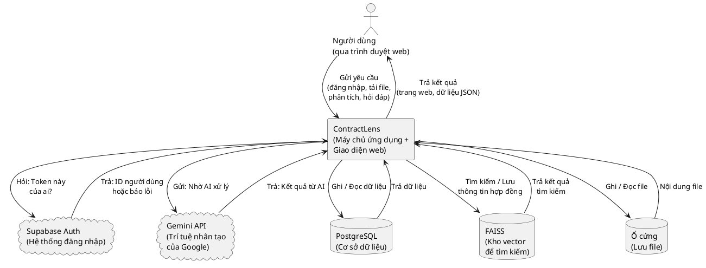
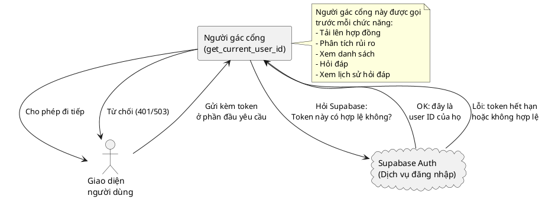
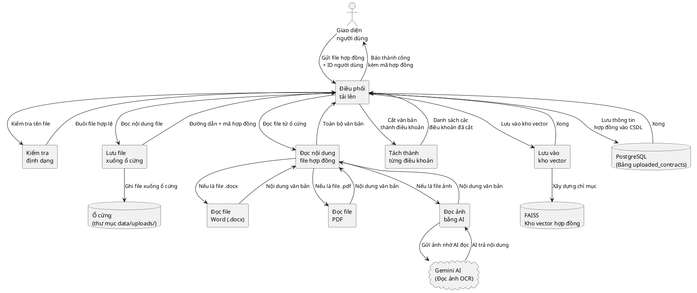
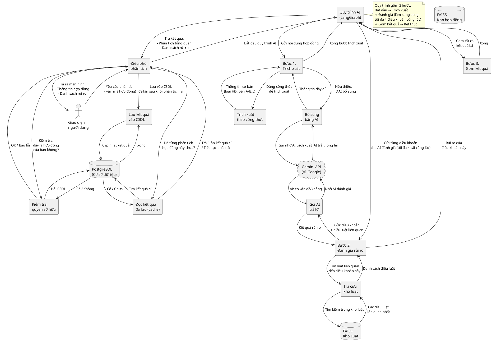
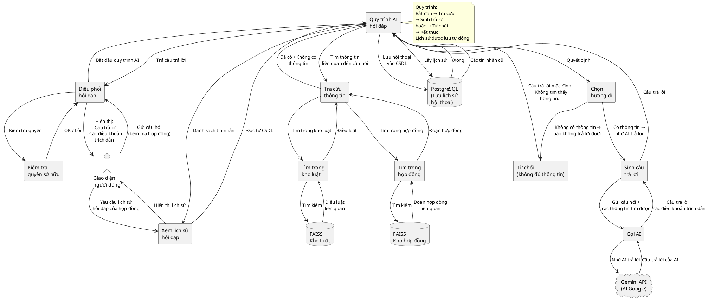
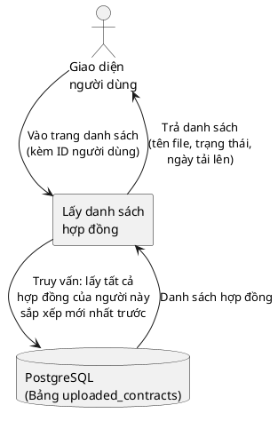
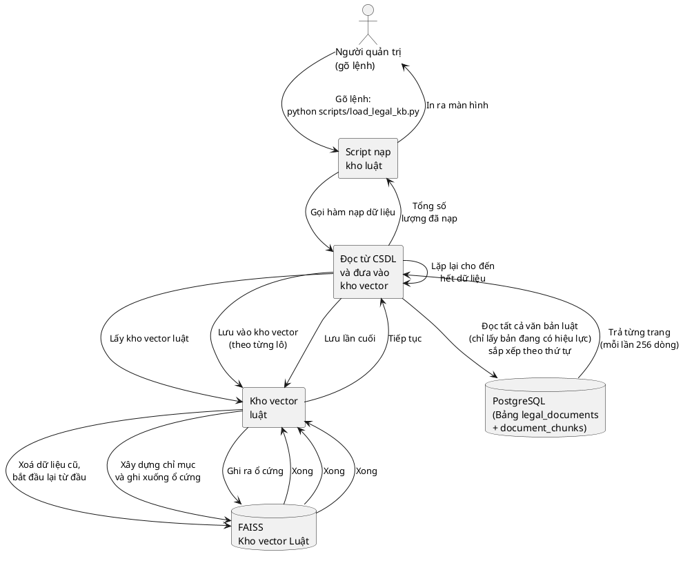
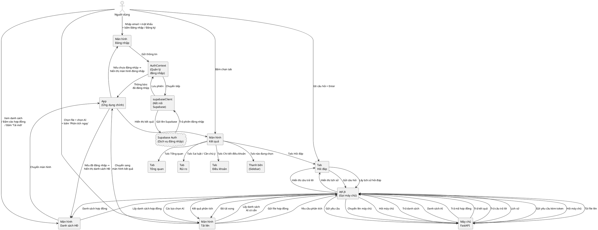

# ContractLens — Sơ đồ Luồng Dữ liệu (DFD)

> Dựa trên phân tích toàn bộ mã nguồn. Mọi thành phần, kho dữ liệu, luồng đều được dẫn chiếu tới file code thật.
> Ngày tạo: 2026-07-26

---

## Mục lục

| DFD | Tên module | File nguồn |
|-----|------------|------------|
| Mức 0 | Sơ đồ Tổng quan Hệ thống | — |
| Mức 1 | Sơ đồ Chi tiết các Module chính | — |
| Mức 2 | Xác thực Người dùng | `app/core/auth.py:6` |
| Mức 2 | Tải lên & Xử lý Hợp đồng | `app/document/file_handler.py:21`, `app/document/parser.py:58`, `app/document/chunker.py:44`, `app/services/contract_service.py:36` |
| Mức 2 | Phân tích Rủi ro (AI Workflow) | `app/agents/workflow.py:85`, `app/agents/clause_parser.py:453`, `app/agents/risk_flagger.py:10`, `app/agents/llm_client.py:23` |
| Mức 2 | Hỏi đáp Hợp đồng (Chat Q&A) | `app/agents/qa_agent.py:170`, `app/agents/llm_client.py:12` |
| Mức 2 | Danh sách Hợp đồng | `app/services/contract_service.py:110` |
| Mức 2 | Nạp Kho Dữ liệu Luật | `app/knowledge_base/loader.py:16`, `scripts/load_legal_kb.py` |
| Mức 2 | Giao diện Người dùng (Frontend) | `frontend/src/api.js`, `frontend/src/App.jsx`, `frontend/src/components/*.jsx` |

---

# DFD Mức 0 — Sơ đồ Tổng quan Hệ thống

Nhìn từ bên ngoài: Người dùng giao tiếp với Hệ thống ContractLens, và ContractLens gọi các dịch vụ bên ngoài.

---

# DFD Mức 1 — Sơ đồ Chi tiết các Module chính

Bên trong hệ thống ContractLens có 7 module chính. Hình dưới đây cho thấy tất cả luồng dữ liệu giữa chúng.

```plantuml
@startuml
!define ENTITY actor
!define PROCESS rectangle
!define STORE database
!define EXTERNAL cloud

actor "Người dùng\n(qua trình duyệt)" as User

rectangle "Xác thực\nNgười dùng" as Auth
rectangle "Tải lên &\nXử lý Hợp đồng" as Upload
rectangle "Phân tích\nRủi ro AI" as Analyze
rectangle "Hỏi đáp\nHợp đồng" as Chat
rectangle "Danh sách\nHợp đồng" as List
rectangle "Nạp Kho\nDữ liệu Luật" as LegalLoader
rectangle "Giao diện\nNgười dùng" as Frontend

cloud "Supabase Auth\n(Đăng nhập)" as SupabaseAuth
cloud "Gemini API\n(AI Google)" as GeminiAPI
database "PostgreSQL\n(Cơ sở dữ liệu)" as PG
database "FAISS\nHợp đồng" as FaissC
database "FAISS\nKho Luật" as FaissL
database "Ổ cứng\nLưu file" as LocalFS

' ---- Giao diện người dùng ----
User --> Frontend : "Thao tác"
Frontend --> User : "Hiển thị màn hình"

' ---- Đăng nhập ----
Frontend --> SupabaseAuth : "Gửi email + mật khẩu"
SupabaseAuth --> Frontend : "Trả phiên đăng nhập"
Frontend --> Auth : "Gửi token qua header"
Auth --> SupabaseAuth : "Hỏi token hợp lệ không?"
SupabaseAuth --> Auth : "Trả ID người dùng"

' ---- Tải lên hợp đồng ----
Frontend --> Upload : "Gửi file hợp đồng"
Upload --> LocalFS : "Lưu file xuống ổ cứng"
Upload --> FaissC : "Lưu vector vào kho"
Upload --> PG : "Ghi thông tin hợp đồng"
Upload --> Frontend : "Trả mã hợp đồng"

' ---- Phân tích rủi ro ----
Frontend --> Analyze : "Yêu cầu phân tích"
Analyze --> PG : "Đọc kết quả cũ (nếu có)"
Analyze --> FaissC : "Lấy nội dung hợp đồng"
Analyze --> GeminiAPI : "Gọi AI trích xuất"
Analyze --> GeminiAPI : "Gọi AI đánh giá rủi ro"
Analyze --> FaissL : "Tra cứu luật liên quan"
Analyze --> PG : "Lưu kết quả phân tích"
Analyze --> Frontend : "Trả kết quả"

' ---- Hỏi đáp ----
Frontend --> Chat : "Gửi câu hỏi"
Chat --> FaissC : "Tra cứu hợp đồng"
Chat --> FaissL : "Tra cứu kho luật"
Chat --> GeminiAPI : "Gọi AI trả lời"
Chat --> PG : "Lưu lịch sử hội thoại"
Chat --> Frontend : "Trả câu trả lời"

' ---- Danh sách hợp đồng ----
Frontend --> List : "Yêu cầu danh sách"
List --> PG : "Đọc danh sách"
List --> Frontend : "Trả danh sách"

' ---- Nạp kho luật ----
LegalLoader --> PG : "Đọc dữ liệu luật"
LegalLoader --> FaissL : "Lưu vào kho vector"

@enduml
```

---

# DFD Mức 2 — Xác thực Người dùng

File nguồn: `app/core/auth.py:6`

Mỗi khi người dùng gửi yêu cầu tới máy chủ, một "người gác cổng" kiểm tra token đăng nhập trước khi cho phép thao tác.

---

# DFD Mức 2 — Tải lên & Xử lý Hợp đồng

File nguồn: `app/document/file_handler.py:21`, `app/document/parser.py:58`, `app/document/chunker.py:44`, `app/services/contract_service.py:36`

Khi người dùng tải hợp đồng lên, máy tính sẽ đọc file, tách thành từng điều khoản, rồi lưu vào kho vector để sau này tìm kiếm.

---

# DFD Mức 2 — Phân tích Rủi ro (AI Workflow)

File nguồn: `app/agents/workflow.py:85`, `app/agents/clause_parser.py:453`, `app/agents/risk_flagger.py:10`, `app/agents/llm_client.py:23`

Đây là quy trình AI phức tạp nhất. Hệ thống đọc hợp đồng, trích xuất thông tin, rồi gửi từng điều khoản cho AI đánh giá xem có vi phạm luật không.

---

# DFD Mức 2 — Hỏi đáp Hợp đồng (Chat Q&A)

File nguồn: `app/agents/qa_agent.py:170`, `app/agents/llm_client.py:12`

Người dùng có thể hỏi bất kỳ câu hỏi nào về hợp đồng. Hệ thống sẽ tra cứu hợp đồng và kho luật, rồi nhờ AI trả lời.

---

# DFD Mức 2 — Danh sách Hợp đồng

File nguồn: `app/services/contract_service.py:110`

Khi người dùng vào trang chính, hệ thống lấy danh sách các hợp đồng của họ từ cơ sở dữ liệu.

---

# DFD Mức 2 — Nạp Kho Dữ liệu Luật

File nguồn: `app/knowledge_base/loader.py:16`, `scripts/load_legal_kb.py`

Đây là tác vụ chạy thủ công (gõ lệnh trong terminal) để đưa các văn bản luật vào kho vector, phục vụ cho việc tra cứu khi phân tích hợp đồng.

---

# DFD Mức 2 — Giao diện Người dùng (Frontend)

File nguồn: `frontend/src/App.jsx`, `frontend/src/api.js`, `frontend/src/components/*.jsx`

Sơ đồ này mô tả cách người dùng tương tác với từng màn hình và cách dữ liệu chạy từ giao diện tới máy chủ.

---

## Danh sách Kiểm tra

| # | Tiêu chí | Trạng thái |
|---|----------|------------|
| 1 | Mọi đối tượng bên ngoài đều được thể hiện | ✓ Người dùng, Supabase Auth, Gemini API |
| 2 | Mọi kho dữ liệu đều được thể hiện | ✓ PostgreSQL, FAISS (hợp đồng + luật), Ổ cứng |
| 3 | Mọi yêu cầu đều có phản hồi | ✓ Tất cả mũi tên đi đều có mũi tên về |
| 4 | Mọi truy cập CSDL đều được vẽ | ✓ SELECT/INSERT/UPDATE trong tất cả sơ đồ |
| 5 | Mọi API bên ngoài đều được vẽ | ✓ Supabase Auth REST, Gemini LLM, Gemini OCR |
| 6 | Mọi lưu tạm (cache) đều được vẽ | ✓ Kiểm tra kết quả cũ khi phân tích |
| 7 | Mọi tác vụ nền đều được vẽ | ✓ Nạp Kho Dữ liệu Luật (chạy bằng lệnh) |
| 8 | Mọi luồng xác thực đều được vẽ | ✓ Sơ đồ Xác thực Người dùng |
| 9 | Không có thành phần nào bịa đặt | 100% dẫn chiếu từ file code thật |
